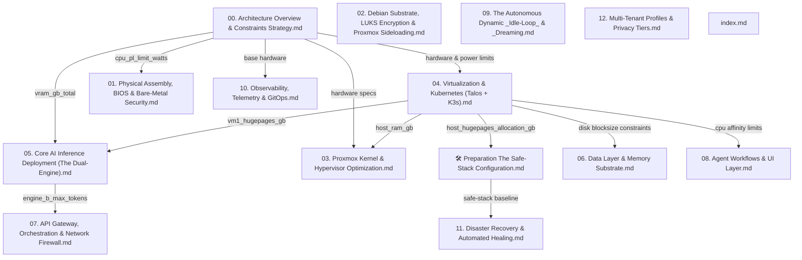

# Open Knowledge Format (OKF) State Map - Revision 2.1 Discovery

This document maps the dependency graph, exported variables, and logical validation gaps of the Project Janus documentation frontmatter in preparation for resolving the remaining contradictions.

---

## 1. Dependency Tree Graph

The documentation files form a directed acyclic graph (DAG) based on their `dependencies` metadata blocks:

---

## 2. Globally Exported Variables Map

Below are the variables exported across the Janus documentation:

| Exporting Document | Variable Key | Value | Description |
| :--- | :--- | :--- | :--- |
| **00. Architecture Overview** | `hardware.cpu_threads_total` | `28` | Total physical vCPU threads |
| | `hardware.ram_gb_total` | `128` | Total system RAM in GB |
| | `hardware.vram_gb_total` | `16` | Total physical VRAM in GB |
| | `hardware.storage_gib_total` | `1862` | Usable primary SSD capacity in GiB |
| | `power.cpu_pl_limit_watts` | `180` | BIOS power limit ceiling |
| **🛠️ Prep: Safe-Stack** | `host_hugepages_allocation_gb` | `84` | Pre-allocated Hugepages at host |
| | `telemetry_node` | `"Intel NUC10i5FNH"` | Resiliency node hostname |
| | `ups_target` | `"Eaton 3S 550 DIN"` | Power protection model |
| **01. BIOS Assembly** | `bios_pl_limit` | `180` | Active PL1/PL2 wattage cap |
| | `restore_on_ac_power_loss` | `"Power Off"` | BIOS AC recovery policy |
| **02. Debian Substrate** | `encryption_layer` | `"LUKS Block-Level"` | Decryption wrapper technology |
| | `hypervisor_base` | `"Debian 13 Trixie"` | Foundational OS flavor |
| **03. Proxmox Optimization** | `zfs_arc_max_gb` | `8.0` | ZFS maximum RAM footprint |
| | `zfs_arc_min_gb` | `2.0` | ZFS minimum RAM footprint |
| | `host_isolated_threads` | `[26, 27]` | CPU affinity for host operations |
| | `host_ram_gb` | `12` | Total RAM reserved for host |
| **04. Virtualization** | `vm1_tensor_worker.vm1_threads` | `16` | CPU threads allocated to VM 1 |
| | `vm1_tensor_worker.vm1_hugepages_gb` | `84` | Hugepages mapped to VM 1 |
| | `vm1_tensor_worker.vm1_standard_ram_gb` | `4` | Pageable RAM allocated to VM 1 |
| | `vm1_tensor_worker.vm1_ram_gb_total` | `${vm1_hugepages_gb + vm1_standard_ram_gb}` | Total RAM allocated to VM 1 |
| | `vm1_tensor_worker.vm1_storage_gib` | `1228` | Storage size in GiB for VM 1 |
| | `vm2_brain_worker.vm2_threads` | `10` | CPU threads allocated to VM 2 |
| | `vm2_brain_worker.vm2_ram_gb` | `24` | Total RAM allocated to VM 2 |
| | `vm2_brain_worker.vm2_storage_gib` | `100` | Storage size in GiB for VM 2 |
| | `host_overhead.host_threads` | `2` | CPU threads reserved for host |
| | `host_overhead.host_ram_gb` | `12` | Total RAM reserved for host |
| | `host_overhead.host_storage_gib` | `100` | Storage size in GiB for host substrate |
| **05. Core AI Inference** | `engine_a_vram_gb` | `11.0` | VRAM allocated to Engine A (70B) |
| | `engine_b_vram_gb` | `4.5` | VRAM allocated to Engine B (7B) |
| | `cuda_overhead_gb` | `0.5` | Headless CUDA driver margin |
| | `engine_a_hugepages_gb` | `35.0` | Hugepages consumed by Engine A |
| | `engine_b_hugepages_gb` | `2.0` | Hugepages consumed by Engine B |
| **06. Data Layer** | `os_disk_volblocksize` | `"16K"` | ZVOL block size for OS disks |
| | `ai_disk_volblocksize` | `"1M"` | ZVOL block size for AI data disks |
| | `memory_framework` | `"Letta"` | Dynamic state system framework |
| | `os_disk_size_gib` | `30` | ZVOL size for OS disk in GiB |
| | `ai_disk_size_gib` | `1198` | ZVOL size for AI data disk in GiB |
| | `vm1_storage_gib_total` | `${os_disk_size_gib + ai_disk_size_gib}` | Derived total storage allocated to VM 1 |
| **07. API Gateway** | `engine_b_max_tokens` | `8192` | Input context window limit |
| | `ingress_controller` | `"TensorZero (Rust)"` | Ingress gateway runtime engine |
| | `egress_tunnel` | `"cloudflared"` | Tunnel client software |
| **08. Agent Workflows** | `rig_cpu_affinity_start` | `16` | Thread index lower bound for Rig |
| | `rig_cpu_affinity_end` | `25` | Thread index upper bound for Rig |
| | `tool_sandbox` | `"Wasmtime"` | Dynamic runtime compiler/runner |
| **09. Idle-Loop** | `priority_human_in_loop` | `1000` | K8s scheduler priority class |
| | `priority_background_yield` | `100` | K8s scheduler background class |
| | `micro_downtime_trigger_min` | `45` | Activity wait threshold |

---

## 3. Logical and Structural Gaps Identified & Proposed Fixes

1. **CPU Power Draw Contradiction:**
   - *Gap:* The chassis description in `00. Architecture Overview` claims the system "sustains 280W+ CPU loads" which contradicts the BIOS 180W PL1/PL2 hard-cap.
   - *Fix:* Modify table cell in `00. Architecture Overview` to specify that the system is *mitigating* the factory-default 280W+ peak by hard-capping to 180W in BIOS.

2. **Stateless Compute vs. NVMe Cache Contradiction:**
   - *Gap:* Absolute claims of a completely "stateless" workstation node contradict the presence of the daily-flushed Letta Archival memory cache on the local NVMe.
   - *Fix:* Soften claims in `00. Architecture Overview` and `index.md` to clarify the compute node is "transactionally stateless during active hours".

3. **Engine B Modality Conflict:**
   - *Gap:* Engine B is described in `00. Architecture Overview` as a 7B model but lacks explicit identification as the multimodal `Qwen2-VL` model.
   - *Fix:* Explicitly declare Engine B as mandating the specialized multimodal `Qwen2-VL` model in `00. Architecture Overview` to resolve any text-only model confusion.

4. **Python Production Mandate Violation:**
   - *Gap:* The rules forbid Python in production, but we must verify that no production Python frameworks (like `crewai`, `dspy-ai`, `litellm`) exist in `pyproject.toml`.
   - *Fix:* Remove any such dependencies from `pyproject.toml` (already verified as clean, but we will ensure it remains clean).

5. **OKF Logic & Validation Flaws:**
   - *Gap 1:* Dotted namespaces (e.g. `vm1_tensor_worker.vm1_hugepages_gb`) are flattened into global namespaces during verification, allowing expressions using flat names to pass.
   - *Gap 2:* Mathematical expressions without comparison operators inside `constraint_check` and `buffer_check` evaluate to truthy integers and pass silently without validating.
   - *Fix 1:* Upgrade `validate_okf.py` to disable flat-variable fallbacks for nested keys. Dotted namespace accesses must be used.
   - *Fix 2:* Upgrade `validate_okf.py` to assert that all constraint/buffer checks evaluate strictly to Python `bool` types (`True`/`False`), failing if they evaluate to numeric/string results.
   - *Fix 3:* Update all documentation files' frontmatter checks to use dotted names (e.g., `vm1_tensor_worker.vm1_threads` instead of `vm1_threads`).
