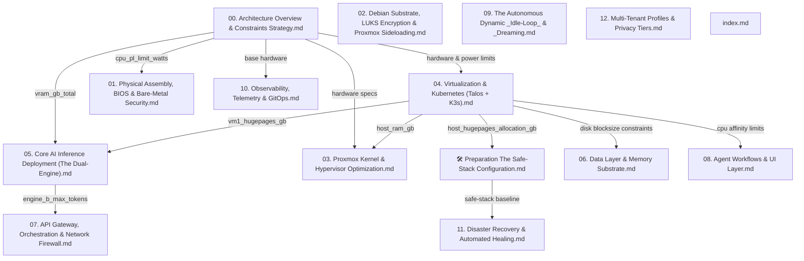

# Open Knowledge Format (OKF) State Map - Revision 2.0 Discovery

This document maps the dependency graph, exported variables, and logical validation gaps of the Project Janus documentation frontmatter in preparation for the OKF Revision 2.0 upgrade.

---

## 1. Dependency Tree Graph

The documentation files form a directed acyclic graph (DAG) based on their `dependencies` metadata blocks:

### Path Hierarchy Summary
* **Base Reference Node:** `00. Architecture Overview & Constraints Strategy.md`
* **Infrastructure Chain:** `00. Architecture` $\rightarrow$ `04. Virtualization & Kubernetes` $\rightarrow$ `🛠️ Prep: Safe-Stack` $\rightarrow$ `11. Disaster Recovery`
* **Inference Chain:** `00. Architecture` $\rightarrow$ `04. Virtualization & Kubernetes` $\rightarrow$ `05. Core AI Inference` $\rightarrow$ `07. API Gateway`
* **Independent Root Nodes:** `02. Debian Substrate`, `09. Idle-Loop & Dreaming`, `12. Multi-Tenant Privacy`, and `index.md` do not declare upstream dependencies in their frontmatter.

---

## 2. Globally Exported Variables Map

Below are all variables currently exported across the Janus documentation, mapped to their hardcoded values:

| Exporting Document | Variable Key | Current Value | Description |
| :--- | :--- | :--- | :--- |
| **00. Architecture Overview** | `hardware.cpu_threads_total` | `28` | Total physical vCPU threads |
| | `hardware.ram_gb_total` | `128` | Total system RAM in GB |
| | `hardware.vram_gb_total` | `16` | Total physical VRAM in GB |
| | `hardware.storage_gib_total` | `1862` | Usable primary SSD capacity in GiB |
| | `power.cpu_pl_limit_watts` | `180` | BIOS power limit ceiling |
| **🛠️ Prep: Safe-Stack** | `host_hugepages_allocation_gb` | `84` | Pre-allocated Hugepages at host |
| | `telemetry_node` | `"Intel NUC10i5FNH"` | Resiliency node hostname |
| | `ups_target` | `"Eaton 3S 550 DIN"` | Power protection model |
| **01. BIOS Assembly** | `bios_pl_limit` | `180` | Active PL1/PL2 wattage cap |
| | `restore_on_ac_power_loss` | `"Power Off"` | BIOS AC recovery policy |
| **02. Debian Substrate** | `encryption_layer` | `"LUKS Block-Level"` | Decryption wrapper technology |
| | `hypervisor_base` | `"Debian 13 Trixie"` | Foundational OS flavor |
| **03. Proxmox Optimization** | `zfs_arc_max_gb` | `8.0` | ZFS maximum RAM footprint |
| | `zfs_arc_min_gb` | `2.0` | ZFS minimum RAM footprint |
| | `host_isolated_threads` | `[26, 27]` | CPU affinity for host operations |
| **04. Virtualization** | `vm1_tensor_worker.vm1_threads` | `16` | CPU threads allocated to VM 1 |
| | `vm1_tensor_worker.vm1_hugepages_gb` | `84` | Hugepages mapped to VM 1 |
| | `vm1_tensor_worker.vm1_standard_ram_gb` | `4` | Pageable RAM allocated to VM 1 |
| | `vm2_brain_worker.vm2_threads` | `10` | CPU threads allocated to VM 2 |
| | `vm2_brain_worker.vm2_ram_gb` | `24` | Total RAM allocated to VM 2 |
| | `host_overhead.host_threads` | `2` | CPU threads reserved for host |
| | `host_overhead.host_ram_gb` | `12` | Total RAM reserved for host |
| **05. Core AI Inference** | `engine_a_vram_gb` | `11.0` | VRAM allocated to Engine A (70B) |
| | `engine_b_vram_gb` | `4.5` | VRAM allocated to Engine B (7B) |
| | `cuda_overhead_gb` | `0.5` | Headless CUDA driver margin |
| | `engine_a_hugepages_gb` | `35.0` | Hugepages consumed by Engine A |
| | `engine_b_hugepages_gb` | `0.0` | Hugepages consumed by Engine B |
| **06. Data Layer** | `os_disk_volblocksize` | `"16K"` | ZVOL block size for OS disks |
| | `ai_disk_volblocksize` | `"1M"` | ZVOL block size for AI data disks |
| | `memory_framework` | `"Letta"` | Dynamic state system framework |
| **07. API Gateway** | `engine_b_max_tokens` | `8192` | Input context window limit |
| | `ingress_controller` | `"TensorZero (Rust)"` | Ingress gateway runtime engine |
| | `egress_tunnel` | `"cloudflared"` | Tunnel client software |
| **08. Agent Workflows** | `rig_cpu_affinity_start` | `16` | Thread index lower bound for Rig |
| | `rig_cpu_affinity_end` | `25` | Thread index upper bound for Rig |
| | `tool_sandbox` | `"Wasmtime"` | Dynamic runtime compiler/runner |
| **09. Idle-Loop** | `priority_human_in_loop` | `1000` | K8s scheduler priority class |
| | `priority_background_yield` | `100` | K8s scheduler background class |
| | `micro_downtime_trigger_min` | `45` | Activity wait threshold |

---

## 3. Logical and Structural Gaps Identified

A deep review of variables vs. text constraints reveals several inconsistencies that an automated OKF parsing compiler would reject:

### 1. Inconsistent Variable Scoping and Namespaces
* In `04. Virtualization & Kubernetes (Talos + K3s).md`, the constraint checks reference `vm1_ram_gb`, `vm2_ram_gb`, and `host_ram_gb`.
* However, in the `exports` block, these variables are nested under namespace structures: `vm1_tensor_worker.vm1_hugepages_gb`, `vm1_tensor_worker.vm1_standard_ram_gb`, `vm2_brain_worker.vm2_ram_gb`, and `host_overhead.host_ram_gb`.
* `vm1_ram_gb` is never actually exported as a single variable, making the constraint check formula `- vm1_ram_gb + vm2_ram_gb + host_ram_gb <= hardware.ram_gb_total` structurally unresolvable without preprocessing sum logic.

### 2. Missing Storage Capacity Constraints
* The text of the documentation meticulously calculates drive capacity: *"...consuming 1428 GiB, leaving an exact unallocated ZFS buffer of 434 GiB to preserve SSD write endurance..."*
* However, there is **no storage validation check** in the frontmatter of `04. Virtualization & Kubernetes (Talos + K3s).md` or `06. Data Layer & Memory Substrate.md` to mathematically enforce that the sum of VM disk images does not exceed `hardware.storage_gib_total`.

### 3. Missing Unallocated RAM Buffer Verification
* While memory partitioning maps to `124 GB` total (`88 GB` VM 1 + `24 GB` VM 2 + `12 GB` Host), leaving `4 GB` unallocated as a safety cushion, the constraint check `vm1_ram_gb + vm2_ram_gb + host_ram_gb <= hardware.ram_gb_total` only checks that the sum is less than or equal to `128 GB`.
* It does not enforce the safety margin (e.g., `<= hardware.ram_gb_total - 4.0`).

### 4. Non-Functional Constraint Validation Script
* The local script `scripts/validate_okf.py` only validates basic YAML structure and absolute file path links. It does not parse or evaluate the mathematical expressions in `constraint_check` blocks, meaning errors in equations are currently silent.
