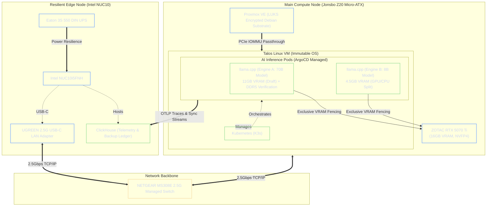

# Architecture Overview and Constraint Strategy

Project Janus is engineered upon a foundational philosophy of *Constraint Engineering*. The objective is to deploy an enterprise-grade, autonomous artificial intelligence cluster utilizing consumer-grade hardware, specifically bounded within a thermally restricted Micro-ATX form factor. Achieving deterministic performance and resilience under these constraints requires rigorous optimization of compute resources, memory bandwidth, and physical infrastructure separation.

!!! abstract "The Paradigm of Constraint Engineering"
    Instead of scaling hardware linearly to meet software demands, Janus applies deep hardware-aware optimizations—such as NVFP4 quantization and heterogeneous memory offloading—to achieve datacenter-equivalent throughput within strict thermal and physical limitations.

---

## 1. System Constraints and Hardware Profile

The physical infrastructure dictates the boundaries of the software architecture. Every component in the primary compute node is selected and tuned to maximize the utility of the GPU while mitigating thermal throttling.

### 1.1 Compute Node Hardware Specifications

The following table summarizes the precise physical parameters of the main compute node (Jonsbo Z20):

| Component | Specification | Operational Constraint / Mounting Strategy |
| :--- | :--- | :--- |
| **CPU** | Intel Core i7-14700K (20 Cores: 8 P-Cores / 12 E-Cores) | Sustains peak compute; capped to 180W PL1/PL2 via ASRock BIOS. |
| **CPU Mod** | Thermal Grizzly / Thermalright Contact Frame + Gelid GC-Extreme | Replaces stock Intel ILM for perfectly flat mounting & optimized thermals. |
| **Motherboard** | ASRock B760M Pro RS (Micro-ATX, DDR5, 3x M.2 slots) | Foundational substrate; holds the strict PCIe passthrough & virtualization settings. |
| **RAM** | 128 GB Crucial DDR5 Kit | Crucial offload tier for cold-neurons; installed in slots **A2 and B2** for stability. |
| **GPU** | ZOTAC GAMING GeForce RTX 5070 Ti SOLID CORE (or SOLID CORE OC) | 16GB GDDR7, PCIe 5.0, 2.5-slot cooler, 303.5mm length. Native NVFP4 accelerator. |
| **Storage (Primary)** | 1x 2TB Seagate FireCuda 530 Gen4 NVMe SSD (with **be quiet! MC1 SSD Cooler**) | TLC NAND, 2GB DRAM-cache, Phison E18, 2,550 TBW. Top `M2_1` slot under MC1 heatsink to ensure cooler clearance. |
| **Chassis** | Jonsbo Z20 (Micro-ATX, 20-liter) | Highly restricted thermal dissipation for sustained 280W+ CPU loads. |
| **CPU Cooler** | Thermalright Peerless Assassin 120 SE White ARGB | Dual-tower design, 155mm height. Standard for compact CPU thermal taming. |
| **Power Supply (PSU)** | ASUS ROG Loki SFX-L 850W/1000W (White, PCIe 5.0, ATX 3.0) | Highest front-bracket mounting (P-level) to avoid modular cable-GPU collision. |

### 1.2 Compute and Memory Boundaries

- **Central Processing Unit (CPU):** Intel Core i7-14700K. Featuring a hybrid architecture with 8 Performance-Cores and 12 Efficient-Cores (20 cores total), this CPU handles high-throughput memory fetching for cold-neuron evaluation in large language models. The integration of a **Thermal Grizzly / Thermalright Contact Frame** replaces the stock Intel Independent Loading Mechanism (ILM) to eliminate motherboard warping and ensure perfectly flat cooler contact, combined with **Gelid GC-Extreme Thermal Paste** for optimized heat dissipation under heavy thermal loads.
- **System Memory (RAM):** 128GB Crucial DDR5. This massive capacity serves as the critical offload tier for model weights that exceed the GPU's onboard VRAM, functioning as a high-speed buffer before falling back to NVMe storage. To guarantee signal integrity and boot stability at target speeds under high memory density, the dual-channel kit must be installed strictly in slots **A2 and B2**.
- **Storage Substrate:** 1x 2TB Seagate FireCuda 530 Gen4 NVMe SSD. Featuring premium TLC NAND, a dedicated 2GB DRAM-cache, and the high-performance Phison E18 Controller with an endurance rating of 2,550 TBW. To ensure absolute physical clearance under the massive dual-tower CPU cooler while maintaining optimal SSD thermal performance under prolonged read/write cycles, the drive is equipped with a low-profile **be quiet! MC1 M.2 SSD Cooler** and mounted in the top `M2_1` slot.

### 1.3 The Blackwell GPU Advantage

- **Graphics Processing Unit (GPU):** ZOTAC GAMING GeForce RTX 5070 Ti SOLID CORE (or SOLID CORE OC).
  - *Core Architecture:* Built on the NVIDIA Blackwell (SM120) architecture featuring 5th-generation Tensor Cores. It supports native hardware-accelerated NVFP4 (4-bit floating point) inference, allowing the 16GB VRAM to effectively behave like a 32GB+ card for supported AI models.
  - *Specifications:* Equipped with 16GB GDDR7 memory on a 256-bit interface, operating over a PCIe 5.0 bus, and powered via a single 16-pin 12V-2x6 connector.
  - *Clearance Constraint:* Features a 2.5-slot cooling design with an exact length of 303.5 mm. Due to this length constraint, you must mount your power supply at its highest possible position within the case to prevent cable collisions.

### 1.4 Thermal, Airflow, and Physical Limitations

!!! danger "Thermal and Spatial Constraints (Jonsbo Z20)"
    The hardware is housed within a **Jonsbo Z20 Micro-ATX** chassis. The critical engineering constraint here is the highly restricted thermal dissipation envelope. Because sustaining the factory 280W+ peak power draw of the i7-14700K is impossible within this chassis, the CPU is strictly hard-capped to 180W in the BIOS, paired with precise physical component positioning, and a highly engineered positive-pressure airflow configuration:
    - **PSU Mounting:** The ASUS ROG Loki SFX-L PSU must be installed at the highest P-level in the Jonsbo front bracket. The 120mm RGB fan must face the **front side panel** (mesh) to intake fresh ambient air, and its cables must route directly downward to prevent collision with the 303.5 mm GPU backplate.
    - **Airflow Configuration (Bottom-to-Top / Rear-to-Front):**
      - *Bottom (Intake):* 2x Noctua Slim 120mm fans (Connected via Y-cable to motherboard header `CHA_FAN2`) to feed fresh air directly into the GPU intake.
      - *Rear (Intake):* 1x ARCTIC P12 Pro Reverse A-RGB White 120mm connected directly to the motherboard, configured with PWM and 5V ARGB controls, with 0dB mode active at < 5% PWM. This draws fresh air directly into the CPU cooler.
      - *Top (Exhaust):* 2x HAVN H14 140mm fans (Daisy-chained via integrated loop cable to motherboard header `CHA_FAN1`) to exhaust hot air out of the top chassis panel.

---

## 2. The Dual-Engine AI Philosophy

A standard 70-billion parameter language model quantized to 16-bit floating point (FP16) requires approximately 140GB of memory, vastly exceeding the RTX 5070 Ti's 16GB VRAM buffer. To resolve this, Janus implements a bifurcated, highly optimized dual-engine system.

### 2.1 Engine A: The Deep Orchestrator (llama.cpp Speculative Decoding)

Engine A is designed for heavy reasoning and complex semantic routing using a 70B parameter model.
By utilizing GGUF 4-bit quantization, the 70B model's footprint is compressed to roughly 35GB. Because this still exceeds the 16GB VRAM limit, **llama.cpp** acts as the execution backend using **Multi-Token Prediction (MTP) Speculative Decoding**:

- **Drafting in VRAM:** A tiny 1.5B/3B draft model resides in the 5070 Ti's VRAM to guess sequences of tokens at high speeds.
- **Verification on CPU:** The full 70B model weights reside in the 128GB DDR5 system RAM, where the i7-14700K's 8 physical P-Cores execute the verification pass on the guesses.

This heterogeneous execution strategy drastically minimizes DDR5 memory bandwidth bottlenecking, unlocking inference speeds traditionally reserved for multi-GPU datacenter clusters.

### 2.2 Engine B: The Multimodal Reflex Agent (llama.cpp)

Engine B is engineered for low-latency, high-frequency operations such as tool-calling, external API interactions, and immediate user interface responses.
By unifying the backend on **llama.cpp**, Janus leverages heterogeneous CPU/GPU offloading to safely isolate multi-modal vision encoders into system RAM. The 4-bit quantized text weights are loaded entirely into VRAM to execute text generation natively on the GPU, while the Vision Encoder is offloaded to system CPU/RAM, keeping Engine B's GPU memory footprint strictly within its 4.5GB static VRAM fence.

---

## 3. High-Level System Architecture Diagram

The following C4-style architectural diagram illustrates the physical separation and logical routing between the stateless compute tier and the resilient state-storage tier.

---

## 4. Security and Virtualization Posture

To ensure maximum security and rapid deployment iterations, the hypervisor and container environments are strictly decoupled.

- **Zero-Trust Bare Metal:** The foundational OS is Proxmox Virtual Environment, sideloaded onto a hardened Debian 13 substrate. It runs no secondary services and is fully protected by block-level LUKS encryption (AES-256-GCM).
- **Hardware Isolation via IOMMU:** The RTX 5070 Ti is not virtualized via vGPU slicing. It is isolated and passed directly via PCIe passthrough to a secure Talos Linux virtual machine.
- **Immutable Orchestration:** The Talos Linux VM runs K3s. All AI inference engines, API gateways, and internal routing operate as isolated Kubernetes Pods. These workloads are declaratively managed by ArgoCD, permitting zero-downtime rolling updates as new models or binaries are released.

---

## 5. The Crash-Safe Edge-Node Resilience Strategy

!!! note "The Zero-UPS Compute Philosophy"
    Procuring an Uninterruptible Power Supply (UPS) capable of sustaining the 400W+ instantaneous load of the main AI compute server is cost-prohibitive. Consequently, the architecture explicitly assumes that the main server will experience ungraceful power loss during an outage.

To mitigate data corruption while maintaining high performance, the system is partitioned into transactionally stateless compute and stateful memory telemetry tiers.

1. **The Transactionally Stateless Main Server:** Due to its reliance on an immutable operating system (Talos) and declarative GitOps (ArgoCD), the main server's base configuration cannot be corrupted by a sudden power failure. Upon power restoration, the cluster self-heals and pulls the latest declarative state from the repository.
2. **The Stateful Edge-Node (Intel NUC):** The cluster's analytical telemetry database and cold-backup target—handled by **ClickHouse**—is physically decoupled from the main compute node and hosted on a low-power Intel NUC10i5FNH.
3. **Power Resilience:** The NUC is supported by an **Eaton 3S 550 DIN UPS**. Because the NUC draws minimal wattage, the UPS can sustain the services for extended periods, guaranteeing graceful operation and preventing NVMe index shattering during outages.
4. **Bandwidth Parity:** The primary bottleneck for decoupled logging and telemetry architectures is network latency. Because the NUC natively supports only 1Gbps Ethernet, it is augmented with a **UGREEN 2.5G USB-C LAN Adapter**. This ensures symmetric 2.5Gbps throughput across the **NETGEAR MS308E Managed Switch**, allowing the AI Pods to stream telemetry and recover Letta memory state rapidly without network saturation.
