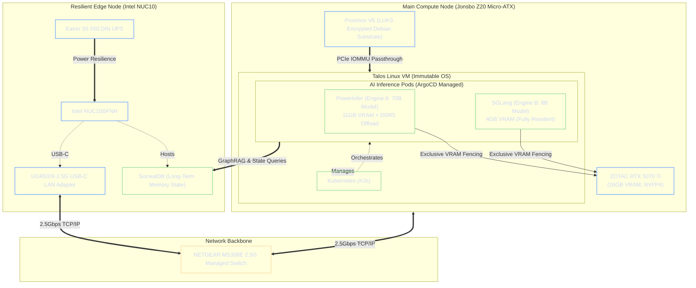

# Architecture Overview and Constraint Strategy

Project Janus is engineered upon a foundational philosophy of *Constraint Engineering*. The objective is to deploy an enterprise-grade, autonomous artificial intelligence cluster utilizing consumer-grade hardware, specifically bounded within a thermally restricted Micro-ATX form factor. Achieving deterministic performance and resilience under these constraints requires rigorous optimization of compute resources, memory bandwidth, and physical infrastructure separation.

!!! abstract "The Paradigm of Constraint Engineering"
    Instead of scaling hardware linearly to meet software demands, Janus applies deep hardware-aware optimizations—such as NVFP4 quantization and heterogeneous memory offloading—to achieve datacenter-equivalent throughput within strict thermal and physical limitations.

---

## 1. System Constraints and Hardware Profile

The physical infrastructure dictates the boundaries of the software architecture. Every component in the primary compute node is selected and tuned to maximize the utility of the GPU while mitigating thermal throttling.

### 1.1 Compute and Memory Boundaries

- **Central Processing Unit (CPU):** Intel Core i7-14700K. Featuring a hybrid architecture with 8 Performance-Cores and 12 Efficient-Cores (20 cores total), this CPU handles high-throughput memory fetching for cold-neuron evaluation in large language models.
- **System Memory (RAM):** 128GB Crucial DDR5. This massive capacity serves as the critical offload tier for model weights that exceed the GPU's onboard VRAM, functioning as a high-speed buffer before falling back to NVMe storage.

### 1.2 The Blackwell GPU Advantage

- **Graphics Processing Unit (GPU):** ZOTAC RTX 5070 Ti (16GB VRAM).

!!! success "Nvidia Blackwell Architecture (SM120)"
    The primary enabler of the Janus stack is the Blackwell GPU architecture. Equipped with 5th-generation Tensor Cores, it supports native hardware-accelerated **NVFP4 (4-bit floating point)** matrix multiplications. This effectively doubles the parameter capacity of the 16GB VRAM pool compared to standard FP8 operations, allowing it to behave analogously to an Ampere or Ada card equipped with 32GB of VRAM.

### 1.3 Thermal and Physical Limitations

!!! danger "Thermal Constraint (Micro-ATX)"
    The hardware is housed within a **Jonsbo Z20 Micro-ATX** chassis. The critical engineering constraint here is the restricted thermal dissipation envelope. Sustaining the 280W+ peak power draw of the i7-14700K alongside a 250W GPU requires aggressive undervolting and strict workload isolation to prevent thermal throttling during prolonged autonomous inference loops.

---

## 2. The Dual-Engine AI Philosophy

A standard 70-billion parameter language model quantized to 16-bit floating point (FP16) requires approximately 140GB of memory, vastly exceeding the RTX 5070 Ti's 16GB VRAM buffer. To resolve this, Janus implements a bifurcated, highly optimized dual-engine system.

### 2.1 Engine A: The Deep Orchestrator (PowerInfer)

Engine A is designed for heavy reasoning and complex semantic routing using a 70B parameter model.
By utilizing NVFP4 quantization, the 70B model's footprint is compressed to roughly 35GB. Because this still exceeds the 16GB VRAM limit, **PowerInfer** acts as the execution backend. PowerInfer analyzes the activation sparsity of the neural network:

- **Hot Neurons:** The statistically most-activated weights are mapped to a strict 11GB VRAM budget.
- **Cold Neurons:** The rarely-activated weights are spilled to the 128GB DDR5 system RAM.

This heterogeneous execution strategy drastically minimizes PCIe bus bottlenecking, unlocking inference speeds traditionally reserved for multi-GPU datacenter clusters.

### 2.2 Engine B: The Rapid Executor (SGLang)

Engine B is engineered for low-latency, high-frequency operations such as tool-calling, external API interactions, and immediate user interface responses.
Utilizing **SGLang**, this engine hosts a hyper-optimized 7B–8B model (e.g., `Qwen-2.5-7B`). By loading native NVFP4 weights, the entire model footprint is reduced to approximately 4GB. This allows the model to reside *entirely* within the remaining VRAM, operating alongside Engine A with zero latency penalty from system RAM fetching.

---

## 3. High-Level System Architecture Diagram

The following C4-style architectural diagram illustrates the physical separation and logical routing between the stateless compute tier and the resilient state-storage tier.

---

## 4. Security and Virtualization Posture

To ensure maximum security and rapid deployment iterations, the hypervisor and container environments are strictly decoupled.

- **Zero-Trust Bare Metal:** The foundational OS is Proxmox Virtual Environment, sideloaded onto a hardened Debian 13 substrate. It runs no secondary services and is fully protected by block-level LUKS encryption (AES-256-GCM).
- **Hardware Isolation via IOMMU:** The RTX 5070 Ti is not virtualized via vGPU slicing. It is isolated and passed directly via PCIe passthrough to a secure Talos Linux virtual machine.
- **Immutable Orchestration:** The Talos Linux VM runs K3s. All AI inference engines, API gateways, and internal routing operate as isolated Kubernetes Pods. These workloads are declaratively managed by ArgoCD, permitting zero-downtime rolling updates as new models or binaries are released.

---

## 5. The Crash-Safe Edge-Node Resilience Strategy

!!! note "The Zero-UPS Compute Philosophy"
    Procuring an Uninterruptible Power Supply (UPS) capable of sustaining the 400W+ instantaneous load of the main AI compute server is cost-prohibitive. Consequently, the architecture explicitly assumes that the main server will experience ungraceful power loss during an outage.

To mitigate data corruption while maintaining high performance, the system is partitioned into stateless compute and stateful memory.

1. **The Stateless Main Server:** Due to its reliance on an immutable operating system (Talos) and declarative GitOps (ArgoCD), the main server's base configuration cannot be corrupted by a sudden power failure. Upon power restoration, the cluster self-heals and pulls the latest declarative state from the repository.
2. **The Stateful Edge-Node (Intel NUC):** The cluster's "Long-Term Memory" and state—handled by **SurrealDB**—is physically decoupled from the main compute node and hosted on a low-power Intel NUC10i5FNH.
3. **Power Resilience:** The NUC is supported by an **Eaton 3S 550 DIN UPS**. Because the NUC draws minimal wattage, the UPS can sustain the database for extended periods, guaranteeing graceful shutdowns and preventing NVMe index shattering during outages.
4. **Bandwidth Parity:** The primary bottleneck for decoupled GraphRAG architectures is network latency. Because the NUC natively supports only 1Gbps Ethernet, it is augmented with a **UGREEN 2.5G USB-C LAN Adapter**. This ensures symmetric 2.5Gbps throughput across the **NETGEAR MS308E Managed Switch**, allowing the AI Pods to query the SurrealDB state rapidly without network saturation.
