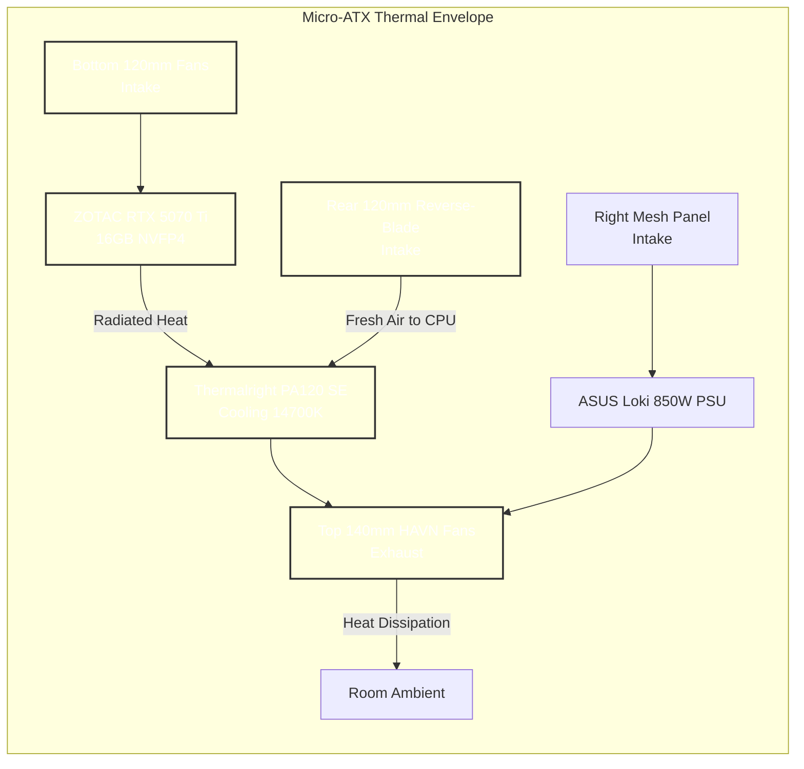
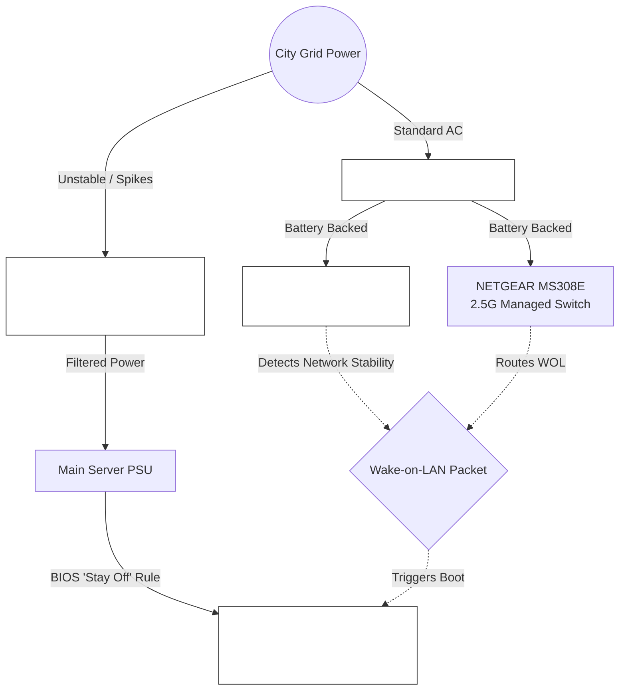

# Physical Assembly, BIOS & Bare-Metal Security

The foundational layer of the Janus cluster is physical hardware integration and low-level firmware configuration. Because consumer-grade hardware lacks the inherent physical security and thermal headroom of enterprise blade servers, these mitigations must be manually engineered into the assembly and BIOS phases.

!!! abstract "The Hardware-Firmware Boundary"
    The objective of this phase is threefold: to guarantee physical clearances within the Micro-ATX chassis, to restrict the thermal envelope of the CPU without catastrophic performance degradation, and to harden the bare-metal firmware against direct memory access (DMA) attacks and grid instability.

---

## 1. Physical Assembly Clearances (Jonsbo Z20)

Building an enterprise-grade AI cluster inside a 20-liter Micro-ATX chassis requires absolute precision. The physical layout must prioritize airflow to the RTX 5070 Ti and the 14700K simultaneously.

*   **GPU & PSU Collision:** The ZOTAC RTX 5070 Ti is exactly 303.5mm long. The ASUS ROG Loki SFX-L PSU must be mounted at the highest possible P-level in the front bracket to prevent the modular PSU cables from colliding with the GPU backplate.
*   **PSU Orientation:** The 120mm RGB fan of the Loki PSU must face the right-side mesh panel to intake fresh, ambient air from outside the case.
*   **NVMe Thermal Armor:** The 2TB FireCuda 530 must be installed in the top M2_1 slot. Use the motherboard's built-in silver heatsink rather than a third-party one to ensure perfect clearance under the Thermalright PA120 SE CPU cooler.

### 🌬️ Thermal Airflow Logic

To prevent the 14700K from inhaling the RTX 5070 Ti's exhaust, we utilize a positive-pressure, bottom-to-top airflow design with a dedicated rear intake.

---

## 2. BIOS Thermal Tuning (Taming the 14700K)

Under full load, the Intel Core i7-14700K will attempt to draw over 280W. Inside the Jonsbo Z20, this will cause the CPU to hit 100°C instantly, leading to severe thermal throttling during long AlphaEvolve training runs.

!!! tip "The Undervolting Strategy"
    Undervolting allows the CPU to maintain significantly higher clock speeds and push more instructions while remaining trapped safely beneath your wattage ceiling. You claw back lost performance without raising ambient case temperatures.

**Implementation Protocol:**
1.  **Boot into the ASRock BIOS** (F2 or DEL).
2.  **Power Cap:** Navigate to `OC Tweaker -> CPU Configuration`. Hard-cap **PL1 and PL2 to 180W**.
3.  **Undervolting:** Navigate to the `Voltage Configuration` menu. Apply a **Negative Core Voltage Offset** (Start with -0.050V and test for stability using stress tests before moving to production).

---

## 3. BIOS Virtualization & IOMMU

To pass the RTX 5070 Ti directly to the Kubernetes VM, hardware virtualization must be absolutely unrestricted at the bare-metal level.

1.  Navigate to `Advanced -> CPU Configuration`. Enable **Intel Virtualization Technology (VT-x)**.
2.  Navigate to `Advanced -> System Agent (SA) Configuration`. Enable **VT-d (Intel IOMMU)**.

---

## 4. Bare-Metal Anti-Theft Mitigations

Because consumer motherboards lack enterprise RAM encryption (like Intel MKTME or AMD SME), physical mitigations are required to prevent data extraction from a running server.

!!! warning "Zero-Trust Physical Layer"
    If an attacker gains physical access to a running machine, they can use specialized PCIe hardware to scrape decryption keys directly from the RAM.

*   **Disable Unused DMA Vectors:** In the BIOS Advanced menus, explicitly disable any unused PCIe slots, secondary M.2 slots, and unused internal USB headers. This prevents a thief from plugging in a Direct Memory Access (DMA) device.
*   **Chassis Intrusion Header:** (Optional but recommended). Connect the Jonsbo side-panel switch to the ASRock motherboard's Chassis Intrusion pins. Later, this can be tied to a Proxmox trigger to immediately kill power or wipe RAM if the case is opened while armed.

---

## 5. Surge Protection & The "Stay Off" Protocol

Without a UPS on the main compute node, the server is highly vulnerable to massive voltage spikes that occur when the city grid restores power after an outage.

### 🔌 Power & Recovery Topology

### Protocol Implementation

1.  **Hardware Protection:** Do not plug the server into the wall or a cheap power strip. Use a dedicated high-end surge protector. The MOVs inside will sacrifice themselves to absorb grid spikes before they hit the ASUS Loki PSU.
2.  **The BIOS "Stay Off" Rule:** When the grid comes back online, power is often "dirty". The server must not attempt to boot into this chaos.
    *   In the ASRock BIOS, navigate to `Advanced -> ACPI Configuration`.
    *   Find **Restore on AC/Power Loss** and set it strictly to **Power Off**.
3.  **The WOL Handoff:** The NETGEAR MS308E must be plugged into the Eaton UPS alongside the NUC. This ensures the network path remains alive. Once grid power returns and the NUC verifies network stability, it securely issues the Wake-on-LAN packet to safely awaken the AI cluster.
