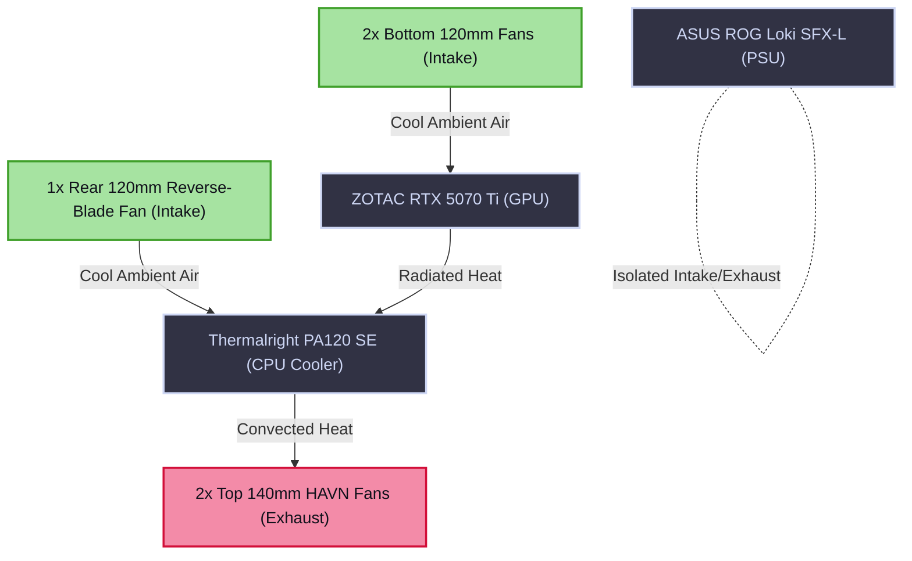

# Physical Assembly, BIOS Configuration, and Bare-Metal Security

The foundational layer of the Janus cluster is physical hardware integration and low-level firmware configuration. Because consumer-grade hardware lacks the inherent physical security and thermal headroom of enterprise blade servers, these mitigations must be manually engineered into the assembly and BIOS phases.

!!! abstract "The Hardware-Firmware Boundary"
    The objective of this phase is threefold: to guarantee physical clearances within the Micro-ATX chassis, to restrict the thermal envelope of the CPU without catastrophic performance degradation, and to harden the bare-metal firmware against direct memory access (DMA) attacks and grid instability.

---

## 1. Physical Assembly and Spatial Constraints

The **Jonsbo Z20** is a highly compact Micro-ATX chassis. Integrating high-wattage components within this volume requires strict adherence to spatial clearances and forced-convection airflow logic.

### 1.1 Internal Component Clearances

- **GPU to Power Supply Interface:** The ZOTAC RTX 5070 Ti measures exactly 303.5mm in length. To accommodate this, the **ASUS ROG Loki SFX-L** Power Supply Unit (PSU) must be mounted at the highest possible vertical position (P-level) on the front bracket. Failure to do so will result in a hard physical collision between the PSU cables and the GPU backplate.
- **PSU Intake Orientation:** The 120mm RGB intake fan of the Loki PSU must face the right-side mesh panel. This ensures the power supply draws fresh ambient air from outside the chassis, rather than recirculating hot exhaust generated by the GPU.
- **NVMe Thermal Management:** The primary 2TB FireCuda 530 NVMe drive must be installed in the motherboard's top `M2_1` slot directly connected to the CPU PCIe lanes. It is critical to utilize the motherboard's built-in silver heatsink rather than third-party aftermarket armor to ensure adequate vertical clearance beneath the **Thermalright PA120 SE** dual-tower CPU cooler.

### 1.2 Thermal Dissipation and Airflow Logic

The system utilizes a bottom-to-top convection-assisted airflow pattern, designed to sweep heat away from the GPU and push it through the CPU cooler.

---

## 2. BIOS Thermal Tuning and Undervolting

Under unrestricted workloads, the Intel Core i7-14700K will attempt to draw over 280 watts of power. Within the constrained volume of the Jonsbo Z20, this will result in instantaneous thermal throttling (reaching 100°C), drastically reducing the frequency of both P-Cores and E-Cores.

To resolve this, we manipulate the processor's Voltage/Frequency (V/F) curve via the ASRock UEFI BIOS.

### 2.1 Implementing the Power Ceiling

1. Boot into the ASRock BIOS (using `F2` or `DEL`).
2. Navigate to `OC Tweaker -> CPU Configuration`.
3. Hard-cap both **PL1 (Long Duration Power Limit)** and **PL2 (Short Duration Power Limit)** strictly to **180W**. This establishes the absolute maximum thermal dissipation required by the PA120 SE cooler.

### 2.2 Core Voltage Offset (Undervolting)

By reducing the voltage supplied to the CPU at a given frequency, we increase the processor's electrical efficiency.
- Navigate to the **Voltage Configuration** menu.
- Apply a **Negative Core Voltage Offset** (Begin with `-0.050V` and conduct Prime95/Cinebench stability testing).
- **Result:** The CPU utilizes less power per clock cycle. Under the strict 180W PL1/PL2 ceiling, this thermal headroom allows the processor to maintain significantly higher boost frequencies for longer durations, clawing back performance while maintaining safe ambient case temperatures.

---

## 3. Virtualization and IOMMU Preparation

To achieve bare-metal performance for the AI inference models running inside the Kubernetes cluster, the RTX 5070 Ti must be passed entirely through the hypervisor directly to the Talos Linux virtual machine.

This requires unrestricted hardware virtualization access at the firmware level.

1. Navigate to `Advanced -> CPU Configuration` and enable **Intel Virtualization Technology (VT-x)**. This allows the Proxmox host to execute multiple operating systems simultaneously.
2. Navigate to `Advanced -> System Agent (SA) Configuration` and enable **VT-d (Intel IOMMU)**. Input-Output Memory Management Unit (IOMMU) is the critical hardware component that maps device memory addresses (from the GPU) to the virtualized memory space of the VM, enabling direct PCIe passthrough.

---

## 4. Bare-Metal Anti-Theft Mitigations

!!! danger "Direct Memory Access (DMA) Vulnerability"
    Consumer-grade motherboards typically lack enterprise memory encryption features like Intel MKTME. Consequently, if an adversary gains physical access to a powered-on server, they can utilize a malicious PCIe device to perform a Direct Memory Access (DMA) attack, scraping cryptographic keys directly from the DDR5 RAM without OS interaction.

To mitigate physical extraction vectors:

- **Disable Unused DMA Vectors:** Within the BIOS `Advanced` menus, explicitly disable all unpopulated PCIe slots, secondary M.2 slots, and unused internal USB headers. This prevents the insertion of unauthorized DMA hardware (such as a PCIe screamer) while the system is running.
- **Chassis Intrusion Header:** Connect the Jonsbo Z20 side-panel micro-switch to the ASRock motherboard's Chassis Intrusion pins. In the operational phase, this will be bound to a Proxmox trigger designed to immediately cut system power or wipe RAM upon unauthorized chassis opening.

---

## 5. Surge Protection and The "Stay Off" Protocol

Because the primary compute node operates without a UPS, it is highly vulnerable to the massive voltage transients (spikes) that occur when the municipal electrical grid restores power following a blackout.

### 5.1 Hardware Surge Mitigation
The server must never be connected directly to a wall outlet or standard power strip. It mandates a dedicated, high-end surge protector (e.g., *Brennenstuhl Premium-Protect-Line*, rated for >60,000A). The internal Metal Oxide Varistors (MOVs) will sacrifice themselves to absorb grid spikes before they reach the ASUS Loki PSU.

### 5.2 The Firmware "Stay Off" Rule

When grid power is initially restored, the electrical frequency is often "dirty" and fluctuating. The server must not attempt an automated boot into this chaotic current.

1. In the ASRock BIOS, navigate to `Advanced -> ACPI Configuration`.
2. Locate the `Restore on AC/Power Loss` directive and set it strictly to **Power Off**.
3. **Network Topology Requirement:** The **NETGEAR MS308E** switch must be powered by the Eaton UPS alongside the NUC Edge-Node. This guarantees that during an outage, the local area network remains active.
4. **Result:** When grid power returns, the main server receives current but remains dormant. It will only initiate its boot sequence once the grid stabilizes and the UPS-backed NUC Edge-Node transmits a cryptographic Wake-on-LAN (WoL) packet.
