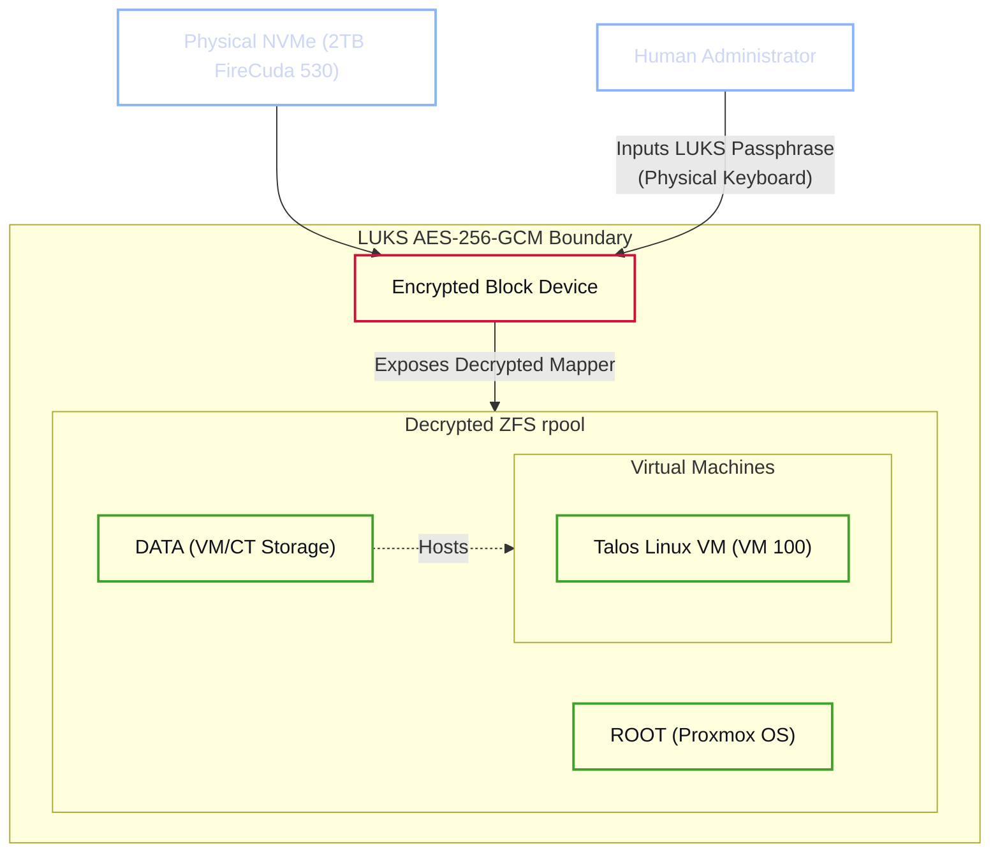

# Debian Substrate, LUKS Encryption & Proxmox Sideloading

The physical hardware of the Janus cluster is abstracted by Proxmox Virtual Environment (VE). However, the deployment of this layer has undergone a critical architectural shift. To ensure maximum cryptographic stability and performance, Proxmox is no longer installed as a standalone appliance via the official ISO. Instead, it is sideloaded onto a hardened Debian Linux substrate.

!!! abstract "The Zero-Trust Bare Metal Mandate"
    The governing security principle for this layer is **Absolute Minimalism**. By utilizing a Debian 13 (Trixie) base, we establish a "Zero-Trust Bare Metal" environment where the cryptographic boundary is enforced at the block level via LUKS (Linux Unified Key Setup). This substrate exists solely to maintain the encrypted volume and provide the necessary kernel hooks for the Proxmox hypervisor.

---

## 1. Hypervisor Provisioning (The Debian Substrate)

The installation of the hypervisor must follow a rigorous procedure to establish the primary cryptographic boundary. While Proxmox 9.1 supports ZFS, we deliberately avoid the native ZFS encryption implementation in favor of block-level LUKS encryption.

### 1.1 The Rationale: Avoiding OpenZFS Native Encryption

Current upstream stability audits of OpenZFS (specifically within the Proxmox 9.1/Debian 13 ecosystem) have identified critical failure modes when utilizing native ZFS encryption:

1. **Memory-Pressure Deadlocks:** High-intensity I/O operations under significant memory pressure—common during Large Language Model (LLM) inference offloading—can trigger kernel deadlocks when ZFS must handle both encryption and compression logic simultaneously.
2. **Broken Replication:** Proxmox's native `zfs send/receive` replication protocols exhibit inconsistent behavior when handling encrypted datasets, occasionally resulting in state-corruption during automated snapshots.

By pivoting to **LUKS (dm-crypt)**, we offload the cryptographic overhead to a mature, kernel-level block mapper (AES-256-GCM), allowing ZFS to operate as a high-performance, unencrypted filesystem *within* a secure container.

### 1.2 Provisioning Sequence

1. **Boot Media:** Initialize the system using the `debian-live-13.4.0-amd64-standard.iso`.
2. **Manual Partitioning:** Utilize the Debian manual partitioner to target the primary 2TB FireCuda 530 NVMe (`nvme0n1`).
3. **LUKS Container Establishment:** Create a LUKS encrypted partition spanning the device.
    * **Algorithm:** AES-256-GCM.
    * **Key Derivation:** Argon2id (High-entropy passphrase).
4. **ZFS rpool Initialization:** Format an unencrypted ZFS storage pool (`rpool`) *inside* the unlocked LUKS mapper device (`/dev/mapper/nvme0n1_crypt`). This ensures that ZFS provides bit-rot protection and CoW snapshots, while LUKS handles the cryptographic boundary.

---

## 2. Proxmox Sideloading (The Transformation)

Once the Debian substrate is established and the encrypted `rpool` is mounted, the host must be "morphed" into a Proxmox hypervisor. This is achieved via the Command Line Interface (CLI) by integrating the official Proxmox repositories.

### 2.1 Repository Integration

Inject the Proxmox VE 9.x (Trixie) repository into the system's package manager:

```bash
echo "deb [arch=amd64] http://download.proxmox.com/debian/pve trixie pve-no-subscription" > /etc/apt/sources.list.d/pve-install-repo.list
wget https://enterprise.proxmox.com/proxmox-release-trixie.gpg -O /etc/apt/trusted.gpg.d/proxmox-release-trixie.gpg
```

### 2.2 Hypervisor Installation

Execute the transformation by updating the package index and installing the core Proxmox suite:

```bash
apt update && apt full-upgrade
apt install proxmox-ve postfix open-iscsi
```

Upon completion, the system will transition from a standard Debian host to a Type-1 hypervisor, retaining the LUKS-level encryption established during the substrate provisioning.

---

## 3. Cryptographic Architecture Diagram

The following architecture defines the revised cryptographic boundary. The LUKS layer acts as a transparent filter for the underlying ZFS pool.



---

## 4. The Human-in-the-Loop Decryption Protocol

If the main server experiences a power failure, a kernel panic, or physical theft, the hardware reverts to a functionally inert state. Upon booting, the system will halt at the GRUB/initramfs stage, awaiting the LUKS passphrase to unlock the container.

!!! danger "Strict Prohibition on Remote Decryption"
    It is common in homelab environments to bypass physical unlock requirements by installing remote decryption daemons (e.g., `dropbear-initramfs` over SSH). **This practice is strictly prohibited within the Janus Safe-Stack.**

    Automating the transmission of the LUKS decryption key across the network fundamentally violates the "Zero-Trust Bare Metal" mandate. You must accept the operational friction of a "Human-in-the-Loop" requirement for cold boots. If the server chassis is compromised or stolen, the inability to remotely unlock the drive guarantees the absolute cryptographic security of the underlying AI weights and personal vector databases.

Once the passphrase is provided via a directly attached physical keyboard, the kernel unlocks the LUKS container, mounts the internal ZFS datasets, and exposes the Proxmox Web Management Interface on port `8006`.
