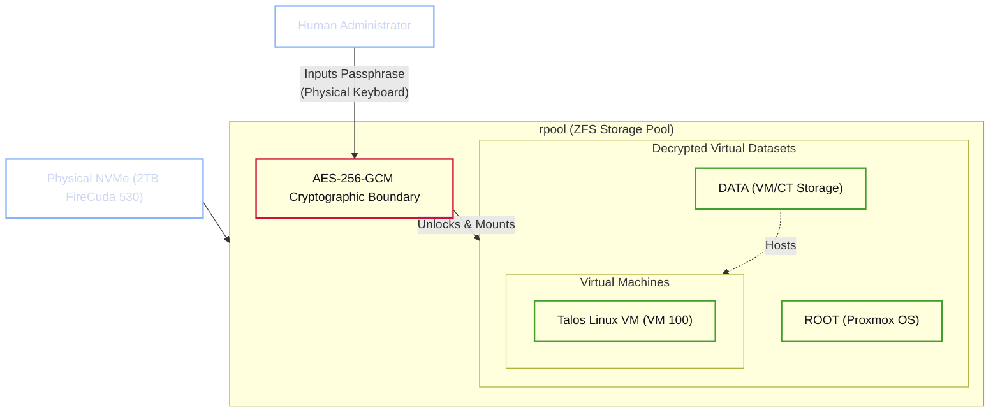

# Proxmox Base Installation and Cryptographic Boundaries

The physical hardware of the Janus cluster is abstracted by Proxmox Virtual Environment (VE). This layer serves as the absolute foundational bedrock of the software stack. Its primary responsibilities are strictly limited to hardware orchestration, input/output (I/O) routing, and enforcing cryptographic boundaries.

!!! abstract "The Zero-Trust Bare Metal Mandate"
    Proxmox VE is a Type-1 hypervisor based on Debian Linux. The governing security principle for this layer is **Absolute Minimalism**. No secondary software, Docker containers, or user-space applications may be installed directly on this host. It exists solely to hold the ZFS encryption keys and allocate bare-metal resources to the overlying virtual machines.

---

## 1. Hypervisor Provisioning

The installation of the hypervisor must follow a strict cryptographic procedure. By default, standard Linux filesystems (e.g., `ext4` or `xfs`) do not provide the necessary data integrity or native encryption required by the "Crash-Safe" philosophy.

During the Proxmox installation wizard, the target filesystem must be explicitly overridden.

### 1.1 ZFS Native Encryption Implementation

1. **Filesystem Selection:** The target hard disk (2TB FireCuda 530 NVMe) must be configured with **`zfs (RAID0)`**. Despite operating on a single-drive topology where standard RAID redundancy is inapplicable, ZFS is mandatory. It provides block-level checksumming, bit-rot detection, and Copy-on-Write (CoW) snapshot capabilities critical for atomic state recovery.
2. **Cryptographic Algorithm:** Within the Advanced Options, **ZFS Native Encryption** must be enabled utilizing the AES-256-GCM cipher suite. This ensures that all data blocks are encrypted at rest with hardware-accelerated Galois/Counter Mode, incurring near-zero performance overhead on the i7-14700K.
3. **Key Derivation:** The encryption key format must be set to **Passphrase**. A high-entropy password is required to derive the master decryption key.

### 1.2 Cryptographic Architecture Diagram

The following architecture defines the cryptographic boundary established during installation. All virtual machines and their subsequent data layers exist entirely within the encrypted dataset.

---

## 2. The Human-in-the-Loop Decryption Protocol

If the main server experiences a power failure, a kernel panic, or physical theft, the hardware reverts to a functionally inert state. Upon booting, the Pre-boot Execution Environment (PXE) and bootloader will halt at a terminal prompt, awaiting the ZFS passphrase to unlock the `rpool`.

!!! danger "Strict Prohibition on Remote Decryption"
    It is common in homelab environments to bypass physical unlock requirements by installing remote decryption daemons (e.g., `dropbear-initramfs` over SSH). **This practice is strictly prohibited within the Janus Safe-Stack.**

    Automating the transmission of the ZFS decryption key across the network fundamentally violates the "Zero-Trust Bare Metal" mandate. You must accept the operational friction of a "Human-in-the-Loop" requirement for cold boots. If the server chassis is compromised or stolen, the inability to remotely unlock the drive guarantees the absolute cryptographic security of the underlying AI weights and personal vector databases.

Once the passphrase is provided via a directly attached physical keyboard, the hypervisor unlocks the SSD, mounts the internal datasets, and exposes the Proxmox Web Management Interface on port `8006`.
