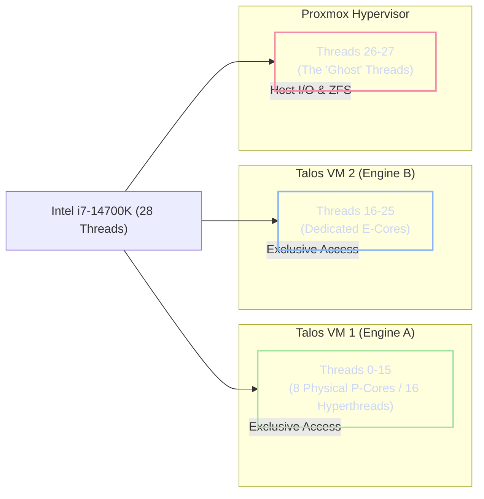

# Proxmox Kernel and Hypervisor Optimization

While Proxmox Virtual Environment provides an excellent orchestration baseline, its default kernel behaviors are optimized for general-purpose enterprise computing rather than high-performance Artificial Intelligence inference. If left unconfigured, the hypervisor's default memory management and CPU scheduling algorithms will actively sabotage the deterministic latency required by the Janus "Dual-Engine" stack.

!!! abstract "The Principle of Isolation"
    The hypervisor must be forcibly constrained. It exists solely to manage I/O and encryption; therefore, we must enact strict resource fencing to prevent the host OS from consuming memory bandwidth or interrupting the CPU cache coherence of the AI inference virtual machines.

---

## 1. Taming the ZFS Adaptive Replacement Cache (ARC)

By default, the ZFS filesystem will eagerly allocate up to 50% of the host's total system memory (64GB out of 128GB) to the Adaptive Replacement Cache (ARC) to accelerate disk reads.

!!! danger "Out-Of-Memory (OOM) Cascades"
    If ZFS is permitted to consume 64GB of RAM, loading a quantized 70B parameter model (which requires ~35GB of DDR5 offload) will trigger a catastrophic collision. The Linux kernel will attempt to rapidly evict the ARC to free memory, causing massive PCIe bus latency spikes, context switching overhead, and ultimately an OOM kernel panic.

To resolve this, we must statically bound the ARC size.

### 1.1 ARC Hard-Limiting Implementation

Because the KVM process strictly locks 84GB of physical RAM, the default ZFS ARC behavior will attempt to claim the remaining memory, immediately triggering a host-level Out-Of-Memory (OOM) panic. We must strictly bound the ARC to operate within a deterministic 2GB to 8GB window.

1. Create or edit the ZFS modprobe configuration file:
   ```bash
   sudo nano /etc/modprobe.d/zfs.conf
   ```

2. Append both the minimum (2GB) and maximum (8GB) physical byte limits:
   ```bash
   # Enforce a 2GB floor and 8GB ceiling for ZFS ARC to prevent KVM/OOM collisions
   options zfs zfs_arc_min=2147483648
   options zfs zfs_arc_max=8589934592
   ```

3. Update the initramfs to apply the kernel hook during early boot:
   ```bash
   sudo update-initramfs -u -k all
   ```

4. Reboot the host.


---

## 2. The Swap Destruction Protocol

In standard Linux environments, when physical memory is exhausted, the kernel initiates "swapping"—paging memory blocks to the underlying storage drive.

In the context of Large Language Models, paging a 40GB neural network to a consumer-grade NVMe drive introduces severe complications:
1. **Latency:** PCIe 4.0 NVMe speeds (~7GB/s) are astronomically slower than DDR5 bandwidth (~70GB/s). Inference will effectively freeze.
2. **Endurance Destruction:** Continuous paging of 40GB tensor matrices will exhaust the Total Bytes Written (TBW) endurance rating of the FireCuda 530 SSD within weeks.

We must explicitly instruct the system to instantly OOM-kill (crash) a misconfigured AI pod rather than engage in destructive NVMe thrashing.

### 2.1 Disabling the Paging File

1. Immediately disable active swapping: `swapoff -a`
2. Remove the logical volume dedicated to swap: `lvremove /dev/pve/swap`
3. Edit the filesystem table (`/etc/fstab`) and comment out any line referencing a swap partition to ensure it does not remount on reboot.

---

## 3. Strict Hypervisor Hardware Boundaries

To achieve bare-metal performance, the hypervisor must be physically walled off from the virtualized Kubernetes nodes.

### 3.1 Memory Partitioning

Proxmox is strictly allocated a **12 GB memory envelope**: 8 GB for the ZFS ARC, and 4 GB for the underlying Debian OS and routing overhead. The remaining 112 GB is passed directly to the virtual machines (88 GB for the Tensor Worker and 24 GB for the Brain Worker). This exact partitioning leaves a 4 GB unallocated hardware buffer on the host, preventing out-of-memory kernel panics during sudden hypervisor I/O spikes.

### 3.2 Host-Level 1GB Hugepage Pre-Allocation

To achieve zero-fragmentation memory fetching for the 35GB LLM weights, the Proxmox host must lock physical memory into massive 1GB blocks *before* the Talos guest OS boots.

1. Edit the host GRUB configuration (`/etc/default/grub`).
2. Append the following kernel parameters to physically lock exactly 84GB of RAM (reserving the entire memory footprint of VM 1 to match the QEMU backend request):
   ```bash
   GRUB_CMDLINE_LINUX_DEFAULT="... default_hugepagesz=1G hugepagesz=1G hugepages=84"
   ```
3. Update GRUB and reboot. The Proxmox host will now mount exactly 84 contiguous 1GB pages at `/dev/hugepages`, ensuring VM 1 boots with pristine, TLB-optimized memory.

### 3.3 Deterministic CPU Shielding (Core Pinning)

The Intel Core i7-14700K features 20 physical cores yielding 28 logical threads (indexed 0-27). Standard Linux CPU schedulers constantly migrate tasks across these cores, ruining L2/L3 cache locality and introducing micro-stutters. We enforce strict hardware isolation via CPU affinity (taskset pinning).



#### Implementing "Ghost" Thread Isolation

Threads 26 and 27 are explicitly reserved as "Ghost Threads" for the host. We must restrict the Proxmox OS from scheduling any background tasks on threads 0-25 to prevent interference with AI inference cycles.

1. Edit the systemd configuration file: `/etc/systemd/system.conf`
2. Define the CPU affinity: `CPUAffinity=26 27`
3. Reboot the host. The hypervisor is now physically walled off, utilizing only these two E-cores for LUKS encryption overhead and 2.5G network I/O.

## 4. Post-Boot Hardware Sanitization

Once the main OS is actively booting, several low-level conflicts must be permanently neutralized to stabilize the hardware prior to launching the inference engines.

### 4.1 Systemd Path Conflict Resolution

Debian installers often leave overlapping or relative ZFS paths in the filesystem table. `systemd` generators strictly require absolute paths. Failure to resolve this causes a fatal `chase.c` abort during boot.

* Edit `/etc/fstab` and **comment out** any lines referencing a swap partition or relative ZFS datasets (e.g., `rpool/ROOT/debian`).

### 4.2 Silencing ZFS ACL Journal Errors

To satisfy systemd logging and prevent excessive journald errors on the root filesystem, permanently flip the POSIX ACL property on the ZFS OS dataset:

```bash
sudo zfs set acltype=posixacl rpool/ROOT/debian
```

### 4.3 The Silent Hardware Panic (GPU Blacklist)

Even with `nomodeset` enabled, `systemd-udevd` actively probes the PCIe bus. When it detects the RTX 5070 Ti, it attempts to attach the open-source `nouveau` driver. On Blackwell GPUs, this causes an instantaneous, silent kernel panic. The host OS must explicitly blacklist this driver.

```bash
echo -e "blacklist nouveau\noptions nouveau modeset=0" | sudo tee /etc/modprobe.d/blacklist-nouveau.conf
sudo update-initramfs -u -k all
```
