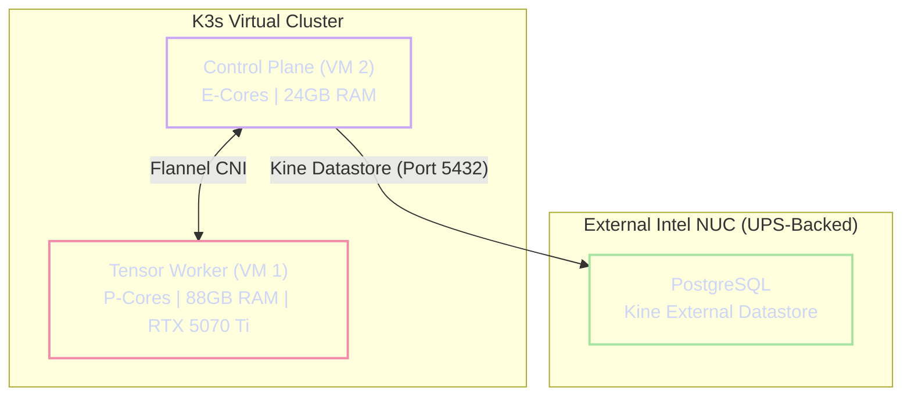

# Virtualization and Kubernetes Topology

The Janus architecture discards traditional, bloated Linux distributions (e.g., Ubuntu Server) in favor of **Talos Linux**—a modern, API-driven, immutable operating system designed exclusively to host Kubernetes.

!!! abstract "The Immutable OS Advantage"
    Talos Linux contains no SSH daemon, no interactive console, and no mutable root filesystem. This architecture serves two critical functions:
    1. **Resource Maximization:** Talos idles at under 500MB of RAM, reserving maximum physical memory for the AI Tensor matrices.
    2. **Attack Surface Reduction:** The lack of shell access drastically hardens the system against intrusion, enforcing strict declarative infrastructure management via its gRPC API.

---

## 1. Asymmetrical Hardware Slicing

The virtualization layer is divided into two highly specialized Virtual Machines, mapping directly to the underlying P-Core/E-Core physical topology of the Intel i7-14700K.

### 1.1 The Tensor Worker (VM 1)
**Role:** AI Inference, Hardware Acceleration, and Heavy Compute.

* **CPU:** 16 Virtual Cores. The CPU type must be set to `host` to expose Intel AVX2 and native topology instructions to the guest OS. While this VM is strictly pinned to the 8 physical P-Cores, provisioning 16 vCPUs ensures the Talos guest scheduler fully utilizes all 16 hyperthreaded execution paths (Threads 0-15) during llama.cpp parallel verification passes.
* **Memory:** **88 GB DDR5**. Memory ballooning must be disabled. This strict allocation is mathematically partitioned: **84 GB** is physically locked to the `hugetlbfs` KVM backend to house the zero-fragmentation AI weights, leaving exactly **4 GB** of standard pageable RAM for the Talos Linux kernel, `containerd`, and the Kubernetes Kubelet overhead.
* **Storage:** $1.2\text{ TiB}$ ($1228\text{ GiB}$), split into a **$30\text{ GiB}$** OS disk (ZVOL with `16K` block size) and an **$1198\text{ GiB}$** AI Data Disk (ZVOL with `1M` block size). This AI Data Disk is mounted strictly to VM 1 to host model weights (GGUFs), maximizing sequential read performance.
  *Architectural Note on Capacity:* A physical $2\text{ TB}$ Seagate FireCuda drive yields exactly $1862\text{ GiB}$ of formatted, usable space. With $1228\text{ GiB}$ provisioned to the Tensor Worker (VM 1), $100\text{ GiB}$ to the Brain Worker (VM 2), and $100\text{ GiB}$ reserved for the Proxmox hypervisor substrate, the system consumes $1428\text{ GiB}$. This leaves an exact unallocated ZFS buffer of **$434\text{ GiB}$**. This $434\text{ GiB}$ buffer is strictly maintained to preserve high SSD write endurance and accommodate future Talos system snapshotting without saturating the drive.
* **PCIe Passthrough:** The ZOTAC RTX 5070 Ti is passed through directly. Parameters `All Functions`, `ROM-Bar`, and `PCI-Express` must be checked to enable the NVIDIA drivers within the guest container.

### 1.1.a GPU Time-Slicing Configuration
Because Engine A and Engine B operate as discrete Pods that both require hardware acceleration, the standard NVIDIA device plugin will cause a scheduling deadlock. To permit both pods to share the RTX 5070 Ti simultaneously, a Time-Slicing `ConfigMap` must be deployed to the cluster prior to inference initialization:

```yaml
apiVersion: v1
kind: ConfigMap
metadata:
  name: nvidia-device-plugin-config
  namespace: kube-system
data:
  config.yaml: |
    version: v1
    flags:
      migStrategy: "none"
    sharing:
      timeSlicing:
        resources:
          - name: nvidia.com/gpu
            replicas: 2 # Exposes the single GPU as two logical devices
```

### 1.2 The Brain & Memory Worker (VM 2)
**Role:** Kubernetes Control Plane, Orchestration, and Stateful Proxies.

* **CPU:** 10 Virtual Cores. This VM is strictly pinned to the dedicated physical E-Cores (Threads 16-25).
* **Memory:** 24 GB DDR5. Memory ballooning must be disabled.
* **Storage:** **100 GiB**. Formatted with `volblocksize=64K` to host the embedded LanceDB database files (Recall & Archival memory), permitting Rig to execute zero-copy `io_uring` queries locally while heavy transactional database logs are offloaded to ClickHouse on the external Intel NUC to preserve NVMe endurance.


---

## 2. Kubernetes Cluster Architecture (K3s)

Once Talos Linux is bootstrapped across both VMs, the K3s cluster is initialized. VM 2 operates as the Control Plane and a general-purpose worker node, while VM 1 joins exclusively as an accelerated worker node.



### 2.1 The Taint Firewall

To prevent background telemetry or orchestration pods from stealing CPU cycles from the inference engines, the Tensor Worker (VM 1) must be isolated via Kubernetes Taints.

!!! danger "Enforcing the Taint Boundary"
    VM 1 must be tainted with `gpu=true:NoSchedule`. This acts as an internal cluster firewall.

    Any pod that legitimately requires hardware acceleration (e.g., Engine A, Engine B, or multimodal MCP pods) **MUST** explicitly define a matching `toleration` within its deployment manifest. Pods lacking this toleration will sit in a `Pending` state indefinitely rather than schedule on the Tensor Worker.

### 2.2 Kine External Datastore Resilience and Healing

Because the primary workstation lacks an Uninterruptible Power Supply (UPS) (adhering to the "Crash-Safe" philosophy), an abrupt power loss during a database write could corrupt the Kubernetes cluster state.

To prevent local NVMe write-amplification and eliminate the need for local `etcd` WAL writes or volatile RAM-backed `tmpfs` workarounds, K3s is configured to utilize the **Kine translation layer**. Kine redirects all Kubernetes API state transactions over the 2.5Gbps symmetric network to a PostgreSQL instance hosted on the UPS-backed Intel NUC.

1. **State Backup and Durability:** Since the state database resides on the UPS-backed NUC, it is protected from sudden power outages on the main compute node. The database itself is backed up automatically, eliminating the need for complex local etcd snapshot/restore scripts.
2. **Reconciliation on Boot:** Upon recovering from a power loss, the primary node's K3s control plane reconnects to the external Kine datastore on the NUC. ArgoCD reconciles the cluster to the target state defined in the Git repository, ensuring the system self-heals and resumes AI workloads automatically.

---

## 3. KVM Hugepage Passthrough (The TLB Fix)

Memory management is a coordinated **Dual-Layer Allocation**. To prevent TLB thrashing during inference, the Proxmox host locks physical RAM to back the VM via KVM passthrough, and the Talos guest OS simultaneously registers the 1GB hugepages via kernel command line so the Kubernetes Kubelet can allocate them to the inference pods.

* **The KVM & Affinity Hook:** In the Proxmox VM configuration file (`/etc/pve/qemu-server/100.conf`), append both the memory-backing argument and the explicit physical thread affinity:
  ```bash
  args: -object memory-backend-file,id=ram-node0,size=84G,mem-path=/dev/hugepages,share=yes -numa node,nodeid=0,cpus=0-15,memdev=ram-node0
  affinity: 0-15
  ```

  The `affinity: 0-15` parameter is mandatory. It physically locks the VM's virtual cores to the 8 physical P-Cores of the i7-14700K, ensuring true hardware-level isolation from the orchestration E-Cores.
