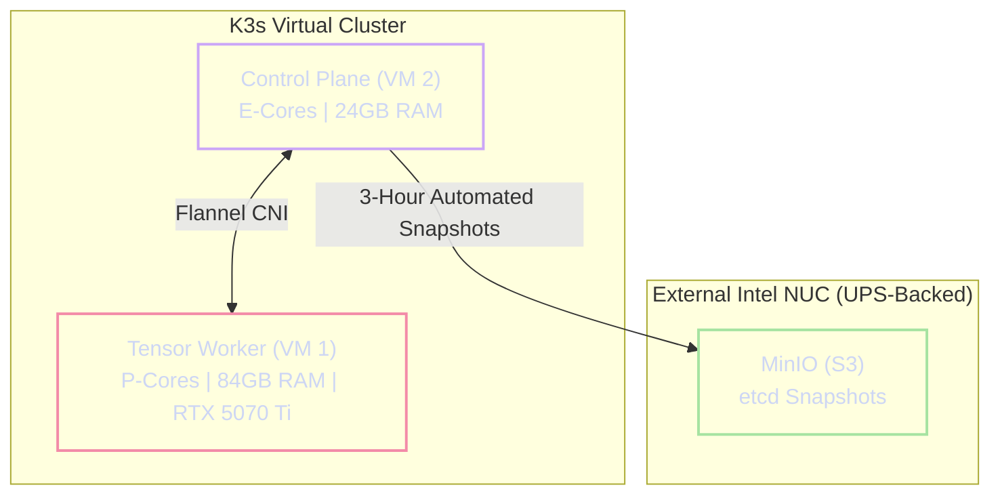

# Virtualization and Kubernetes Topology

The Janus architecture discards traditional, bloated Linux distributions (e.g., Ubuntu Server) in favor of **Talos Linux**—a modern, API-driven, immutable operating system designed exclusively to host Kubernetes.

!!! abstract "The Immutable OS Advantage"
    Talos Linux contains no SSH daemon, no interactive console, and no mutable root filesystem. This architecture serves two critical functions:
    1. **Resource Maximization:** Talos idles at under 500MB of RAM, reserving maximum physical memory for the AI Tensor matrices.
    2. **Attack Surface Reduction:** The lack of shell access drastically hardens the system against intrusion, enforcing strict declarative infrastructure management via its gRPC API.

---

## 1. Asymmetrical Hardware Slicing

The virtualization layer is divided into two highly specialized Virtual Machines, mapping directly to the underlying P-Core/E-Core physical topology of the Intel i7-14700K.

### 1.1 The Tensor Worker (VM 1)
**Role:** AI Inference, Hardware Acceleration, and Heavy Compute.

* **CPU:** 16 Virtual Cores. The CPU type must be set to `host` to expose Intel AVX2 and native topology instructions to the guest OS. While this VM is strictly pinned to the 8 physical P-Cores, provisioning 16 vCPUs ensures the Talos guest scheduler fully utilizes all 16 hyperthreaded execution paths (Threads 0-15) during llama.cpp parallel verification passes.
* **Memory:** **84 GB DDR5**. Memory ballooning must be disabled to prevent Proxmox from reclaiming memory during inference spikes. (This leaves an 8GB unallocated hardware buffer on the host).
* **Storage:** $1.2\text{ TiB}$ ($1228\text{ GiB}$), provisioned on a ZFS dataset configured with a 1M recordsize.
  *Architectural Note on Capacity:* A physical $2\text{ TB}$ Seagate FireCuda drive yields exactly $1862\text{ GiB}$ of formatted, usable space. With $1228\text{ GiB}$ provisioned to the Tensor Worker (VM 1), $100\text{ GiB}$ to the Brain Worker (VM 2), and $100\text{ GiB}$ reserved for the Proxmox hypervisor substrate, the system consumes $1428\text{ GiB}$. This leaves an exact unallocated ZFS buffer of **$434\text{ GiB}$**. This $434\text{ GiB}$ buffer is strictly maintained to preserve high SSD write endurance and accommodate future Talos system snapshotting without saturating the drive.
* **PCIe Passthrough:** The ZOTAC RTX 5070 Ti is passed through directly. Parameters `All Functions`, `ROM-Bar`, and `PCI-Express` must be checked to enable the NVIDIA drivers within the guest container.

### 1.2 The Brain & Memory Worker (VM 2)
**Role:** Kubernetes Control Plane, Orchestration, and Stateful Proxies.

* **CPU:** 10 Virtual Cores. This VM is strictly pinned to the dedicated physical E-Cores (Threads 16-25).
* **Memory:** 24 GB DDR5. Memory ballooning must be disabled.
* **Storage:** **100 GiB**. (Reduced from standard deployments, as heavy database write-loads are offloaded to the external Intel NUC to preserve NVMe endurance).


---

## 2. Kubernetes Cluster Architecture (K3s)

Once Talos Linux is bootstrapped across both VMs, the K3s cluster is initialized. VM 2 operates as the Control Plane and a general-purpose worker node, while VM 1 joins exclusively as an accelerated worker node.



### 2.1 The Taint Firewall

To prevent background telemetry or orchestration pods from stealing CPU cycles from the inference engines, the Tensor Worker (VM 1) must be isolated via Kubernetes Taints.

!!! danger "Enforcing the Taint Boundary"
    VM 1 must be tainted with `gpu=true:NoSchedule`. This acts as an internal cluster firewall.

    Any pod that legitimately requires hardware acceleration (e.g., Engine A, Engine B, or multimodal MCP pods) **MUST** explicitly define a matching `toleration` within its deployment manifest. Pods lacking this toleration will sit in a `Pending` state indefinitely rather than schedule on the Tensor Worker.

### 2.2 etcd Resilience and Healing

Because the primary workstation lacks an Uninterruptible Power Supply (UPS) (adhering to the "Crash-Safe" philosophy), an abrupt power loss during a high-I/O `etcd` database write can corrupt the Kubernetes cluster state.

1. K3s is configured to execute automated `etcd` snapshots every 3 hours.

   **Zero-Write Network Streaming:** These snapshots do not violate the local NVMe write-amplification ban. Utilizing the `--etcd-s3` K3s arguments, the snapshots bypass the local disk entirely and stream directly over the 2.5G network to the S3-compatible MinIO bucket hosted on the UPS-backed Intel NUC. This frequent interval protects dynamic GitOps infrastructure changes (e.g., ArgoCD ConfigMap updates) without degrading the primary SSD.
2. Upon booting, if Talos detects a corrupted `etcd` state, the `--cluster-reset` flag is invoked, pointing to the MinIO endpoint. This automatically pulls the last known good state, ensuring the cluster self-heals without manual rebuilding.

---

## 3. KVM Hugepage Passthrough (The TLB Fix)

Memory management is a coordinated **Dual-Layer Allocation**. To prevent TLB thrashing during inference, the Proxmox host locks physical RAM to back the VM via KVM passthrough, and the Talos guest OS simultaneously registers the 1GB hugepages via kernel command line so the Kubernetes Kubelet can allocate them to the inference pods.

* **The KVM Hook:** In the Proxmox VM configuration file (`/etc/pve/qemu-server/100.conf`), append the explicit memory-backing argument:
  ```bash
  args: -object memory-backend-file,id=ram-node0,size=84G,mem-path=/dev/hugepages,share=yes -numa node,nodeid=0,cpus=0-15,memdev=ram-node0
  ```
  This guarantees the Talos K3s cluster operates on a pristine, zero-fragmentation memory substrate perfectly matched to the physical hardware.
