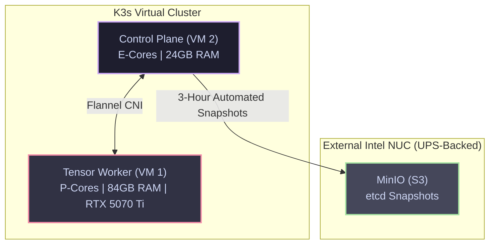

# Virtualization and Kubernetes Topology

The Janus architecture discards traditional, bloated Linux distributions (e.g., Ubuntu Server) in favor of **Talos Linux**—a modern, API-driven, immutable operating system designed exclusively to host Kubernetes.

!!! abstract "The Immutable OS Advantage"
    Talos Linux contains no SSH daemon, no interactive console, and no mutable root filesystem. This architecture serves two critical functions:
    1. **Resource Maximization:** Talos idles at under 500MB of RAM, reserving maximum physical memory for the AI Tensor matrices.
    2. **Attack Surface Reduction:** The lack of shell access drastically hardens the system against intrusion, enforcing strict declarative infrastructure management via its gRPC API.

---

## 1. Asymmetrical Hardware Slicing

The virtualization layer is divided into two highly specialized Virtual Machines, mapping directly to the underlying P-Core/E-Core physical topology of the Intel i7-14700K.

### 1.1 The Tensor Worker (VM 1)
**Role:** AI Inference, Hardware Acceleration, and Heavy Compute.

* **CPU:** 8 Virtual Cores. The CPU type must be set to `host` to expose Intel AVX2 instructions to the guest OS. This VM is strictly pinned to the physical P-Cores (Threads 0-15).
* **Memory:** **84 GB DDR5**. Memory ballooning must be disabled to prevent Proxmox from reclaiming memory during inference spikes. (This leaves an 8GB unallocated hardware buffer on the host).
* **Storage:** 500 GB, provisioned on a ZFS dataset configured with a 1M `recordsize` to optimize read-throughput for massive serialized model weights.
* **PCIe Passthrough:** The ZOTAC RTX 5070 Ti is passed through directly. Parameters `All Functions`, `ROM-Bar`, and `PCI-Express` must be checked to enable the NVIDIA drivers within the guest container.

### 1.2 The Brain & Memory Worker (VM 2)
**Role:** Kubernetes Control Plane, Orchestration, and Stateful Proxies.

* **CPU:** 10 Virtual Cores. This VM is strictly pinned to the dedicated physical E-Cores (Threads 16-25).
* **Memory:** 24 GB DDR5. Memory ballooning must be disabled.
* **Storage:** **100 GB**. (Reduced from standard deployments, as heavy database write-loads are offloaded to the external Intel NUC to preserve NVMe endurance).

---

## 2. Kubernetes Cluster Architecture (K3s)

Once Talos Linux is bootstrapped across both VMs, the K3s cluster is initialized. VM 2 operates as the Control Plane and a general-purpose worker node, while VM 1 joins exclusively as an accelerated worker node.



### 2.1 The Taint Firewall

To prevent background telemetry or orchestration pods from stealing CPU cycles from the inference engines, the Tensor Worker (VM 1) must be isolated via Kubernetes Taints.

!!! danger "Enforcing the Taint Boundary"
    VM 1 must be tainted with `gpu=true:NoSchedule`. This acts as an internal cluster firewall.

    Any pod that legitimately requires hardware acceleration (e.g., Engine A, Engine B, or multimodal MCP pods) **MUST** explicitly define a matching `toleration` within its deployment manifest. Pods lacking this toleration will sit in a `Pending` state indefinitely rather than schedule on the Tensor Worker.

### 2.2 etcd Resilience and Healing

Because the primary workstation lacks an Uninterruptible Power Supply (UPS) (adhering to the "Crash-Safe" philosophy), an abrupt power loss during a high-I/O `etcd` database write can corrupt the Kubernetes cluster state.

1. K3s is configured to execute automated `etcd` snapshots every 3 hours.
2. These snapshots are **not** stored locally. They are pushed to an S3-compatible MinIO bucket hosted on the UPS-backed Intel NUC.
3. Upon booting, if Talos detects a corrupted `etcd` state, the `--cluster-reset` flag is invoked, pointing to the MinIO endpoint. This automatically pulls the last known good state, ensuring the cluster self-heals without manual rebuilding.

---

## 3. Guest-OS Hugepage Delegation

Instead of locking Hugepages at the bare-metal Proxmox layer (which incurs a severe virtualization penalty when mounting host directories into Kubernetes pods), memory management is delegated directly to the Talos Guest OS.

When generating the `talos-machineconfig.yaml` for VM 1, kernel arguments must be explicitly appended to lock **56 GB** of memory into 1GB contiguous blocks at boot.

```yaml
machine:
  kernel:
    args:
      - default_hugepagesz=1G
      - hugepagesz=1G
      - hugepages=56
```

**The Execution Flow:** When VM 1 boots, the Talos kernel immediately locks 56 GB of its 84 GB provisioned RAM. When the primary inference engine deploys, it requests a Kubernetes volume mount using `emptyDir` configured with `medium: HugePages`, pulling pristine, zero-fragmentation memory directly from the guest operating system.
