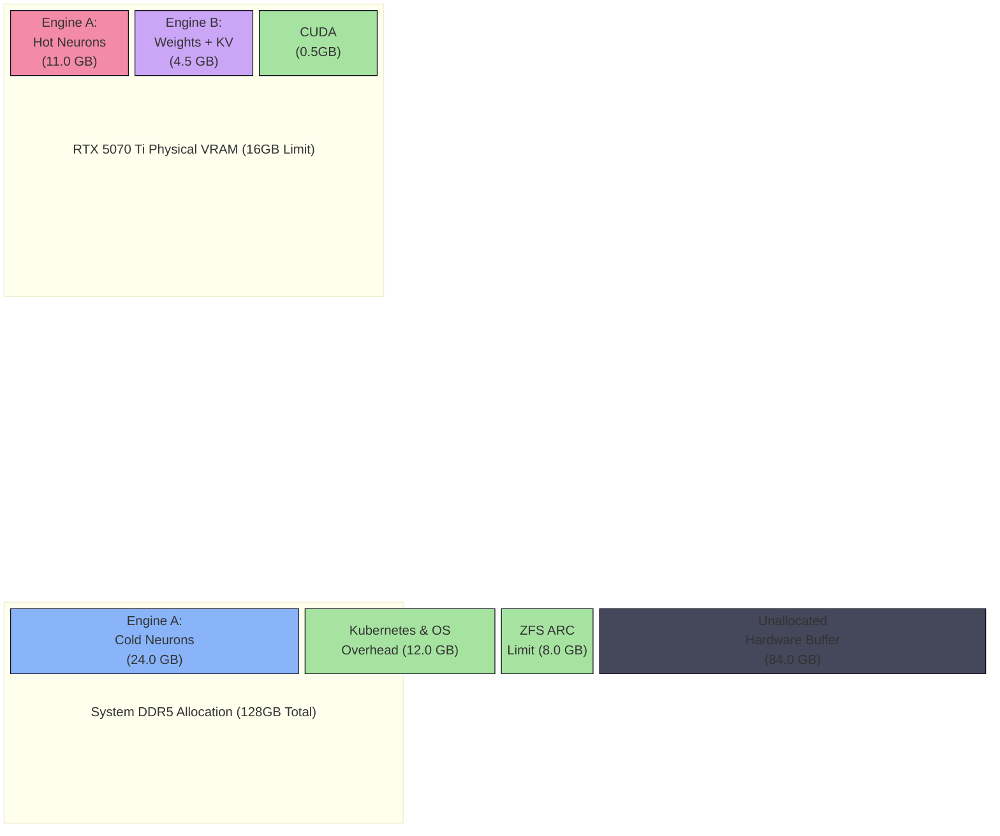

# Core AI Inference Deployment (The Dual-Engine)

The theoretical foundation of the Janus architecture relies on an asymmetric "Dual-Engine" inference topology. By orchestrating two fundamentally different inference engines across a single hardware substrate, we achieve both deep reasoning (System 2 thinking) and high-frequency reflex actions (System 1 thinking) without requiring data-center class hardware.

These engines are deployed as containerized Kubernetes Pods onto the Tensor Worker (VM 1).

---

## 1. Engine A: The Deep Orchestrator (`PowerInfer`)

Engine A is responsible for deep context analysis, multi-step planning, and complex logical deductions. It hosts a massive 70-Billion parameter language model.

Running a 70B model typically requires 140GB of VRAM (using 16-bit precision) and multi-GPU distributed inference. To compress this onto a single 16GB RTX 5070 Ti, we combine **Blackwell NVFP4 Micro-Scaling** with **Activation Sparsity**.

### 1.1 The Sparsity Shift Implementation

We utilize the `PowerInfer` inference engine to exploit the high sparsity inherent in modern LLMs (where only a small percentage of neurons are active during any given token generation).

1. **NVFP4 Quantization:** The model weights are quantized into 4-bit floating-point precision, shrinking the total footprint from ~140GB to ~35GB with negligible degradation in reasoning capability.
2. **Memory Pinning (`mlock`):** The Kubernetes Pod must be deployed with `IPC_LOCK` security capabilities. This permits the engine to execute the `mlock` syscall, permanently locking the "Cold Neurons" into the DDR5 RAM (via the Talos Hugepages) to prevent OS-level paging.
3. **Hardware Routing:** The engine is launched with a strict VRAM boundary: `--vram-capacity 11GB`.
   - PowerInfer dynamically maps the statistically active "Hot Neurons" directly into the GPU's 11GB VRAM budget for maximum PCIe bandwidth efficiency.
   - The remaining ~24GB of "Cold Neurons" are stored in the host DDR5 RAM and computed by the Intel i7-14700K's P-Cores.

---

## 2. Engine B: The Rapid Executor (`SGLang`)

Engine B is responsible for continuous tool-calling, API interaction, and rapid sub-agent execution. It hosts a specialized 7B-8B parameter model.

Unlike Engine A, which shares compute across the CPU and GPU, Engine B resides entirely within the GPU VRAM for absolute lowest-latency execution.

### 2.1 Blackwell-Native Execution (`SGLang`)

We deploy `SGLang` as the executor pod, leveraging the `nvidia-container-toolkit` for exclusive hardware access.

1. **Hardware-Native Weights:** The pod loads models natively compiled for the Blackwell architecture (e.g., `modelopt_fp4`). An 8B model natively consumes approximately 4GB of VRAM.
2. **Strict VRAM Capping:** To prevent the model's KV Cache from expanding indefinitely and crashing Engine A, the container is launched with `--mem-fraction-static`. This permanently fences Engine B into a ~4.5GB footprint.
3. **NVFP4 KV Caching:** Standard FP8 or experimental 3-bit branches are prohibited. We mandate native **NVFP4 KV Caching**, leveraging hardware micro-scaling to compress the AI's contextual short-term memory by an additional 50% without fidelity loss.

!!! danger "FlashInfer Backend Criticality"
    You must explicitly append `--fp4-gemm-backend flashinfer_cudnn` to the launch arguments. Relying on the default `flashinfer_cutlass` backend leads to severe `NaN` (Not a Number) tensor crashes under high concurrent load on consumer Blackwell GPUs.

---

## 3. The Hardware Equilibrium Model

By strictly bounding both engines, we guarantee absolute stability. The 16GB physical limit of the RTX 5070 Ti is never breached, entirely eliminating Out-of-Memory (OOM) kernel panics.

---

## 4. Storage Architecture (OpenEBS LocalPV)

Because the cluster consists of a single physical workstation, deploying complex distributed storage arrays (e.g., Longhorn or Ceph) introduces unnecessary orchestration overhead and latency. Instead, we deploy **OpenEBS LocalPV** to map host paths to Kubernetes Persistent Volumes.

!!! warning "Sacrificing GPUDirect Storage (GDS)"
    True NVIDIA Magnum IO (GPUDirect Storage) allows the GPU to bypass the CPU and RAM entirely, loading model weights directly from the physical NVMe controller.

    However, because the primary FireCuda 530 is secured at the bare-metal level via **ZFS Native Encryption**, the Proxmox kernel strictly controls the I/O path. GPUDirect Storage is therefore topologically impossible in the Janus architecture.

### 4.1 The Security Trade-Off
We deliberately sacrifice GPUDirect Storage to preserve physical data encryption. OpenEBS LocalPV utilizes standard virtualization interfaces (`virtio-blk` or `virtio-scsi`) pointing to the 1M recordsize ZFS dataset.

Reading a 35GB tensor matrix into DDR5 RAM via these standard interfaces easily saturates 3,000 to 4,000 MB/s. A cold boot of Engine A requires approximately 12 seconds (compared to 6 seconds with GDS). Once the model weights are locked into RAM and VRAM, storage speeds become entirely irrelevant, and token generation speed is completely unaffected.
