# Core AI Inference Deployment (The Dual-Engine)

The theoretical foundation of the Janus architecture relies on an asymmetric **"Dual-Engine"** inference topology. By orchestrating two fundamentally different inference engines across a single hardware substrate, we achieve both deep reasoning (System 2 thinking) and high-frequency reflex actions (System 1 thinking) without requiring costly, enterprise-grade server clusters.

These engines are deployed as high-performance Kubernetes Pods onto the Talos Linux compute worker VM, enjoying exclusive, low-overhead access to the physical GPU and CPU core topologies.

---

## 1. Engine A: The Deep Orchestrator (llama.cpp Speculative Decoding)

Engine A is responsible for high-level semantic planning, memory consolidation, multi-step task synthesis, and complex code generation. It hosts a massive **70-Billion parameter language model** (e.g., Llama-3-70B).

Running a 70B model at FP16 precision requires approximately $140\text{ GB}$ of VRAM, an impossibility on consumer-grade workstations. In the legacy 2024 architecture, we utilized PowerInfer to exploit activation sparsity (ReLU). However, top-tier modern reasoning models have transitioned to SwiGLU activation functions, rendering ReLU-specific sparsity models obsolete.

To resolve the memory bottleneck, the 2026 Janus stack deploys **llama.cpp** configured with **Multi-Token Prediction (MTP) Speculative Decoding**:

### 1.1 The Speculative Execution Pipeline

1. **4-Bit GGUF Quantization:** The base 70B parameter model is compressed using 4-bit quantization (GGUF), shrinking the physical storage footprint to roughly $35\text{ GB}$ with negligible reasoning degradation.
2. **VRAM-Resident Draft Model:** A lightweight, highly responsive draft model (e.g., a $1.5\text{B}$ or $3\text{B}$ parameter model) is loaded entirely within the primary compute node's GPU VRAM, occupying a portion of a strict **$11\text{ GB}$ VRAM allocation**.
3. **Speculative Guessing:** The draft model guesses multiple consecutive tokens inside the GPU VRAM at high speeds, completely bypassing the physical PCIe bus bandwidth bottleneck.
4. **Physical P-Core Verification:** The 70B base model weights reside in the workstation's $128\text{ GB}$ system DDR5 RAM, bound via Talos hugepages to prevent OS-level cache eviction. The **8 physical P-Cores** of the Intel i7-14700K execute a parallel verification pass, batch-verifying the draft model's guessed tokens.
5. **Operational Latency Result:** By converting a memory-bandwidth-bound sequential problem into a compute-bound batch verification task, Engine A sustains **$15\text{-}20\text{+ tokens/second}$** on a 70B model operating out of DDR5 system RAM, avoiding CPU thermal throttling and keeping PCIe lanes unsaturated.

---

## 2. Engine B: The Rapid Executor (SGLang)

Engine B is responsible for real-time tool-calling, structural JSON schema parsing, and continuous visual environment observation. It hosts a specialized multi-modal **$8\text{B}$ parameter model (Qwen2-VL)**.

Unlike Engine A, which shares compute across heterogeneous CPU and GPU memory domains, Engine B is fully resident in GPU VRAM to achieve absolute lowest-latency execution.

### 2.1 Blackwell-Native Execution & NVFP4 Math

We deploy **SGLang (v0.4+)** as the executor pod, leveraging custom **deep_gemm** kernels for hardware-accelerated **NVFP4 (4-bit floating point)** calculations:

1. **Static VRAM Fencing:** To guarantee system stability and prevent memory allocation battles between the engines, the SGLang container is launched with a strict static memory limit:
   ```bash
   --mem-fraction-static 0.28
   ```
   This strict declarative boundary ensures Engine B (SGLang) never spikes past its $4.5\text{ GB}$ static VRAM fence, permanently preserving the $0.5\text{ GB}$ ($500\text{ MB}$) system buffer reserved for Talos and headless CUDA context overhead, maximizing the $11\text{ GB}$ allocation for Engine A.
2. **TurboQuant 3-Bit KV-Caching:** As agents execute autonomous loops overnight, the transaction logs and system context windows swell exponentially. Standard FP16 KV-caches would consume the entire VRAM pool in minutes, triggering a kernel Out-of-Memory (OOM) crash. We force **TurboQuant 3-Bit KV-Caching** inside SGLang's engine parameters. This reduces context memory overhead by 60%, allowing the 8B model to sustain up to a **$128\text{k}$ context window** entirely inside its 4.5GB VRAM fence.
3. **Unified Vision-Reflex (Qwen2-VL):** By hosting Qwen2-VL, Engine B handles both visual DOM parsing and text reflex actions in a single VRAM fence. This eliminates the legacy 2024 requirement of running independent vision MCP servers or external browser scrapers, eliminating the latency penalty of cross-network image data hops.

!!! danger "FlashInfer Backend Criticality"
    You must explicitly append `--fp4-gemm-backend flashinfer_cudnn` to the launch arguments. Relying on default execution backends leads to severe numerical instability and `NaN` (Not a Number) tensor failures under concurrent, multi-agent tool-calling loads on consumer Blackwell GPUs.

---

## 3. The Hardware Equilibrium Model

By maintaining strict physical partitions between Engine A and Engine B, the 16GB VRAM ceiling of the RTX 5070 Ti is never breached, completely neutralizing the risk of ungraceful CUDA crashes.

```mermaid
block-beta
  columns 20
  %% Hardware Equilibrium Model

  VRAM_TITLE["RTX 5070 Ti Physical VRAM (16GB Limit)"]:20

  A_HOT["Engine A: Draft Model & Context (11.0 GB)"]:12
  B_ALL["Engine B: Qwen2-VL & Adapters (4.5 GB)"]:6
  OVER["CUDA Overhead (0.5 GB)"]:2

  RAM_TITLE["System DDR5 Allocation (128GB Total)"]:20

  A_COLD["Engine A: 70B GGUF Weights (35 GB)"]:5
  K8S["K8s & OS (12 GB)"]:4
  ZFS["ZFS ARC (8 GB)"]:3
  FREE["Unallocated DDR5 Buffer (73 GB)"]:8

  %% Theme-agnostic styling (Perfect for Dark Mode)
  classDef hot fill:transparent,stroke:#ff5252,stroke-width:2px,rx:6px,ry:6px;
  classDef exec fill:transparent,stroke:#b388ff,stroke-width:2px,rx:6px,ry:6px;
  classDef sys fill:transparent,stroke:#9e9e9e,stroke-width:2px,rx:6px,ry:6px;
  classDef cold fill:transparent,stroke:#00b8d4,stroke-width:2px,rx:6px,ry:6px;
  classDef free fill:transparent,stroke:#00e676,stroke-width:2px,stroke-dasharray: 6 6,rx:6px,ry:6px;
  classDef title fill:none,stroke:none,font-weight:bold,font-size:18px;

  class A_HOT hot
  class B_ALL exec
  class OVER sys
  class A_COLD cold
  class K8S sys
  class ZFS sys
  class FREE free
  class VRAM_TITLE,RAM_TITLE title
```



---

## 4. Storage Architecture (OpenEBS LocalPV & io_uring)

Because the cluster consists of a single physical workstation, deploying complex distributed storage arrays (e.g., Longhorn or Ceph) introduces unnecessary scheduling overhead, SSD write-wear, and filesystem latency. Instead, we deploy **OpenEBS LocalPV** to map raw host paths directly to Kubernetes Persistent Volumes.

!!! warning "Magnum IO GPUDirect Storage (GDS) Incompatibility"
    True NVIDIA Magnum IO (GPUDirect Storage) permits the GPU to bypass the CPU and system RAM entirely, streaming model tensors directly from the physical NVMe controller via peer-to-peer DMA.

    However, because the primary Seagate FireCuda 530 SSD is secured at the bare-metal block level via **LUKS Block Encryption**, the Proxmox kernel must actively intermediate the decryption path. Consequently, GPUDirect Storage is topologically incompatible with the secure cryptographic boundary of the Janus architecture.

### 4.1 The Security-Latency Trade-Off

We deliberately sacrifice GPUDirect Storage to maintain absolute block-level physical data encryption. OpenEBS LocalPV utilizes standard virtualization interfaces (`virtio-blk`) pointing directly to the $1\text{ MB}$ recordsize ZFS dataset on the host:

* **Asynchronous io_uring Paging:** To mitigate the virtualization penalty, the Talos Linux guest OS leverages `io_uring` to load GGUF weights and Letta archival states asynchronously.
* **Loading Speed:** Reading a $35\text{ GB}$ GGUF matrix into system DDR5 RAM via decrypted `io_uring` pipelines saturates physical SSD throughput at $3,500\text{ MB/s}$ to $4,500\text{ MB/s}$.
* **Performance Impact:** A cold boot of Engine A requires approximately **$8\text{ seconds}$**. While this is double the theoretical $4\text{-second}$ GPUDirect Storage (GDS) capability, it is the physical mathematical limit of fetching $35\text{ GB}$ through a standard virtualization interface. Once the model weights are locked into RAM and VRAM via the `mlock` system call, storage performance becomes irrelevant, and active token generation speed is unaffected.

---

### 🛠️ Verification and Safety Checklist

!!! safety "Dual-Layer 1GB Contiguous Page Enforcement"
    Memory fragmentation must be neutralized at both the hypervisor and guest levels. While Proxmox backs the VM memory via KVM arguments, the primary Talos guest OS worker must also be configured to partition that memory for Kubernetes by injecting `hugepagesz=1G hugepages=56` into the kernel command line within `talos-machineconfig.yaml`. This specific geometry prevents TLB thrashing when mapping the monolithic 35GB llama.cpp GGUF weights, completely neutralizing OS paging pauses.
!!! danger "Numerical Crash Mitigation"
    Engine B must be strictly launched with `--fp4-gemm-backend flashinfer_cudnn`. If SGLang falls back to the Cutlass backend, real-time tool calling loops will silently crash with `NaN` tensors on physical Blackwell GPUs under high concurrent thread load.
