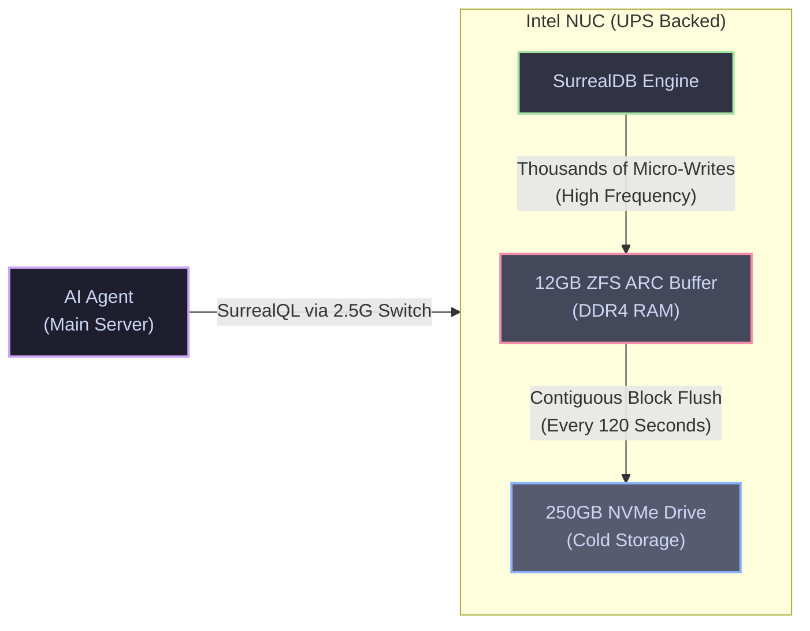

# Data Layer and Memory Substrate

Standard Retrieval-Augmented Generation (RAG) methodologies—typically utilizing rudimentary vector similarity extensions (e.g., `pgvector`)—are fundamentally insufficient for long-term agentic autonomy. Autonomous agents require a cognitive substrate capable of understanding complex entity relationships, executing temporal reasoning, and sustaining massive, high-frequency write operations without hardware degradation.

To achieve this, the Janus architecture offloads state management entirely from the primary hypervisor to an independent, UPS-backed "Edge-Tier Brain."

---

## 1. The Edge-Tier Brain (SurrealDB on Intel NUC)

To protect the primary workstation's expensive NVMe drive from the brutal write-amplification caused by autonomous agent logging, and to ensure cluster survivability during catastrophic power loss, the primary database (SurrealDB) is hosted on dedicated hardware.

### 1.1 Hardware and Network Topology

* **Compute Substrate:** An Intel NUC10i5FNH (i5-10210U) equipped with 16GB RAM and a 250GB NVMe drive.
* **Operating System:** To maximize available memory for the database write-buffer, the NUC runs a lean, bare-metal **Debian 12 Server** installation (no virtualization layer).
* **Isolated Networking:** The NUC connects to the primary Proxmox host via a dedicated **NETGEAR MS308E 2.5G Managed Switch** and a UGREEN USB-C to 2.5G Adapter (leveraging the Realtek RTL8156B chipset for native Debian driver support).
* **UPS Resilience:** Both the Intel NUC and the NETGEAR switch are physically tethered to an Eaton 3S 550 DIN UPS. This configuration isolates the database from grid instability, guarantees data integrity during ungraceful shutdowns, and ensures the NUC can successfully transmit the Wake-on-LAN (WoL) "magic packet" to resurrect the primary server once grid power stabilizes.

### 1.2 Cryptographic Namespace Scoping
To facilitate multi-tenant operational security, SurrealDB is partitioned into isolated namespaces. The `Architect` and `Partner` profiles utilize distinct, cryptographically separated environments (`ns: architect` vs `ns: partner`). Strict Role-Based Access Control (RBAC) API credentials ensure cross-contamination of context is computationally impossible.

---

## 2. The RAM Shock Absorber (ZFS Asynchronous Mode)

Because the Intel NUC is entirely shielded by the UPS, standard database paranoia regarding sudden power loss (which normally necessitates immediate synchronous disk flushes) can be safely ignored. We configure the NUC's RAM as a massive write-buffer, acting as a "Shock Absorber" for the NVMe SSD.

### 2.1 ZFS Memory Budgeting

The NUC's NVMe drive is formatted with the ZFS filesystem. We enforce the following configuration to intercept database micro-writes:

1. **Disable Synchronous Writes:** The dataset is configured with `zfs set sync=disabled <pool>/surrealdb`.
2. **Expand Transaction Groups:** The flush interval is dramatically increased: `zfs_txg_timeout=120`.
3. **Hard-Limit the ARC:** The ZFS Adaptive Replacement Cache is strictly bounded (`zfs_arc_max=12G`). This permanently reserves the remaining 4GB of physical DDR4 memory for the Debian kernel, the 2.5G network driver, and the MinIO S3 backup container.

!!! danger "The Dependency on Uninterruptible Power"
    Executing `sync=disabled` instructs the kernel to acknowledge database writes *before* they are physically committed to non-volatile storage. If the NUC loses power during the 120-second transaction window, the data residing in the RAM buffer is irreversibly destroyed. **This configuration is catastrophic without a verified, functional UPS.**

**The Asynchronous Effect:** Autonomous agents execute thousands of tiny micro-writes (graph relationship definitions, telemetry logs) entirely within the blazing-fast 12GB DDR4 buffer. Every 2 minutes, ZFS packages this fragmented memory state and flushes it as a single, highly contiguous block to the NVMe. This structural realignment reduces SSD wear-and-tear (write-amplification) by over 90%.

---

## 3. Advanced Memory Subsystems

The data layer employs sophisticated ingestion, retrieval, and archival mechanisms to support long-term agentic behavior.

### 3.1 Bi-Temporal GraphRAG (SurrealDB)

* **Hybrid Querying:** Agents leverage SurrealQL to execute singular, cross-network queries that seamlessly combine semantic vector search, graph relationship traversal, and temporal logic (e.g., *Find documents related to `[Vector]` -> authored by `[Graph Node]` -> modified after `[Temporal Interval]`*). This unified approach incurs only a 1–3ms latency penalty.
* **The Append-Only Ledger:** The database functions as an immutable ledger. If an agent detects a state change, the previous record is not deleted; rather, its validity interval is temporally capped. This bi-temporal tracking prevents agents from hallucinating outdated system states.
* **The Spectron Subsystem:** We leverage SurrealDB's native Spectron layer. During the nocturnal "Idle-Loop/Dreaming" phase, Spectron background processes autonomously crawl the knowledge graph to consolidate fragmented records, infer implicit ontological relationships, and resolve entity ambiguities using the NUC's CPU.

### 3.2 Cold Archival Pipeline (The "Archivist")

Because the database operates as an append-only ledger on a limited 250GB NVMe drive, capacity exhaustion is a mathematical certainty.
To prevent this, a Kubernetes CronJob (The "Archivist") is deployed on the main server. Executing weekly, it queries SurrealDB for non-essential execution logs older than 30 days, compresses them into `.tar.gz` archives, and offloads them to the primary 2TB FireCuda array or S3 cloud storage. The obsolete records are then pruned from the NUC, guaranteeing perpetual operation.

---

## 4. Hindsight (The Personalization & Entity Engine)

Standard memory architectures (e.g., Mem0) often exhibit Paywall restrictions on graph capabilities and yield suboptimal benchmark accuracies. The Janus architecture bypasses these limitations by deploying **Hindsight** (by Vectorize.io, MIT-licensed) as an interception proxy between the user and the language model.

### 4.1 Multi-Strategy Retrieval and Injection

* **Quad-Core Retrieval:** When standard RAG fails, Hindsight executes four parallel retrieval algorithms locally: Semantic Vector Search, BM25 Keyword Matching, Graph Traversal, and Temporal Reasoning. The results are merged via a local cross-encoder reranker.
* **Structured Beliefs:** Hindsight enforces a rigid epistemological structure, parsing knowledge into distinct memory networks: *World Facts*, *Agent Experiences*, *Subjective Opinions*, and *Consolidated Entity Observations*.
* **Native MCP Injection:** The primary objective of Hindsight is the elimination of repetitive human correction. If a user corrects an agent's behavior, Hindsight algorithmically extracts the preference, resolves the target entity, and permanently stores the directive within the Observation network. Upon the initiation of subsequent workflows, Hindsight utilizes the Model Context Protocol (MCP) to silently intercept the generation request, dynamically injecting the relevant rules and memory networks directly into the system prompt of the executing agent.
