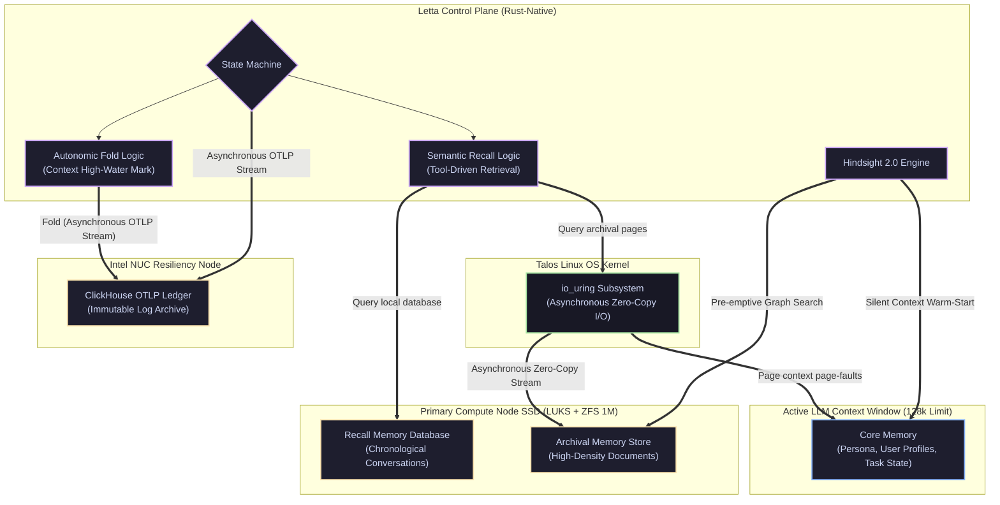

# Data Layer and Memory Substrate

Standard Retrieval-Augmented Generation (RAG)—relying on external, network-bound databases—is the primary bottleneck for autonomous agentic latency. In typical configurations, querying vector datastores over a network bridge introduces multi-millisecond retrieval penalties, stalls GPU thread execution, and increases susceptibility to ungraceful network drops. The Janus architecture eliminates this overhead by transitioning to **Virtualized Cognitive Memory**.

This layer ensures that an agent’s state, historical recall, and archival knowledge are managed as local, zero-latency tiers directly accessible within the LLM's token-space, backed by operating system-level asynchronous I/O and hardware-accelerated decryption pipelines.

---

## 1. The Death of Network-Bound RAG

In the legacy 2024 architecture, autonomous agents executed real-time GraphRAG queries by querying an external SurrealDB instance hosted on the Intel NUC. Even over an optimized 2.5G physical link, this design introduced database serialization overhead and created a critical, single-point-of-failure dependency on network interface card (NIC) stability. During complex task loops, frequent micro-queries starved the primary node's execution threads, forcing the GPU to drop into idle states while awaiting database payloads.

In the **Synapse Edge 2026** stack, we decouple state query loops from network infrastructure:

* **The Intel NUC** is liberated from hot, real-time database query operations. It is repurposed as a **Cold-Tier Telemetry & Backup Node**, hosting an analytical **ClickHouse** engine for high-density, insert-only OTLP logs and a **VictoriaMetrics** instance for timeseries system health monitoring.
* **Active Cognition** is localized entirely on the primary compute node. The memory subsystem is driven by the **Letta (formerly MemGPT)** cognitive state engine utilizing **LanceDB (Embedded Rust Vector-Graph)** as the vector-graph substrate. Because LanceDB is embedded directly into the Rust-native Rig Orchestrator without a separate daemon process, it eliminates JSON network serialization overhead by allowing the Rust Rig to execute zero-copy reads directly from physical memory. By keeping the active memory state local and embedded, the agent's reflex loop remains network-decoupled and immune to packet loss or external database failures.

---

## 2. Letta: Virtualized Token-Space Memory

Janus implements a three-tier memory architecture that mimics human cognitive functions. This virtualized state engine allows autonomous agents to sustain long-term operations, maintaining historical awareness and system-level context over months of execution without exceeding the physical 128k token limits of the Blackwell-quantized models.

### 2.1 The Memory Tiers

| Tier | Physical Substrate | Retrieval Latency | Persistence & Mutability | Functional Purpose |
| :--- | :--- | :--- | :--- | :--- |
| **Core Memory** | Active LLM Context | $0\text{ ms}$ (Resident) | Volatile / Tool-Editable | Houses active system personas, user profile settings, and scratchpad variables. Directly visible to the LLM during generation. |
| **Recall Memory** | Local Vector DB | $<15\text{ ms}$ | Persistent / Local NVMe | Chronological log of all past agent dialogs, execution runs, and environmental feedback. Queried via semantic vector similarity. |
| **Archival Memory** | High-Density Store | $<100\text{ ms}$ | Persistent / Local NVMe | Deep knowledge repositories, codebase catalogs, documentation libraries, and cold logs. Retrievable via semantic search tool calls. |

### 2.2 The Letta State Machine (The Fold/Recall Paradigm)

Rather than treating the LLM context window as a static sliding queue, the Letta integration functions as a dynamic, autonomous state machine. The executing agent is empowered to self-manage its token budget through native tool calls:

1. **The Fold Operation:** When the active **Core Memory** context window reaches a high-water mark, the Letta control loop automatically triggers a "fold." The agent summarizes historical context and transmits the logs asynchronously to the ClickHouse OTLP ledger. To prevent intra-day amnesia without violating the NVMe write-ban, the folded vectors are injected into a **Volatile Daily Journal** (an in-RAM HNSW vector index). During the nocturnal Dreaming phase, this RAM index is compiled and flushed to the persistent NVMe Recall database as a single sequential ZFS write.
2. **The Recall Operation:** When task constraints require historical facts not present in Core Memory, the agent invokes semantic search tools. Letta fetches the relevant records from **Recall** or **Archival** memory, dynamically paging them back into the active context window.

---

## 3. Storage Acceleration: `io_uring` & ZFS 1M

To ensure real-time reflex loops are not bottlenecked by operating system kernel scheduling or hardware translation limits, the primary compute node's disk and kernel subsystems are tuned for extreme sequential and random I/O throughput.

### 3.1 Zero-Copy Asynchronous Streaming via `io_uring`

Letta’s Archival memory is designed to support deep semantic search over massive filesystems. To bypass the traditional Linux kernel block layer latency, Janus implements native **`io_uring`** asynchronous system calls within the Talos Linux guest OS:

* **Kernel Ring Buffers:** Rather than invoking blocking `read()` or `write()` system calls (which force costly CPU context switches and scheduling latency), the Letta Rust control plane submits read requests directly to an asynchronous `io_uring` submission queue (SQ) mapped in kernel memory.
* **Direct DMA Stream:** The kernel processes the queue and uses Direct Memory Access (DMA) to stream bytes directly from the encrypted NVMe controller into the user-space token buffers of the agent with **zero-copy overhead**.
* **Result:** Heavy model GGUF weights and deep memory archives are paged into execution memory at near-native NVMe speeds (exceeding $3,500\text{ MB/s}$), neutralizing the virtualization penalty introduced by the Proxmox and Talos layers while leveraging the CPU's native AES-NI hardware for real-time LUKS decryption.

### 3.2 Dual-Disk ZVOL Block Size Segregation

A massive architectural trap in hyper-converged Kubernetes is storage block-size collision. Kubernetes `etcd` requires microscopic (4KB/16K) synchronous writes, while model loading requires massive (1MB) sequential writes, and LanceDB requires balanced (64K) random/sequential read-write limits.
To optimize performance and avoid write-amplification, you must partition storage specifically:

1. **VM 1 OS Disk (30 GiB):** Set `volblocksize=16K`. This hosts the Talos OS boot disk. Because the cluster mandates zero background write-amplification on the primary NVMe, K3s `etcd` is entirely removed. The Kubernetes control plane utilizes the **Kine translation layer** to route all state database transactions (via `--datastore-endpoint`) over the 2.5Gbps symmetric network to a PostgreSQL/ClickHouse instance hosted on the UPS-backed Intel NUC.
2. **VM 1 AI Data Disk (1198 GiB):** Set `volblocksize=1M`. This disk is formatted inside Talos via OpenEBS LocalPV to host the GGUF model weights, maximizing sequential throughput for model loading.
3. **VM 2 Storage (100 GiB):** Set `volblocksize=64K` to host the embedded LanceDB database files (Recall & Archival memory), permitting the Rig Orchestrator to execute zero-copy `io_uring` vector-graph queries directly from physical memory.

!!! warning "Strict Decoupled ZVOL Topology"
    Even with `etcd` migrated to the external Kine datastore, the virtual machines must be provisioned with strictly segregated virtual disks to prevent ZFS write-amplification:
    1. **VM 1 OS Disk (30 GiB):** Formatted with default `volblocksize=16K` to handle Talos system logs and containerd binary states without fragmenting.
    2. **VM 1 AI Data Disk (1198 GiB):** Formatted strictly with `volblocksize=1M`. This is dedicated exclusively to massive GGUF weight files.
    3. **VM 2 Storage (100 GiB):** Formatted with `volblocksize=64K`. This is dedicated exclusively to LanceDB's asynchronous `io_uring` memory streams, ensuring zero-latency sequential/random memory lookups.

---

## 4. Resiliency & Cold-Tier Sync

While active cognitive state runs locally for latency elimination, **resiliency and durability** are offloaded to the low-power, UPS-backed Intel NUC node to prevent metadata corruption during ungraceful hardware shutdowns.

1. **Asynchronous Transaction Logging:** Every write, fold, or mental association processed by Letta generates a structured OpenTelemetry (OTLP) event. These telemetry traces are dispatched asynchronously over the 2.5G switch via non-blocking TCP streams, leaving the compute node's local disk free from random, tiny write operations.
2. **The ClickHouse NUC Vault:** The Intel NUC hosts a dedicated **ClickHouse** analytical database. ClickHouse’s sparse indexing and column-oriented layout are designed for massive, insert-only workloads. It compresses raw transaction traces by over 70%, writing them to the NUC NVMe in highly contiguous blocks that protect the NUC SSD from wear-and-tear.
3. **Stateless Reconstruction (Crash-Safe recovery):** In the event of a catastrophic grid power failure, the stateless primary compute node instantly drops offline. Upon power restoration, the NUC boots up, validates cluster health, sends a Wake-on-LAN trigger to the compute node, and replays ClickHouse transaction logs. This reconstructs the local LanceDB vector-graph memory database on VM 2 to the exact millisecond before the grid failure.

---

## 5. Hindsight 2.0: Entity-Centric Memory

To eliminate standard vector search limitations (such as semantic dilution and structural paywalls), Janus implements **Hindsight 2.0** proxy logic embedded directly into the Rust-native Rig orchestration layer.

* **Entity Extraction:** During every execution pass, Hindsight parses the dialog stream to extract key domain entities (such as hardware IDs, specific code files, and user constraints).
* **Relationship Mapping:** Rather than generating unstructured raw text fragments, Hindsight indexes these entities as structured nodes in a localized, light-weight semantic graph mapped within Letta’s Archival tier.
* **Context Warm-Starting:** When the user initiates a conversation referencing a known entity, Hindsight intercepts the query. It executes a local graph traversal, identifies connected nodes, and "warm-starts" the agent by injecting the extracted entity-relationship graph directly into the volatile **Core Memory** slot before the LLM generates its first token. This ensures absolute precision and eliminates repetitive prompt alignment steps.

---

### 🛠️ Verification and Safety Checklist

!!! safety "Uninterruptible Power Guard"
    Because Letta transaction events are streamed asynchronously to the ClickHouse vault on the NUC, the primary compute node can remain completely stateless. To guarantee zero transaction loss, the Eaton 3S 550 DIN UPS must maintain communication with the NUC at all times.
!!! warning "The Write-Amplification Ban (Synchronous vs. Batched State)"
    To protect the Seagate FireCuda NVMe, the primary compute node is **transactionally stateless**. Active runtime micro-writes (e.g., token generation logs, step-by-step agent thought processes) are strictly banned from local disk and routed via OTLP to ClickHouse on the NUC.
    The local Letta Recall/Archival databases on the NVMe function strictly as **Read-Heavy local caches** during active hours. They are only written to during the Phase 2 "Dreaming" macro-downtime. During this phase, Letta compiles the day's memory and flushes it to the local disk as a single contiguous archival database write. The underlying Proxmox ZFS storage layer captures this burst and translates it into a highly sequential SSD commit, minimizing write-amplification and preserving the drive's lifespan while maintaining local persistent memory.
