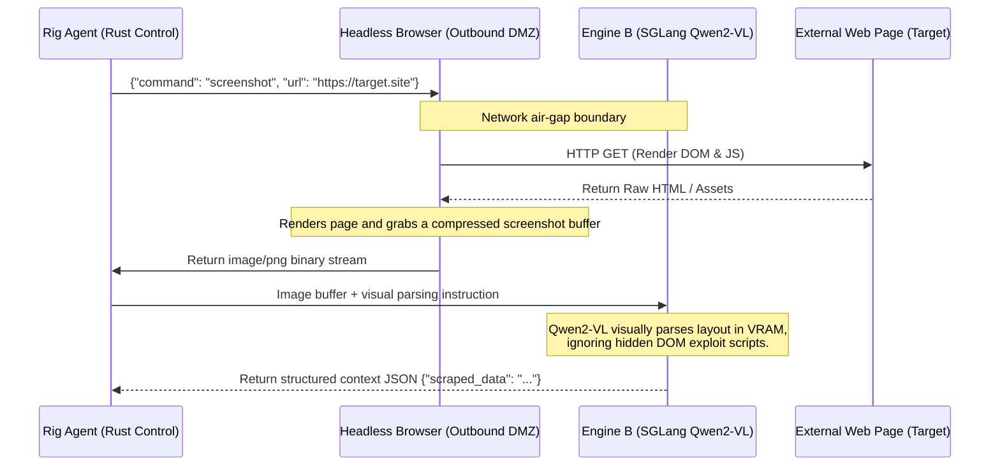

# API Gateway, Orchestration, and Network Firewall

The foundational rule of the Janus network topology is absolute isolation: **Autonomous agents must never possess direct, unmonitored internet access, and the external internet must never possess direct access to the core inference engines.** To enforce this, we implement a secure, software-defined Demilitarized Zone (DMZ) utilizing strict Kubernetes NetworkPolicies and declarative, high-performance semantic routing.

---

## 1. The Internal Traffic Cop (TensorZero Gateway)

The **TensorZero Gateway** (compiled natively in Rust) functions as the unified, high-performance API ingress controller for the internal cluster. No user interface, Rig agent workflow, or Letta memory daemon is permitted to query the underlying inference engines directly. All model communications must route through the gateway.

### 1.1 Declarative Routing and Guardrails

TensorZero evaluates the semantic complexity, requested JSON schema, and multi-tenant priority of every incoming payload to optimize hardware utilization and enforce safety boundaries:

*   **Asymmetric Model Routing:** Simple formatting requests, low-latency reflexive tool-calling, or visual Dom-scraping operations are automatically routed to Engine B (SGLang). Deep logical deductions, strategic planning, or code synthesis tasks are routed to Engine A (llama.cpp) with speculative verification on the physical P-Cores.
*   **Velocity Limits (Infinite Loop Protection):** TensorZero continuously tracks token generation rates and query velocity per agent. If human-impossible request speeds are detected—indicative of an autonomous agent trapped in an infinite execution or API loop—the gateway severs the request pipe, suspends the agent's Wasmtime token-keys, and dispatches a critical alert payload to the Rust Janitor Daemon.
*   **VRAM Fencing (Context Capping):** TensorZero enforces hard `max_tokens` limits. This strict declarative boundary ensures Engine B (SGLang) never spikes past its $4.5\text{ GB}$ static VRAM fence, permanently preserving the $0.5\text{ GB}$ ($500\text{ MB}$) system buffer reserved for Talos and headless CUDA context overhead, maximizing the $11\text{ GB}$ allocation for Engine A.

### 1.2 Multi-Tenant Priority and Egress Control
*   **Egress Tiers:** High-sensitivity operational profiles (Tier 0) are restricted by TensorZero's declarative gateway configuration to local inference nodes. Standard professional tasks (Tier 1) may route to external API providers (e.g., Anthropic, OpenAI) only after executing PII masking filters and Hindsight record-filtering.
*   **Priority Preemption:** Interactive human sessions are assigned a `System-Critical` PriorityClass, while background prompt optimization runs are assigned `Background-Yield`. Upon manual query initiation, TensorZero coordinates with the Kubernetes scheduler to instantly pause or evict background jobs, guaranteeing zero-latency access to the RTX 5070 Ti for the human operator.

---

## 2. Inbound DMZ (Rig Webhook Ingress)

The primary compute workstation, the TensorZero Gateway, and the AI models possess no public IP addresses and no open inbound firewall ports. The **Rig Orchestration Webhook Gateway** acts as the singular authorized bridge for incoming external triggers.

1.  **The Webhook Ingress:** External webhooks (e.g., incoming messaging payloads or external system alerts) strike a secure, authenticated Rig webhook listener.
2.  **Payload Sanitization:** The Rig gateway strips the incoming payload of executable HTML scripts, header injections, or malicious characters, reformats the input into a structured, type-safe JSON schema, and initiates an internal cluster call to the TensorZero Gateway.
3.  **Execution and Return:** TensorZero routes the task, the designated local AI engine executes the logic, and the sanitized output is returned through the Rig gateway to the external system. The core AI itself never directly initiates a raw outbound connection.

---

## 3. WebRTC and Voice-to-Voice Gateway (LiveKit)

To achieve "Ultra-Low-Latency" conversational capabilities, traditional cascading Text-to-Speech (TTS) and Speech-to-Text (STT) pipelines are abandoned in favor of native multimodal execution:

*   **LiveKit Infrastructure:** A high-performance WebRTC server is deployed as a dedicated Pod within the K3s cluster.
*   **Native Audio Processing:** Engine B (SGLang) loads a native speech-to-speech multimodal model, processing raw audio waveforms directly.
*   **The Interrupt Protocol:** When a user speaks over the AI, the WebRTC stream routes the interruption signal to SGLang. Leveraging `RadixAttention` state drops, the engine halts token generation in under $50\text{ ms}$ and immediately pivots to listening for the new auditory command.

---

## 4. Outbound DMZ (The Headless Browser & Qwen2-VL Bridge)

When an internal Rig agent requires data from a live Single-Page Application (SPA) or external website, it is strictly forbidden from executing direct HTTP `GET` requests. All external visual data extraction is managed via an isolated headless browser rendering process.

### 4.1 Deployment and Taint Authorization
The browser rendering pod (e.g., Playwright/Puppeteer) is deployed to the **Tensor Worker (VM 1)**. Because VM 1 is protected by the `gpu=true:NoSchedule` taint, the browser deployment YAML explicitly includes the corresponding toleration.

!!! success "Zero-Trust Egress/Ingress Policies"
    The browser rendering server is strictly isolated within a dedicated `outbound-dmz` Kubernetes Namespace.

    A Kubernetes `NetworkPolicy` creates a software-defined air-gap. The browser pod is granted egress internet access (whitelisted via strict DNS filtering), but its internal ingress/egress is tightly locked to the MCP bridge. If the headless browser is compromised via a malicious external webpage payload, the attacker is trapped inside the container with no routing paths to the database (VM 2) or the hypervisor.

### 4.2 The Air-Gapped Visual Extraction Workflow

Rather than passing raw HTML and Javascript back to the agent (which exposes the LLM to prompt injection attacks embedded in comments or DOM elements), Janus uses a **visual extraction pipeline**:

By decoupling the raw text extraction from the web browser's DOM parser, the core AI never reads malicious raw HTML or executes external JavaScript, securing the cluster against browser-exploit payloads.

---

### 🛠️ Ingress and Egress Safety Checklist

!!! safety "NetworkPolicy Validation"
    The Kubernetes namespace `outbound-dmz` must enforce a strict egress block whitelisting only TCP ports 80/443 to verified external DNS records. Standard UDP and raw IP forwarding are entirely blocked.
!!! danger "Direct Scraping Ban"
    Rig agents are strictly prohibited from importing HTTP libraries (e.g., `reqwest` or `curl`) with direct external endpoints. All external HTTP requests must pass through the `outbound-dmz` browser renderer.
