# API Gateway, Orchestration, and Network Firewall

The foundational rule of the Janus network topology is absolute isolation: **Autonomous agents must never possess direct, unmonitored internet access, and the external internet must never possess direct access to the core inference engines.** To enforce this, we implement a secure, software-defined Demilitarized Zone (DMZ) utilizing strict Kubernetes NetworkPolicies and declarative, high-performance semantic routing.

---

## 1. The Internal Traffic Cop (TensorZero Gateway)

The **TensorZero Gateway** (compiled natively in Rust) functions as the unified, high-performance API ingress controller for the internal cluster. No user interface, Rig agent workflow, or Letta memory daemon is permitted to query the underlying inference engines directly. All model communications must route through the gateway.

### 1.1 Declarative Routing and Guardrails

TensorZero evaluates the semantic complexity, requested JSON schema, and multi-tenant priority of every incoming payload to optimize hardware utilization and enforce safety boundaries:

*   **Asymmetric Model Routing:** Simple formatting requests, low-latency reflexive tool-calling, or visual Dom-scraping operations are automatically routed to Engine B (`llama.cpp`). Deep logical deductions, strategic planning, or code synthesis tasks are routed to Engine A (`llama.cpp`) with speculative verification on the physical P-Cores.
*   **Velocity Limits (Infinite Loop Protection):** TensorZero continuously tracks token generation rates and query velocity per agent. If human-impossible request speeds are detected—indicative of an autonomous agent trapped in an infinite execution or API loop—the gateway severs the request pipe, suspends the agent's Wasmtime token-keys, and dispatches a critical alert payload to the Rust Janitor Daemon.
* **VRAM Fencing (Context Capping):** TensorZero enforces hard input payload size limits mapped exactly to Engine B's `32768` context window. Because `llama.cpp` pre-allocates its KV-Cache statically upon boot, TensorZero acts as the upstream shield, instantly rejecting any payload that exceeds 32,000 tokens. This guarantees Engine B never attempts to page beyond its strict $4.5\text{ GB}$ VRAM boundary, safely preserving the $11\text{ GB}$ allocation for Engine A.

### 1.2 Multi-Tenant Priority and Egress Control
*   **Egress Tiers:** High-sensitivity operational profiles (Tier 0) are restricted by TensorZero's declarative gateway configuration to local inference nodes. Standard professional tasks (Tier 1) may route to external API providers (e.g., Anthropic, OpenAI) only after executing PII masking filters and Hindsight record-filtering.
*   **Priority Preemption:** Interactive human sessions are assigned a `System-Critical` PriorityClass, while background prompt optimization runs are assigned `Background-Yield`. Upon manual query initiation, TensorZero coordinates with the Kubernetes scheduler to instantly pause or evict background jobs, guaranteeing zero-latency access to the RTX 5070 Ti for the human operator.

---

## 2. Inbound DMZ (Rig Webhook Ingress)

The primary compute workstation, the TensorZero Gateway, and the AI models possess no public IP addresses and no open inbound firewall ports. The **Rig Orchestration Webhook Gateway** acts as the singular authorized bridge for incoming external triggers.

1. **The Reverse Tunnel Ingress:** Because the cluster's physical firewall strictly drops all inbound connections, external webhooks cannot reach the Rig Gateway directly. Instead, a lightweight **Cloudflare Tunnel (`cloudflared`)** pod operates in the DMZ. It establishes a secure, outbound-only persistent connection to the Cloudflare edge. External webhooks strike the public Cloudflare endpoint and are routed securely down the tunnel to the internal Rig webhook listener, preserving the zero-inbound firewall constraint.
2.  **Payload Sanitization:** The Rig gateway strips the incoming payload of executable HTML scripts, header injections, or malicious characters, reformats the input into a structured, type-safe JSON schema, and initiates an internal cluster call to the TensorZero Gateway.
3.  **Execution and Return:** TensorZero routes the task, the designated local AI engine executes the logic, and the sanitized output is returned through the Rig gateway to the external system. The core AI itself never directly initiates a raw outbound connection.

---

## 3. WebRTC and Voice-to-Voice Gateway (LiveKit)

To achieve "Ultra-Low-Latency" conversational capabilities, traditional cascading Text-to-Speech (TTS) and Speech-to-Text (STT) pipelines are abandoned in favor of native multimodal execution:

* **LiveKit Infrastructure:** A high-performance WebRTC server is deployed as a dedicated Pod within the K3s cluster.
* **The Whisper STT Bridge:** Because Engine B (Qwen2-VL) is strictly a Vision-Language model, it cannot ingest audio waveforms natively. A dedicated, CUDA-accelerated `whisper.cpp` pod is deployed to the Tensor Worker (VM 1), utilizing the RTX 5070 Ti CUDA cores for near-instantaneous Speech-to-Text translation. By offloading this CPU-intensive workload to the GPU, we prevent E-Core starvation on VM 2 and eliminate audio latency bottlenecks. Translated text tokens are streamed directly to Engine B for reasoning.
* **The Interrupt Protocol:** When a user speaks over the AI, the WebRTC stream routes an interruption signal to the TensorZero Gateway. TensorZero instantly drops the active `llama.cpp` inference slot, halting token generation in under $50\text{ ms}$.

---

## 4. Outbound DMZ (The Headless Browser & Qwen2-VL Bridge)

When an internal Rig agent requires data from a live Single-Page Application (SPA) or external website, it is strictly forbidden from executing direct HTTP `GET` requests. All external visual data extraction is managed via an isolated headless browser rendering process.

### 4.1 Deployment and Taint Authorization

The browser rendering process is highly CPU-intensive and must never compete with the deep-reasoning inference engines. Therefore, the outbound-dmz Headless Chromium browser is driven directly by the Rust TensorZero Gateway via WebSockets using a Headless Chromium CDP (Chrome DevTools Protocol) Adapter. This architecture is explicitly scheduled to the Brain Worker (VM 2) and completely eliminates heavy Node.js/Playwright runtime dependencies in the DMZ. By confining web rendering to the physical E-Cores (Threads 16-25), the P-Cores remain mathematically isolated for Engine A's speculative verification passes.

!!! success "Zero-Trust Egress/Ingress Policies"
    The browser rendering server is strictly isolated within a dedicated `outbound-dmz` Kubernetes Namespace.

    A Kubernetes `NetworkPolicy` creates a software-defined air-gap. The browser pod is granted egress internet access (whitelisted via strict DNS filtering), but its internal ingress/egress is tightly locked to the MCP bridge. If the headless browser is compromised via a malicious external webpage payload, the attacker is trapped inside the container with no routing paths to the database (VM 2) or the hypervisor.

### 4.2 The Air-Gapped Extraction Workflow (DOM-to-Markdown)

Passing raw HTML/JavaScript to an agent exposes the cluster to prompt injection, and passing full-resolution web screenshots to the Engine B Vision Transformer (ViT) aggressively wastes compute cycles and risks KV-cache saturation. To mitigate this, Janus enforces a strict extraction hierarchy.

1. **The DOM-to-Markdown Rule:** The Headless Chromium CDP Adapter must first pass all target URLs through a native Rust-driven sanitization script (e.g., Mozilla's `Readability.js` or an HTML-to-Markdown parser). This strips CSS, ad-bloat, and visual formatting, returning pure, clean Markdown to Engine B as a standard text payload.
2. **Visual Processing Reserve:** The multi-modal capabilities of Engine B (Qwen2-VL) are strictly reserved for literal, unparsable visual data (e.g., architectural diagrams, scientific charts, or embedded UI screenshots).

By enforcing this routing rule at the TensorZero Gateway level, 95% of web-scraping tasks bypass the expensive CPU-bound vision encoder entirely.

```mermaid
flowchart TD
    %% Air-Gapped Extraction Pipeline
    Gateway[TensorZero Gateway]
    DMZ[outbound-dmz : Headless Chromium CDP]

    subgraph Engine B Heterogeneous Split
        GPU[RTX 5070 Ti : Text LLM]
        CPU[i7-14700K : Vision Encoder]
    end

    Gateway -->|URL Target| DMZ

    DMZ -->|Condition 1: Standard Webpage| Parse[Readability.js DOM-to-Markdown]
    DMZ -->|Condition 2: Literal Image/Chart| Snap[High-Res Screenshot]

    Parse -->|Clean Text| GPU
    Snap -->|Raw Pixels| CPU
    CPU -->|Tokenized Geometry| GPU

    style Parse fill:#1e4620,stroke:#4caf50
    style Snap fill:#5c1a1b,stroke:#f44336
```

---

### 🛠️ Ingress and Egress Safety Checklist

!!! safety "NetworkPolicy Validation"
    The Kubernetes namespace `outbound-dmz` must enforce a strict egress block whitelisting only TCP ports 80/443 to verified external DNS records. Standard UDP and raw IP forwarding are entirely blocked.
!!! danger "Direct Scraping Ban"
    Rig agents are strictly prohibited from importing HTTP libraries (e.g., `reqwest` or `curl`) with direct external endpoints. All external HTTP requests must pass through the `outbound-dmz` browser renderer.
!!! warning "Cross-Namespace Webhook Puncture"
    While the `outbound-dmz` is strictly locked down to prevent compromised browsers from scanning the internal cluster, the `cloudflared` tunnel pod resides in this same DMZ. You must explicitly deploy a Kubernetes `NetworkPolicy` that creates a highly specific micro-puncture: allowing Egress from the `cloudflared` pod *strictly and only* to the `rig-gateway` pod in the core namespace, exclusively on the designated gRPC/Webhook port (e.g., 8080).
