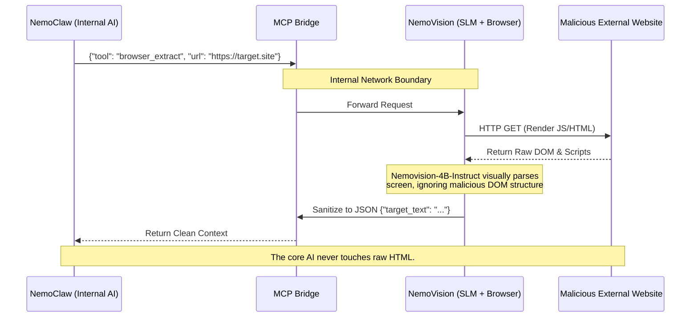

# API Gateway, Orchestration, and Network Firewall

The foundational rule of the Janus architecture's network topology is absolute isolation: **Autonomous agents must never possess direct internet access, and the external internet must never possess direct access to the inference engines.** To enforce this, we implement a secure, software-defined Demilitarized Zone (DMZ) utilizing strict Kubernetes NetworkPolicies and semantic routing.

---

## 1. The Internal Traffic Cop (`LiteLLM` Proxy)

The `LiteLLM` container functions as the unified, OpenAI-compatible ingress controller for the internal network. No user interface, background workflow, or autonomous agent is permitted to query the inference engines directly.

### 1.1 Semantic Routing and Guardrails
LiteLLM evaluates the complexity and context of every incoming prompt to optimize hardware utilization and enforce safety boundaries:

* **Asymmetric Routing:** Simple formatting tasks, reflex logic, or continuous tool-calling loops are routed to Engine B (SGLang). Deep coding tasks or complex autonomous planning are routed to Engine A (PowerInfer) to leverage sparsity offloading.
* **Velocity Limits (Infinite Loop Protection):** LiteLLM continuously monitors token generation and request velocity via a sliding window algorithm. If human-impossible request speeds are detected—indicative of an autonomous agent trapped in an infinite logic loop—the proxy severs the connection and dispatches an alert payload to the orchestration layer (n8n).
* **VRAM Fencing (Context Capping):** LiteLLM enforces a hard `max_tokens` cap on Engine B. This strict boundary ensures SGLang never spikes past its 4.5GB VRAM fence, permanently protecting the critical 1GB buffer reserved for Talos and CUDA overhead.

### 1.2 Multi-Tenant Priority and Egress Control
* **Egress Tiers:** High-sensitivity operational profiles (Tier 0) are cryptographically locked to local inference pods with total egress blocks. Standard professional tasks (Tier 1) may route to external APIs (e.g., Anthropic, OpenAI) only after executing PII masking and Hindsight tag-filtering.
* **Priority Preemption:** Interactive human chat sessions are assigned `priority: 1` (System-Critical), while background agent loops are assigned `priority: 2` (Background-Yield). Upon human initiation, LiteLLM triggers the Kubernetes scheduler to instantly pause or preempt background tasks on the P-Cores, guaranteeing zero-latency access to the GPU for the human operator.

---

## 2. Inbound DMZ (`n8n` Orchestration)

The Talos VMs, LiteLLM proxy, and AI models possess no public IP addresses and no open inbound firewall ports. The `n8n` orchestration engine is the singular authorized bridge for incoming external webhooks.

1. **The Webhook Wall:** External triggers (e.g., an incoming Telegram message or email) strike a secure, authenticated n8n webhook.
2. **Payload Sanitization:** n8n strips the payload of potentially malicious executable code or injection attempts, reformats the data into a sanitized JSON object, and initiates an internal cluster API call to LiteLLM.
3. **Execution and Return:** LiteLLM routes the task, the designated AI engine executes the logic, and the output is returned through the n8n reverse-proxy to the external service. The core AI itself never initiates the outbound connection.

---

## 3. WebRTC and Voice-to-Voice Gateway (`LiveKit`)

To achieve "Ultra-Low-Latency" conversational capabilities, traditional Text-to-Speech (TTS) and Speech-to-Text (STT) pipelines are abandoned in favor of native multimodal inference.

* **LiveKit Infrastructure:** A WebRTC server is deployed as a dedicated Pod within the K3s cluster.
* **Native Audio Processing:** Engine B (SGLang) loads a native speech-to-speech multimodal model (e.g., Llama-3-Audio, Moshi). It processes raw audio waveforms directly.
* **The Interrupt Protocol:** When a user speaks over the AI, the WebRTC stream routes the interruption signal to SGLang. Leveraging `RadixAttention` state drops, the engine halts token generation in under 50ms and immediately pivots to listening for the new auditory command.

---

## 4. Outbound DMZ (The `NemoVision` MCP Bridge)

When an internal agent (e.g., NemoClaw) requires data from a live Single-Page Application (SPA) or external website, it is strictly forbidden from executing an HTTP `GET` request. All external data extraction is delegated via the Model Context Protocol (MCP).

### 4.1 Deployment and Taint Authorization
The NemoVision MCP Server is deployed to the **Tensor Worker (VM 1)** to utilize the RTX 5070 Ti hardware for accelerated visual rendering. Because VM 1 is protected by the `gpu=true:NoSchedule` taint, the NemoVision deployment YAML must explicitly include the corresponding `toleration`.

!!! success "Zero-Trust Egress/Ingress Policies"
    NemoVision is strictly isolated within a dedicated `outbound-dmz` Kubernetes Namespace.

    A Kubernetes `NetworkPolicy` creates a software-defined air-gap. The NemoVision pod is granted egress internet access (whitelisted via strict DNS filtering), but its internal ingress/egress is tightly locked to `stdio` or internal HTTP solely for the MCP bridge. If the headless browser is compromised via a malicious external webpage payload, the attacker is trapped inside the container with no routing paths to the database (VM 2) or the hypervisor.

### 4.2 The Air-Gapped Extraction Workflow

