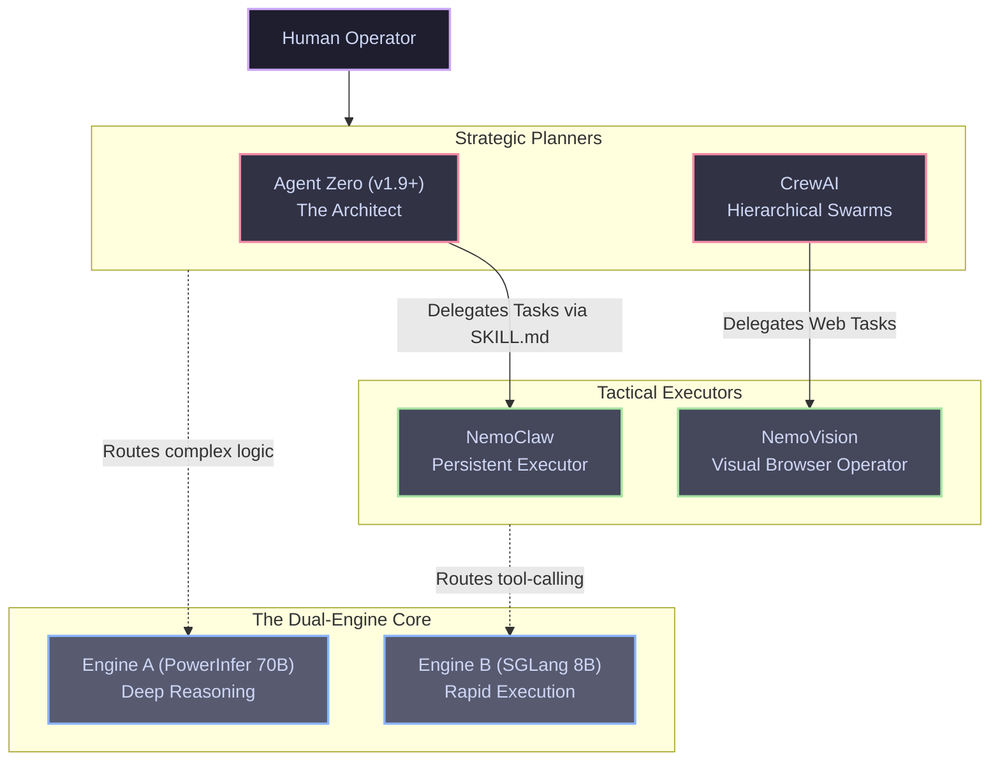

# Agent Workflows and the User Interface Layer

The infrastructure layers established in prior documentation (Hypervisor, Virtualization, Data, and Network) are strictly invisible to the end-user. Interaction with the Janus cluster is exclusively mediated through the presentation layer, which governs both direct human-in-the-loop querying and the asynchronous orchestration of autonomous agent swarms.

---

## 1. The Human-Machine Interface (`AnythingLLM`)

Instead of interacting via raw API endpoints or disparate CLI scripts, we deploy **AnythingLLM** as a persistent Pod within the Kubernetes cluster. It serves as the primary dashboard for interactive Retrieval-Augmented Generation (RAG).

!!! danger "Strict Routing Protocol"
    The AnythingLLM interface must be configured to point its LLM Provider endpoints exclusively to the internal **LiteLLM Proxy** IP address. Direct routing to the underlying `PowerInfer` or `SGLang` APIs bypasses velocity limits, semantic routing, and context capping, destabilizing the entire cluster.

### 1.1 Document Ingestion and Workspaces
* **Workspace Segregation:** The interface is divided into isolated cryptographic workspaces (e.g., "Coding Lab," "Financials," "Hardware Documentation"). This maps directly to the SurrealDB namespace scoping established in the Data Layer.
* **Vectorized Ingestion:** The user may ingest massive, complex datasets (e.g., multi-hundred-page PDFs or compressed ZIP archives of source code). AnythingLLM automatically chunks these documents, generates embeddings, and persists the vectorized data into the external Intel NUC's SurrealDB instance without freezing the UI thread.

---

## 2. Asynchronous Multi-Agent Topologies

While AnythingLLM handles direct user queries, the true power of the Janus architecture lies in its autonomous workforce. The agent ecosystem is heterogeneous, utilizing different frameworks mapped to specific inference engines based on task complexity.

### 2.1 The Architect and Terminal Operator (`Agent Zero`)

* **Framework:** Agent Zero (v1.9+) leveraging Dockerized `Projects` for execution isolation.
* **Assigned Hardware:** Routed via LiteLLM to **Engine A (PowerInfer 70B)**.
* **Role Design:** Acts as the general-purpose, organic supervisor. It possesses raw OS terminal access (sandboxed via Docker). Upon receiving a complex, multi-step human directive, Agent Zero formulates a strategic plan, utilizes standardized `SKILL.md` capabilities, and delegates granular sub-tasks to subordinate execution agents.

### 2.2 The Persistent Executor (`NemoClaw`)

* **Framework:** NVIDIA NemoClaw (Enterprise Agent Platform).
* **Assigned Hardware:** Routed via LiteLLM to **Engine B (SGLang 8B)**.
* **Role Design:** Unlike stateless chat scripts, NemoClaw operates as a continuous, asynchronous background daemon. It executes the gritty tactical work ordered by Agent Zero: reading file structures, chaining API payloads, and executing Python subroutines with extreme latency-efficiency.

### 2.3 The Role-Based Swarm (`CrewAI`)

* **Framework:** CrewAI.
* **Assigned Hardware:** Routed to **Engine B**, allowing multiple specialized personas to be loaded simultaneously in VRAM.
* **Role Design:** Deployed for structured, hierarchical workflows. We instantiate highly specific personas (e.g., "Senior Python Reviewer" and "Security Auditor"). CrewAI orchestrates these personas to sequentially debate code quality or analyze research topologies, preventing the "infinite conversational loop" failure mode common to unstructured swarms.

### 2.4 The Visual Browser Operator (`NemoVision`)

* **Framework:** Model Context Protocol (MCP) Server powered by the **NVIDIA Nemovision-4B-Instruct** multi-modal SLM.
* **Assigned Hardware:** Strictly isolated within the Outbound DMZ Kubernetes namespace.
* **Role Design:** The Nemovision-4B model is natively optimized to comprehend graphical user interfaces. It receives URL targets via the MCP bridge, visually parses the rendered Single-Page Application (SPA), executes synthetic DOM clicks, extracts the requested data, and returns sanitized JSON back to the internal ecosystem, effectively insulating the core AI from malicious external web payloads.
