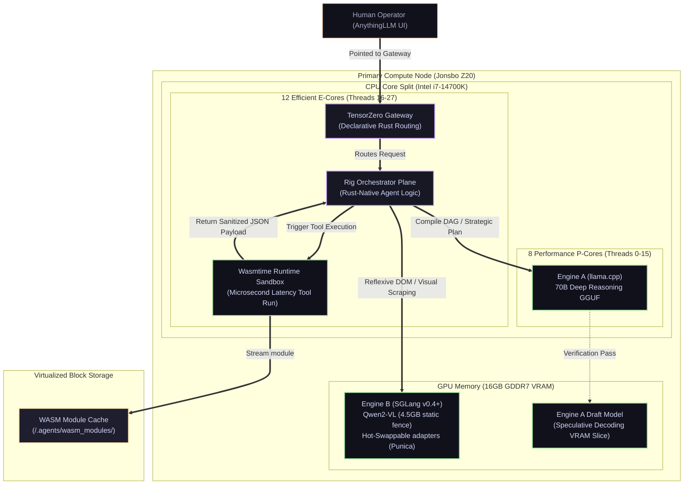

# Agent Workflows and the User Interface Layer

The infrastructure and substrate layers established in prior documentation (Hardened Hypervisor, Virtualized Kubernetes, and Memory Substrate) are designed to operate as a completely headless, zero-maintenance backplane. Interaction with the Janus cluster is exclusively mediated through the orchestration and presentation layer.

In the **Synapse Edge 2026** architecture, the high-latency, resource-heavy, and fragile Python-based multi-agent execution engines have been entirely eliminated. In their place, we deploy a **Rust-native control plane** and **WebAssembly (WASM) tool sandboxing**, enabling sub-millisecond agent choreography and mathematical execution isolation within the strict spatial and thermal limits of the Jonsbo Z20 chassis.

---

## 1. The Human-Machine Interface (AnythingLLM)

While autonomous agents run in the background, **AnythingLLM** remains the primary presentation layer for interactive human-in-the-loop querying, text-analysis, and manual knowledge ingestion. However, its backend integration has been fundamentally re-engineered to prevent runtime bottlenecking and guarantee security boundaries:

* **The TensorZero Bridge:** AnythingLLM no longer routes requests through a Python-based LiteLLM proxy container. Instead, it points exclusively to the internal **TensorZero Gateway** (compiled natively in Rust). This ensures that manual human queries benefit from identical declarative routing, automated failovers, schema validation, and hardware-accelerated NVFP4 mathematical kernels as the background autonomous swarms.
* **Virtualized Workspace Segregation:** Dynamic workspaces (e.g., "DevOps," "Research," "Security") are no longer mapped to static, isolated vector databases. Instead, they are bound directly to specialized **Letta Archival Tiers**. When a user selects a workspace, the system uses Letta's local memory engine to page-in context-relevant historical graphs, allowing for seamless, infinite-context recall during human sessions.

---

## 2. The Rig Orchestration Plane (Rust-Native)

Janus replaces the legacy, slow role-based swarms (CrewAI, NemoClaw) and Python task-delegators (Agent Zero) with the compile-time safe **Rig Framework**.

### 2.1 Why Rust for Orchestration?

In traditional agent systems, Python-based frameworks introduce severe operational overhead and runtime instability:

1. **Elimination of Garbage Collection Latency:** Python's stop-the-world garbage collection pauses introduce unpredictable, high-variance latency during real-time agent reflexive loops. Compiling the orchestrator in Rust guarantees sub-millisecond, deterministic execution paths.
2. **Extreme Memory Efficiency:** Python control stacks often draw in excess of $2\text{ GB}$ of RAM just to manage basic state and thread scheduling. The Rig control plane operates inside a strict **$<150\text{ MB}$ RSS memory fence**, reclaiming vital system DDR5 memory for caching speculative GGUF model weights.
3. **Core Pinning and Thread Affinity:** To prevent the control plane from stealing L3 cache cycles or competing for execution threads during heavy deep-reasoning verification passes, we configure strict hardware thread affinity. The Rig control engine is pinned entirely to the **12 physical E-Cores** (Threads 16–27), leaving the **8 physical P-Cores** completely dedicated to the mathematical execution of the GGUF reasoning engine.

### 2.2 Dual-Engine Agentic Control Loops

Instead of relying on fragile, unstructured conversational swarms, the Rig control plane enforces a rigid, type-safe architectural division of labor:

* **The Strategic Planner (Engine A):** Powered by the $70\text{B}$ parameter model running on **llama.cpp**. The Planner is responsible for parsing high-level goals, retrieving memory graphs, and generating a Rust-compatible, validated Directed Acyclic Graph (DAG) for task execution.
* **The Reflexive Executor (Engine B):** Powered by SGLang running the $8\text{B}$ parameter Qwen2-VL model. The Executor processes tactical tool invocations, parses visual layouts, and returns granular environmental feedback back to the Planner, avoiding costly deep-reasoning calls for basic, low-level reflex calculations.

---

## 3. Mathematical Isolation: WASM Tool Sandboxing

The legacy 2024 architecture relied on spawning heavy, ephemeral Docker containers to sandbox agent-written code. Spawning a Docker container introduces a multi-second initialization penalty, consumes massive RAM, and leaves orphaned network interfaces or corrupted loopback bridges upon agent execution crashes. Janus replaces this system entirely with embedded **WebAssembly (WASM)** execution environments.

### 3.1 The Wasmtime Integration

When the Rig framework determines that an agent must execute a tool (such as compiling a code snippet, executing a calculations script, or modifying a system configuration), it spawns an isolated instance of the **Wasmtime** runtime directly within the parent Rust process:

* **Microsecond Cold Starts:** Spawning a WASM sandboxed instance takes **$<10\text{ ms}$**, enabling real-time, low-latency code-execution loops that feel instantaneous.
* **Linear Memory Isolation:** WASM modules operate within a mathematically bounded linear memory space. A sandboxed tool possesses zero visibility into the parent Proxmox VE substrate, the Talos guest OS filesystem, or the encrypted ZFS storage datasets, except for specific directories exposed via explicit, capability-based handles.
* **Zero Resource Leaks:** Upon tool completion, the Wasmtime instance is programmatically vaporized from memory, ensuring zero zombie processes, network interface leftovers, or orphaned CPU handles.

### 3.2 WASM Module Management

To optimize execution paths, WASM binaries are segmented into two core tiers:

1. **Pre-Compiled Core Modules:** Standard tools (such as JSON sanitizers, math parsers, and base file system utilities) reside as optimized, pre-compiled WASM binaries within `/.agents/wasm_modules/`.
2. **On-the-Fly Dynamic Compilation:** When an agent writes custom scripts to solve novel tasks, the Rig control plane invokes a localized, headless compiler toolchain (`rustc` or `wasmer`) to compile the generated code directly into a temporary WASM module before executing it inside Wasmtime.

---

## 4. Multi-Modal Reflex: SGLang & Qwen2-VL

Engine B (SGLang) acts as the sensory input core of the orchestration plane. By hosting the multi-modal **Qwen2-VL** model natively, we eliminate the network and physical memory overhead of maintaining independent visual scrapers or OCR microservices:

* **Unified DOM Visual Scraping:** During web-browsing or documentation analysis tasks, the Rig orchestrator passes raw screenshots, image buffers, or complex visual DOM trees directly to Engine B. Using SGLang’s optimized NVFP4 kernels, Qwen2-VL processes both visual geometries and raw text characters in a single forward pass, providing sub-millisecond element coordination.
* **Dynamic Multi-LoRA Serving:** Utilizing SGLang’s **Punica/S-LoRA** kernel integration, the orchestration layer serves specialized agent capabilities without memory bloat. While a single base $8\text{B}$ parameter model remains statically locked inside a $4.5\text{ GB}$ VRAM fence, specialized adapter layers (e.g., "Web-Scraper," "API-Validator," "Rust-Compiler-Analyst") reside in system RAM. The SGLang engine dynamically pages and overlays these $\sim100\text{ MB}$ adapters into VRAM on a per-token basis, eliminating cold-start switching latency and guaranteeing complete safety against Out of Memory (OOM) failures.

---

### 🛠️ Verification and Safety Checklist

!!! safety "Control Plane Isolation"
    The Rig orchestrator process must be explicitly bound to CPU affinity masks `0xFFFF0000` (Threads 16-27) via systemd unit configurations to prevent E-Core thread contamination into P-Core domains.
!!! danger "Container Execution Ban"
    Production agents are strictly prohibited from invoking `docker run` or `podman` commands for sandboxing. Any dynamic tool execution must go through Wasmtime, and any violations must trigger an immediate security container freeze.
