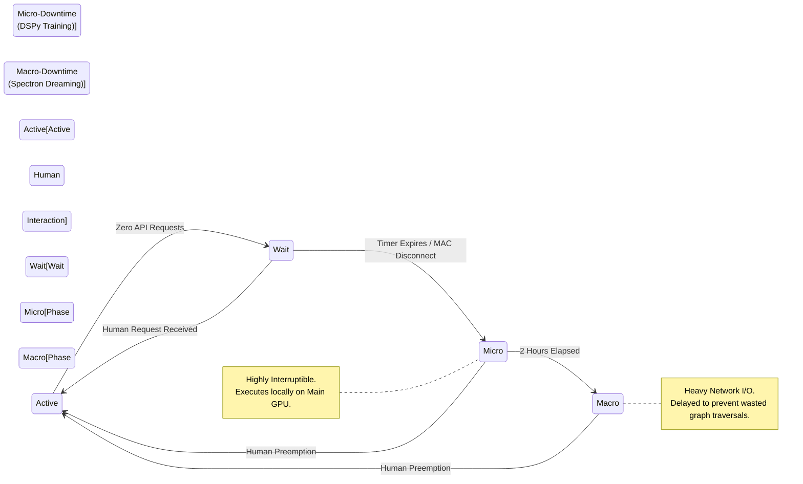

# The Autonomous Dynamic Idle-Loop and "Dreaming" Pipeline

Traditional server environments rely on rigid, clock-based `cron` jobs to execute background maintenance. Because the human operator's work schedule is highly irregular, the Janus architecture discards temporal scheduling in favor of an **Event-Driven Resource Utilization** model.

The system continuously monitors telemetry to instantly capitalize on both micro-downtimes (e.g., running errands) and macro-downtimes (e.g., sleeping), executing heavy autonomous optimization workloads while guaranteeing immediate resource yielding the second the human returns.

---

## 1. The Two Pillars of Idle-State Optimization

The autonomous idle-loop is bifurcated into two distinct operational pillars, segmented by compute target and interruptibility.

### Pillar A: "Dreaming" (Memory Consolidation)
* **Driver:** SurrealDB 3.0 (Spectron Subsystem).
* **Hardware Target:** Intel NUC (Edge-Tier Brain) via 2.5G LAN.
* **Function:** Spectron background processes analyze the day's semantic logs to infer implicit ontological relationships and consolidate fragmented knowledge graphs. This heavy compute executes entirely on the NUC's CPU and RAM buffer, completely offloading the primary server.

### Pillar B: "Training" (Algorithmic Refinement)
* **Driver:** DSPy and Woodpecker CI.
* **Hardware Target:** Primary Server (P-Cores, 128GB RAM, RTX 5070 Ti NVFP4).
* **Function:** Utilizing "AlphaEvolve" methodologies, the Meta-Agent (Engine A) sandboxes historical tasks and mutates the programmatic logic of its subordinate worker agents to find faster, more token-efficient execution pathways.

#### The Evolutionary Coding Workflow
1. **Code-Level Mutation:** Engine A rewrites the actual Python source code (e.g., NemoClaw's tool scripts or semantic routing logic).
2. **Evaluation:** The generated algorithm is tested against historical benchmarks (pulled from the NUC) inside an isolated Woodpecker CI sandbox, executed rapidly by Engine B.
3. **The Autonomous Commit:** If the mutated code successfully executes the task with a verifiably lower token expenditure and zero errors, the agent autonomously commits the new Python script to the local Gitea repository. ArgoCD immediately detects the commit and rolls the optimization out to the live cluster.

---

## 2. The Telemetry Trigger Engine

To determine the transition from Active to Idle states, a lightweight Python watcher daemon operates within the Kubernetes cluster, continuously polling **Prometheus** metrics.

The Idle-Loop initiates if *any* of the following trigger conditions are met:

1. **The Telemetry Threshold:** Prometheus reports <5% CPU/GPU utilization and exactly zero LiteLLM API requests for **45 uninterrupted minutes**.
2. **Network Presence Detachment:** The `n8n` orchestrator polls the local router's DHCP/ARP tables. If the human operator's mobile device MAC address disconnects from the Wi-Fi (indicating departure from the physical premises), the 45-minute wait timer is overridden, and the idle-loop initiates within 5 minutes.
3. **Manual Override:** The execution of the "Away Mode" webhook via the AnythingLLM user interface instantly forces the cluster into deep-training mode.

---

## 3. Dynamic Phasing and Execution Order

Simultaneous execution of both pillars would catastrophically saturate the 2.5G network switch and the NUC's CPU. Because the system cannot predict the duration of the human's absence, it executes tasks in a strict, prioritized two-phase order based on interruptibility.

* **Phase 1: Micro-Downtime (Hours 1-2):** DSPy algorithmic training initiates first. It executes entirely locally on the primary server's GPU and RAM. It is highly interruptible; if aborted midway, no data is corrupted, and the optimization trial simply restarts during the next window.
* **Phase 2: Macro-Downtime (Hours 3+):** Spectron "Dreaming" initiates second. SurrealDB memory consolidation requires sustained, complex recursive queries over the network. To prevent wasting immense network bandwidth and NUC compute cycles on an aborted graph-traversal, "Dreaming" is delayed until the system statistically guarantees a long-term macro-downtime (e.g., the human sleeping).

---

## 4. The Preemptive Scheduler (The "Wake Up" Protocol)

The most severe risk of dynamic autonomous loops is resource starvation. If the human returns and initiates a prompt while the server is maximizing the RTX 5070 Ti for an AlphaEvolve training matrix, the cluster would typically freeze.

We resolve this via strict Kubernetes Preemption.

!!! success "Kubernetes PriorityClass Implementation"
    All primary user-facing Pods (LiteLLM, Engine A, Engine B, AnythingLLM) are strictly assigned a Kubernetes `PriorityClass` of **`System-Critical`**.

    Conversely, all DSPy Training and AlphaEvolve worker pods are assigned a `PriorityClass` of **`Background-Yield`**.

**The Preemption Mechanics:**
If the server is operating at 100% compute capacity during a Phase 1 Training loop, and a human inputs a query into AnythingLLM:
1. The LiteLLM proxy receives the prompt.
2. The Kubernetes scheduler registers a sudden `System-Critical` resource request.
3. The Kubernetes kernel instantly **evicts** and terminates the `Background-Yield` training pods, forcefully flushing the GPU VRAM.
4. The human's prompt is answered in milliseconds with zero perceptible latency.
5. The aborted training job is re-queued, awaiting the next 45-minute telemetry threshold to resume execution.

If an autonomous mutation proves detrimental, causing erratic agent behavior upon the user's return, the architecture's reliance on **ArgoCD** and **Gitea** permits a one-click declarative rollback to the previous day's verified repository state.
