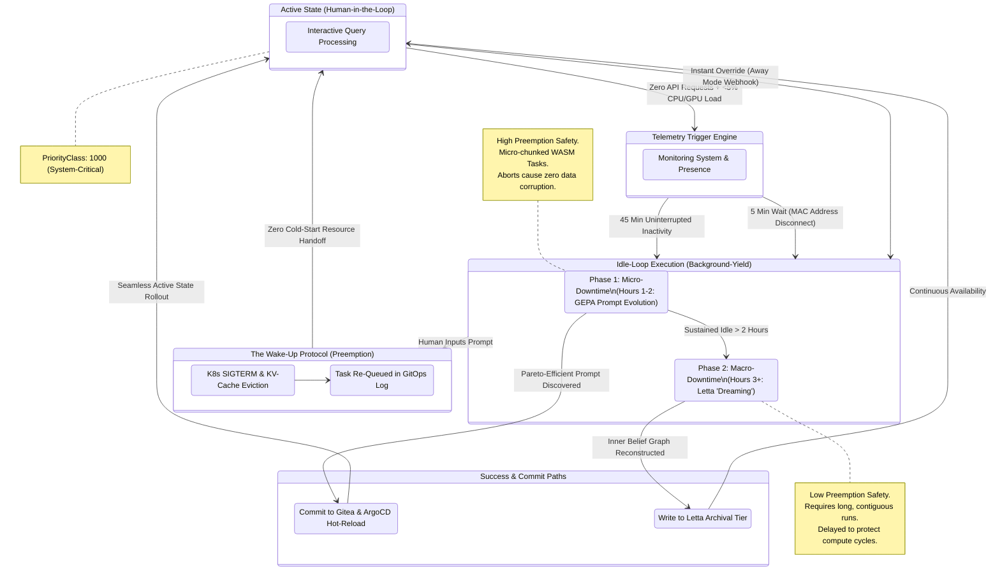

# The Autonomous Dynamic Idle-Loop and "Dreaming" Pipeline

Traditional server environments rely on rigid, clock-based system timers (e.g., `cron`) to execute background maintenance tasks. Because the human operator's cognitive work schedule is highly irregular, the Janus architecture discards temporal scheduling in favor of an **Event-Driven Resource Utilization** model.

The system continuously monitors system telemetry and network presence to instantly capitalize on both micro-downtimes (e.g., when the operator runs errands) and macro-downtimes (e.g., sleep-cycles), executing heavy autonomous optimization workloads while guaranteeing immediate resource yielding the second the human returns.

---

## 1. The Two Pillars of Idle-State Optimization

The autonomous idle-loop is bifurcated into two distinct operational pillars, segmented by compute target, execution objective, and preemption safety.

### Pillar A: "Dreaming" (Local Memory Consolidation)
*   **Driver:** Letta Cognitive State Machine (Rust-Native).
*   **Hardware Target:** Compute Workstation CPU P-Cores and GPU VRAM.
*   **Function:** Instead of routing heavy database graph queries over the network to the Intel NUC, the agent executes "Sleep-time Compute" locally. Letta background routines crawl the chronological **Recall Memory** logs generated throughout the day. Using Engine A (70B), the agent filters out transactional noise, resolves core entity relationships, extracts permanent insights, and writes them back into the local high-density **Archival Memory** tier. The NUC remains strictly in a cold role, receiving the consolidated ledger update asynchronously for transaction safety.

### Pillar B: "Training" (GEPA Prompt Evolution)
*   **Driver:** Nous Hermes Native GEPA (Genetic-Pareto Prompt Evolution) operating within the Rig/Rust control plane.
*   **Hardware Target:** Primary Server (i7-14700K E-Cores & RTX 5070 Ti).
*   **Function:** Rather than mutating highly volatile, compiled Python or Rust source code (which carries catastrophic system-bricking risks if an autonomous commit breaks compilation), Janus restricts self-optimization to the **Prompt and Schema space**. The Meta-Agent iteratively mutates system instructions, API schema limits, and tool descriptions.

#### The Prompt Evolution Workflow
1.  **YAML Prompt Mutation:** The Meta-Agent (Engine A) proposes a set of mutations to the active system prompt YAML files hosted in the `/prompts` directory.
2.  **WASM Simulation:** The mutated prompt variants are deployed within an isolated **Wasmtime sandbox** environment. The executor agent (Engine B) runs standard benchmarking sweeps inside the sandbox, measuring response accuracy, formatting adherence, and token-efficiency.
3.  **Pareto-Efficiency Evaluation:** GEPA evaluates the results against a multi-objective Pareto front, filtering for prompts that optimize both **reasoning accuracy** and **token density**.
4.  **The Autonomous Commit:** If a mutated prompt successfully outperforms the active baseline with zero schema deviations, the agent commits the updated YAML configuration back to Gitea. ArgoCD synchronizes the update, rolling out the superior prompt to the live cluster with zero execution downtime.

---

## 2. The Telemetry Trigger Engine

To determine the transition from Active to Idle states, a lightweight watcher daemon written in Rust polls local **VictoriaMetrics** and the **TensorZero Gateway** telemetry endpoints.

The Idle-Loop initiates if *any* of the following trigger conditions are satisfied:

1.  **TensorZero Inactivity:** The gateway registers exactly zero API requests, and VictoriaMetrics reports system CPU and GPU utilization below 5% for **45 uninterrupted minutes**.
2.  **Operator Network Presence Detachment:** The local home network router is polled. If the human operator's primary mobile device MAC address disconnects from the local Wi-Fi (indicating they have departed the premises), the 45-minute wait timer is overridden, and the idle-loop initiates within 5 minutes.
3.  **Manual Overrides:** Triggering an "Away Mode" webhook via the AnythingLLM interface instantly forces the cluster into deep-training mode.

---

## 3. Dynamic Phasing and Execution Order

Simultaneous execution of memory consolidation and prompt optimization would saturate physical GPU execution fences. Because the system cannot predict when the human operator will return, it executes idle workloads in a strict, prioritized phase order based on resource preemption times.

*   **Phase 1: Micro-Downtime (Hours 1-2):** GEPA Prompt Evolution initiates first. Prompt generation and WASM execution operate in highly micro-chunked tasks. Because prompt tests represent transactional, isolated runs, Phase 1 is highly interruptible. If aborted midway, no active memory state is corrupted, and the optimization run is safely discarded.
*   **Phase 2: Macro-Downtime (Hours 3+):** Letta Memory Consolidation ("Dreaming") initiates second. Memory consolidation requires long, contiguous runs of historical logs and complex reasoning passes to reconstruct the agent's inner belief graph. To avoid wasting vast CPU/GPU compute cycles on aborted runs, Phase 2 is delayed until telemetry statistically guarantees a sustained macro-downtime window (e.g., the operator's sleep schedule).

---

## 4. The Preemptive Scheduler (The "Wake Up" Protocol)

The most severe risk of running deep autonomous optimization loops on consumer hardware is operational starvation. If the human returns and inputs an active prompt while the system is maximizing the RTX 5070 Ti's computing capabilities for a GEPA generation matrix, the cluster would typically lock up, leading to high interface latencies.

Janus resolves this potential bottleneck via strict **Kubernetes PriorityClass Preemption**:

!!! success "Kubernetes PriorityClass Partitioning"
    *   **System-Critical (Priority: 1000):** Assigned to all core interactive components—including the TensorZero Gateway, Engine A, Engine B, Letta memory services, and AnythingLLM.
    *   **Background-Yield (Priority: 100):** Assigned to all GEPA prompt optimization, testing sandboxes, and offline Letta consolidation workers.

### The Preemption Mechanics
If the GPU is operating at 100% load during a prompt evolution loop, and the human operator inputs a manual query into AnythingLLM:

1.  The TensorZero Gateway intercepts the incoming human prompt.
2.  The Kubernetes scheduler registers a `System-Critical` resource request and immediately sends an eviction signal (SIGTERM) to the `Background-Yield` WASM sandboxes, freeing E-Core CPU threads and system RAM.
3.  Simultaneously, TensorZero dispatches an API interrupt to Engine A and Engine B. Utilizing **`llama_kv_cache_seq_rm` (Sequence Removal)**, the `llama.cpp` inference engines instantly evict the background agent's specific context sequence from the static VRAM fence.
4.  The static VRAM fences and model weights remain permanently untouched. The newly freed KV-Cache capacity is instantly allocated to the human operator's prompt, resolving the query with zero cold-start penalty.
5.  The aborted optimization run is quietly re-queued in the local GitOps log, awaiting the next telemetry-confirmed idle window.

If an autonomous prompt mutation introduces an unexpected reasoning regression, Gitea's versioned control coupled with ArgoCD permits a single-click rollback to the previous day's verified, stable YAML definitions.
