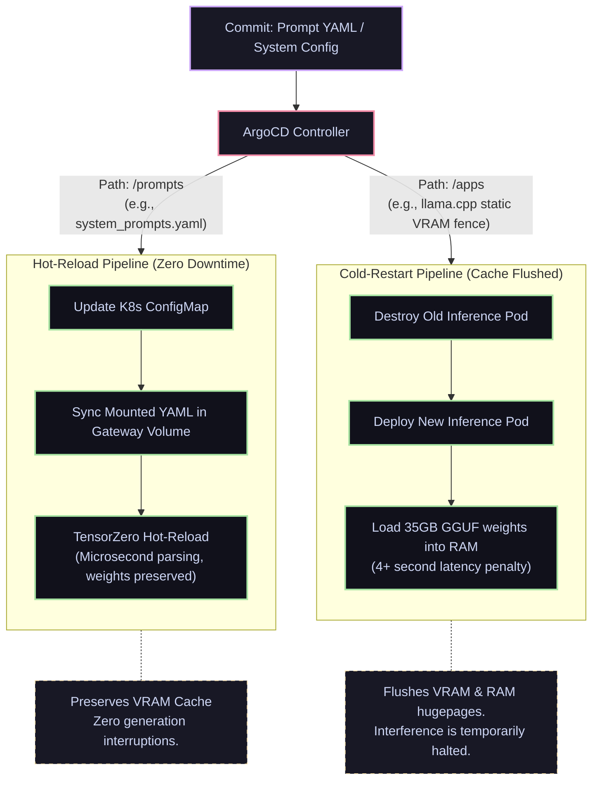

# Observability, Telemetry & GitOps

An autonomous, multi-agent AI cluster operating on highly constrained edge hardware functions essentially as a "black box." If an agent executes an infinite loop burning through thousands of tokens during a nocturnal macro-downtime phase, or if the Intel i7-14700K approaches thermal junction limits during evolutionary prompt training, precise bare-metal and application telemetry is required for diagnostic safety.

Furthermore, iterative prompt modifications generated by autonomous optimization loops must be rolled out via a deterministic, version-controlled pipeline that protects the delicate GPU VRAM state.

---

## 1. High-Density OTLP Telemetry (TensorZero to ClickHouse)

In the legacy 2024 architecture, we utilized Langfuse backed by a local PostgreSQL database for LLM trace logging. While rich in features, this setup consumed significant local RAM ($1.5\text{ GB+}$) and subjected the local Seagate FireCuda NVMe to heavy SSD write wear-and-tear due to frequent database flushes.

The 2026 Janus architecture implements a high-density, **zero-local-overhead telemetry pipeline** by utilizing the Rust-native **TensorZero Gateway**:

*   **Asynchronous OTLP Stream:** The TensorZero Gateway exports structured traces (prompt configurations, generated tokens, tool-calling latency, and system metadata) as asynchronous **OpenTelemetry (OTLP) events**.
*   **Decoupled Network Ingest:** These traces bypass the compute node's local filesystem and SSD buffers entirely. They are streamed over the high-speed 2.5G network bridge directly to the **ClickHouse** database hosted on the UPS-backed Intel NUC.
*   **ClickHouse Analytical Architecture:** ClickHouse's column-oriented layout is natively optimized for dense, insert-heavy workloads. It compresses raw telemetry events by up to 70%, preventing NUC SSD wear-and-tear while storing an immutable ledger of every agent's "thought process" and execution trace.
*   **VictoriaMetrics & Grafana Telemetry:** System-level performance metrics (such as CPU/GPU utilization, thermal temperatures, and network statistics) are collected by lightweight node-exporters and written directly to a highly compressed **VictoriaMetrics** timeseries instance and visualized via **Grafana**, both offloaded from the main Jonsbo rig to run natively on the Intel NUC. This consumes $<100\text{ MB}$ of RAM on the compute node.

---

## 2. Bare-Metal & Network Telemetry (VictoriaMetrics & Grafana)

Running a high-compute workstation within the tight thermal clearances of a 20-liter Jonsbo Z20 chassis requires rigorous bare-metal surveillance. We expose system hardware metrics via Prometheus node-exporters, visualized through Grafana dashboards pulled from VictoriaMetrics:

### 2.1 Mission-Critical Telemetry Dashboards

1.  **Speculative Verification Bandwidth:** Tracks the internal bus and memory bandwidth usage of the i7-14700K P-Cores. This monitors the verification throughput of llama.cpp speculative decoding, ensuring hugepages configurations are correctly preventing RAM-to-disk page-swaps.
2.  **VRAM Saturation Fences:** A critical alarm triggers if the **llama.cpp (Engine B)** memory footprint approaches **98% of its 4.0GB VRAM static fence** (within the 4.5 GB time-sliced partition shared with Whisper STT), alerting the orchestrator to dynamically scale down the active context window or enforce aggressive cache trimming.
3.  **Intel P-Core Thermal Junctions:** Monitors Cores 0-7 (P-Cores).
    > If sustained P-Core temperatures exceed **95°C** during GEPA optimization phases, the system triggers an automated webhook. If temperatures do not decrease within 180 seconds, the host's systemd telemetry watcher dynamically decreases the CPU's PL1/PL2 power limits via the Linux kernel's Intel PowerCap (`intel_rapl`) sysfs interface on the host, cooling the processor in real-time without requiring a system reboot.
4.  **Edge-Node Database Latency:** Monitors network switch packets and ICMP latency to the NUC. If ClickHouse event logging latency exceeds **5ms**, it indicates network backbone congestion that must be resolved to prevent local Rig execution pauses.

---

## 3. GitOps, Prompt Hot-Reloading & Mono-Repo Architecture

To prevent configuration drift, manual interventions (e.g., `kubectl apply`) are strictly prohibited in production. The cluster's complete configuration lives as plain text within a local Gitea repository managed by **ArgoCD**.

### 3.1 The Mono-Repo Folder Structure
*   **`/infrastructure`**: Hardened configurations (e.g., Proxmox BIOS rules, Talos VM configs, network DMZ maps).
*   **`/cluster-tools`**: Base cluster manifests (ArgoCD, storage classes, NVIDIA device plugins).
*   **`/apps`**: Main inference engine parameters (`/inference`), gateways (`/gateways`), and UI mounts (`/ui`).
*   **`/prompts`**: Core agent logic, system templates, tool descriptors, and YAML-based GEPA prompt configurations.

### 3.2 Declarative Prompt Hot-Reloading

When the autonomous GEPA pipeline commits a superior prompt configuration, ArgoCD must deploy this update without disrupting active inference engines. In traditional setups, updating an application pod triggers a cold boot, flushing the static VRAM cache. In the Janus 2026 architecture, we implement **declarative hot-reloading**:

!!! success "Hot-Reloading vs. Cold-Starting"
    *   **Inference Engine Updates (/apps):** If you modify a hard container parameter (e.g., resizing Engine B's VRAM fence fraction), ArgoCD executes a cold restart. This destroys the pod, re-initializes the GPU device context, and reloads the model weights, introducing an **8-second service outage**.
    *   **Prompt & Template Updates (/prompts):** When GEPA commits an optimized prompt to `/prompts`, ArgoCD applies the change to a Kubernetes `ConfigMap`. The **TensorZero Gateway** detects the update to its mounted volumes and instantly hot-reloads the YAML definitions in microseconds. The underlying llama.cpp processes remain untouched, **preserving the static VRAM cache** and avoiding any interruption in active token generation loops.
