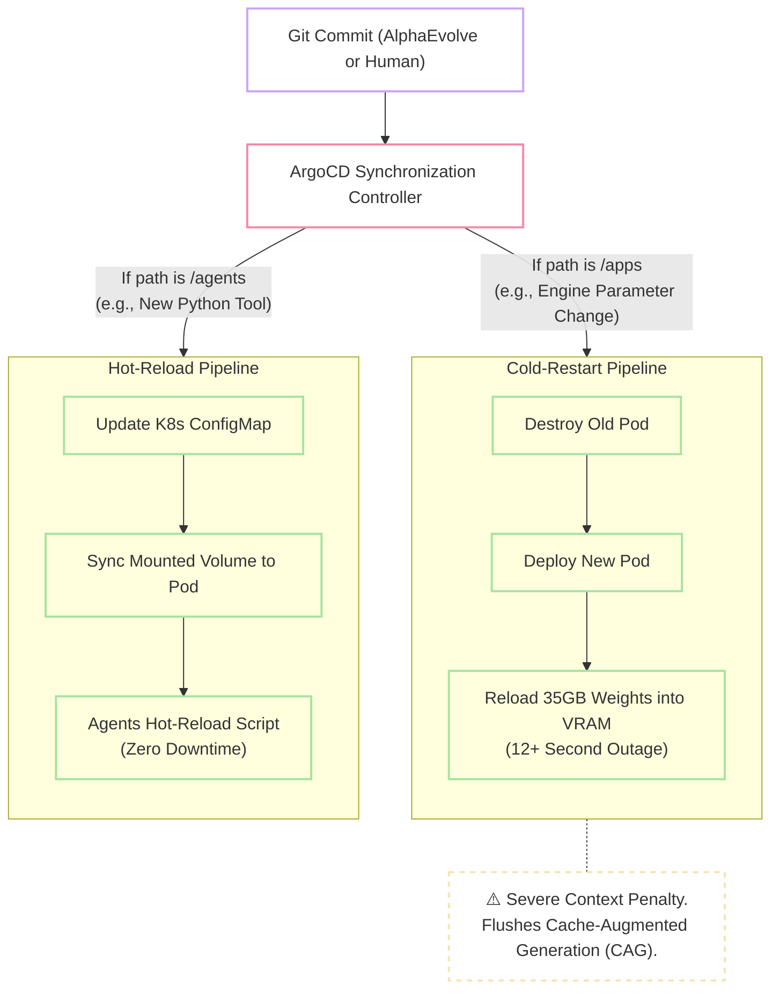

# 10. Observability, Telemetry & GitOps

An autonomous, multi-agent AI cluster operating on constrained edge hardware functions essentially as a "black box." If an agent executes an infinite loop burning through 50,000 tokens during a nocturnal macro-downtime phase, or if the Intel i7-14700K approaches thermal junction limits during evolutionary training, precise telemetry is required for diagnosis.

Furthermore, iterative algorithmic updates generated by the cluster must be deployed via a deterministic, version-controlled pipeline that protects the delicate VRAM state.

---

## 1. LLM Tracing & Agent Observability (Langfuse)

Standard terminal logs (`stdout`/`stderr`) are fundamentally insufficient for tracing the non-linear "thought processes" of autonomous agents. The architecture standardizes on **Langfuse** for granular execution observability.

*   **Deployment Substrate:** The Langfuse open-source container is deployed within the Kubernetes cluster, persisting trace data to a localized Postgres pod.
*   **The LiteLLM Connection:** The `LiteLLM` proxy is configured to natively export all telemetry data—including API requests, latency metrics, and token expenditures—directly to Langfuse.
*   **MCP Tracing:** Because the **NemoVision** system operates as an isolated Model Context Protocol (MCP) server, Langfuse spans are specifically configured to capture and trace the exact visual data NemoVision extracts before it is passed back to the core agents.
*   **The Waterfall UI:** Langfuse generates a visual "Waterfall" UI. This allows the human operator to chronologically debug complex behaviors (e.g., observing exactly what Agent Zero planned, the specific tools NemoClaw called, and the precise millisecond latency of each step).

---

## 2. Bare-Metal & Network Telemetry (Prometheus & Grafana)

Pushing a Micro-ATX thermal envelope and relying on a distributed, asynchronous storage subsystem (the UPS-backed Intel NUC) necessitates strict hardware monitoring. We deploy `node-exporter` on both the bare-metal Proxmox host and the Debian NUC, feeding a centralized Prometheus/Grafana stack within the K3s cluster.

### 2.1 Mission-Critical Grafana Dashboards

The following custom dashboards are mandatory for cluster stability:

1.  **PowerInfer Sparsity Monitor:** Tracks PCIe bus bandwidth utilization. This verifies that Engine A is correctly keeping "hot" NVFP4 neurons inside the RTX 5070 Ti and only spilling "cold" neurons to the Talos Hugepages.
2.  **VRAM Saturation Fences:** A critical alarm triggers if Engine B (**SGLang**) breaches **98% VRAM usage**, allowing for dynamic adjustment of context limits before an Out-of-Memory (OOM) crash occurs.
3.  **P-Core Thermal Analytics:** Explicitly monitors Cores 0-7 (The P-Cores) on the 14700K.
    > !!! warning "Thermal Throttling Failsafe"
    > If sustained temperatures exceed **95°C** during multi-hour AlphaEvolve training loops, the PL1/PL2 wattage limits must be lowered within the ASRock motherboard BIOS to prevent silicon degradation.
4.  **Edge-Node Database Latency:** Monitors 2.5G network switch traffic and ICMP latency to the Intel NUC. If SurrealDB micro-writes exceed a **5ms latency threshold**, it indicates a network bottleneck that will inevitably throttle the inference engines.

---

## 3. GitOps, Hot-Reloading & Mono-Repo Architecture

The AI software landscape moves at breakneck speed. To prevent configuration drift, manual interventions (e.g., `kubectl apply`) are strictly prohibited. The cluster configuration lives as plain text files in a local Gitea repository, managed by **ArgoCD**.

### 3.1 The Mono-Repo Folder Structure
The entire cluster state exists as plain text YAML and Python files stored in a localized Gitea repository. **ArgoCD** continuously polls this repository and synchronizes state changes to the Kubernetes cluster.

*   **`/infrastructure`**: Contains bare-metal configurations (e.g., `talos-machineconfig.yaml`). Used for OS recovery.
*   **`/cluster-tools`**: Contains foundational manifests (ArgoCD, NVIDIA device plugins, OpenEBS storage classes).
*   **`/apps`**: Contains the core inference engines (`/inference`), gateways (`/gateways`), and UI layers (`/ui`).
*   **`/agents`**: Contains dynamic logic: Python tool scripts, CrewAI roles, and system prompts.

### 3.2 The Atomic Update Flow (Protecting the VRAM Cache)

When the autonomous AlphaEvolve pipeline generates a superior algorithm, it autonomously commits the code to the Gitea `/agents` directory. ArgoCD must deploy this update without disrupting the operational cluster.

!!! success "Hot-Reloading vs. Cold-Starting"

    *   **Infrastructure Updates (/apps):** If you change an engine parameter (e.g., giving SGLang more VRAM), ArgoCD destroys the old pod and rolls out a new one. This is a "Cold Start."
    *   **Agent Updates (/agents):** When AlphaEvolve commits a better prompt, ArgoCD syncs the change into a Kubernetes `ConfigMap`. The agent pods mount this as a live folder and instantly "hot-reload" the new logic. This prevents the massive VRAM **Cache-Augmented Generation (CAG)** memory from being flushed, ensuring zero downtime and zero performance penalties.
