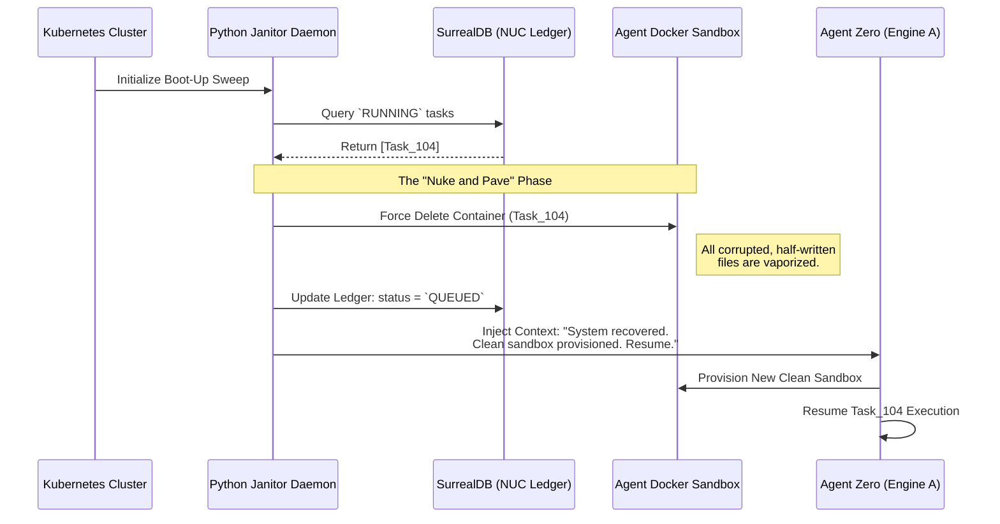

# Disaster Recovery and Automated Healing

Adherence to the "Crash-Safe" philosophy dictates that the primary workstation operates without an Uninterruptible Power Supply (UPS). Consequently, the server is guaranteed to experience ungraceful shutdowns due to grid instability. This layer establishes the autonomic recovery heuristics required to ensure the system sanitizes corrupted execution states without requiring manual SSH intervention from the operator.

---

## 1. The Boot Sequence and Cryptographic Handoff

Because the Proxmox host is secured via Zero-Trust LUKS Block Encryption, it is fundamentally impossible for the primary server to achieve an unattended, fully automated recovery sequence. The recovery protocol mandates a strict "Human-in-the-Loop" phase to satisfy cryptographic requirements.

1. **The Wake-on-LAN Trigger:** When grid power stabilizes, the UPS-backed Intel NUC (Edge-Tier Brain) transmits a Wake-on-LAN (WoL) "magic packet." This initiates the physical boot sequence of the main server's motherboard.
2. **The Cryptographic Air-Gap:** The server halts at the pre-boot environment, prompting for the LUKS decryption passphrase. The human operator must physically connect a keyboard and input the high-entropy key.
3. **The Automated Handoff:** Once the hypervisor unlocks the LUKS container and mounts the ZFS pool, the Talos VMs boot. K3s initiates, pulling the latest `etcd` snapshot from the Intel NUC (if corruption is detected). Upon establishing a healthy cluster state, the Kubernetes scheduler immediately launches the **Python Janitor Daemon**.

---

## 2. The Autonomic Janitor Daemon

The Python Janitor Daemon is a lightweight, declarative script operating as a Kubernetes `CronJob` (or a background orchestration task within `n8n`). It functions as the cluster's autonomic immune system, specifically engineered to execute a "Nuke and Pave" rollback on corrupted agent states.

### 2.1 The Boot-Up Sweep Heuristic

Because autonomous agents frequently manipulate the local filesystem (compiling code, editing configuration files), an ungraceful shutdown during an active execution loop will leave ephemeral docker sandboxes in a fragmented, corrupted state. The Janitor Daemon uses the infallible memory of the Edge-Tier NUC to identify these corruptions.

1. Once the `LiteLLM` proxy reports a `Healthy` readiness probe, the Janitor Daemon initiates a network connection to the SurrealDB instance on the Intel NUC.
2. It executes a query against the Agent Ledger, requesting all tasks currently marked with the status `PENDING` or `RUNNING`.
3. **The Core Logic:** Because the primary server has just booted, any task listed as `RUNNING` is mathematically guaranteed to have been terminated mid-execution by the power outage.

### 2.2 The "Nuke and Pave" Recovery Protocol

For every stranded task identified (e.g., Task ID: 104), the Janitor executes a destructive recovery protocol to guarantee absolute state purity before the AI is permitted to resume.

1. **Destruction:** The Janitor forcefully deletes the ephemeral Docker/LXC sandbox associated with the stranded task. All corrupted files, half-written scripts, and corrupted caches are instantly vaporized.
2. **Ledger Reset:** It executes an API call to SurrealDB, resetting the task's state from `RUNNING` back to `QUEUED`.
3. **Context Injection:** The Janitor utilizes the Hindsight Model Context Protocol (MCP) to inject a highly specific system prompt into Agent Zero's memory window:
   > *"System recovered from ungraceful power failure. Task 104 failed mid-execution. Your previous sandbox was corrupted and has been destroyed. A clean sandbox has been provisioned. Please evaluate the objective and resume execution."*

By pairing the infallible, UPS-backed memory ledger of the Intel NUC with the ruthless sandbox destruction of the Janitor Daemon, the AI ecosystem successfully recovers from sudden-death scenarios with zero manual code tracking or state intervention from the operator.
