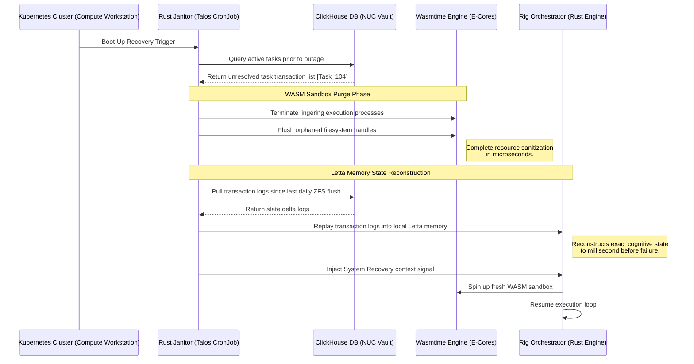

# Disaster Recovery and Automated Healing

Adherence to the "Crash-Safe" philosophy dictates that the primary compute workstation operates without an expensive, high-capacity Uninterruptible Power Supply (UPS). Consequently, the primary server is guaranteed to experience abrupt, ungraceful power shutdowns due to grid instability. This operational tier establishes the autonomic recovery heuristics required to ensure the system sanitizes corrupted execution states and reconstructs cognitive memory without requiring manual SSH intervention from the operator.

---

## 1. The Boot Sequence and Cryptographic Handoff

Because the Proxmox VE hypervisor is secured at the bare-metal level via block-level LUKS Encryption, it is fundamentally impossible for the primary server to achieve a fully unattended, fully automated recovery sequence. The recovery protocol strictly bifurcates into a manual cryptographic validation phase and a zero-touch autonomic state reconstruction loop:

*   **Phase 1: The Cryptographic Bridge (Manual):** The server halts at the `initramfs` Dropbear instance. The remote-unlock script is executed securely via a KeePassXC SSH agent connection, ensuring the decryption key never resides on the NUC or the hypervisor permanently.
*   **Phase 2: Autonomic State Reconstruction (Zero-Touch):** Once the drive is unlocked, the "Automated Healing" strictly refers to the software and cognitive state. The Rust Janitor Daemon autonomously sweeps Wasmtime processes. Because the local NVMe only receives persistent batched writes during the nocturnal "Dreaming" phase, the Janitor queries the ClickHouse NUC database for **all OTLP transaction logs generated since the timestamp of the last successful daily ZFS flush**. It replays this entire delta into the Letta token-space, perfectly reconstructing the agent's memory without data loss.

---

## 2. The Autonomic Rust Janitor Daemon

The Janitor Daemon is compiled as a lightweight, high-performance Rust binary operating as a Kubernetes `CronJob` on the Talos VM. It acts as the cluster's immune system, specifically engineered to execute a "Nuke and Pave" rollback on corrupted agent states while maintaining complete local file integrity.

### 2.1 The Boot-Up Sweep Heuristic

Because autonomous agents frequently run file operations, compile utilities, or execute script logic, an ungraceful shutdown during an active execution run leaves local scratch directories in a fragmented, unpredictable state. The Janitor Daemon uses the infallible, UPS-backed memory on the Intel NUC to isolate and repair these corruptions.

1.  Once the **TensorZero Gateway** reports a `Healthy` readiness state, the Rust Janitor initiates a TCP connection to the **ClickHouse database** on the NUC.
2.  It queries the transaction ledger for all task execution runs registered with the status `IN_PROGRESS` or `RUNNING` at the time of the log interruption.
3.  **The Core Logic:** Because the primary compute node has just booted, any task listed in ClickHouse as `RUNNING` is mathematically guaranteed to have been cut short mid-execution by the grid failure.

### 2.2 The "Nuke and Pave" WASM Recovery Protocol

For every stranded task identified, the Janitor executes a destructive cleanup protocol to guarantee absolute state purity before the Rig orchestration plane is permitted to resume task loops.



1.  **WASM Sandbox Termination:** Unlike legacy Docker container cleanups (which require seconds to parse container maps and prune networks), the Rust Janitor verifies the termination of all lingering **Wasmtime** process handles. It forces the closure of orphaned capability-based file descriptors, releasing locks on local ZFS filesystems in microseconds.
2.  **Letta Cognitive State Reconstruction:** Because the primary compute node is transactionally stateless during active hours, its active local Letta cognitive state might have been corrupted or lost during the power failure. The Janitor queries ClickHouse on the NUC, pulling **all OTLP transaction logs generated since the timestamp of the last successful daily ZFS flush** to prevent memory loss.
3.  **Transaction Replay:** The Janitor replays the transaction logs directly into the local Rust Letta engine, reconstructing the agent's virtual **Core Memory** and **Recall Memory** networks to the exact millisecond before the power failure occurred.
4.  **Context Injection & Resume:** The Janitor sends an API callback to the **Rig Orchestrator**, resetting the task's state in the transaction queue to `QUEUED`, and injects a recovery context trace directly into the agent's volatile memory:
    > *"System recovered from ungraceful power failure. Task 104 was interrupted. Lingering Wasmtime sandboxes have been destroyed. Local Letta state has been successfully replayed and verified. Resume execution from the last safe checkpoint."*

---

## 3. Bare-Metal Recovery (The Chroot Matrix)

If the main Proxmox host's Debian substrate kernel panics, the bootloader corrupts, or the remote cryptographic handoff fails, the primary node becomes unreachable. You must bridge into the bare-metal filesystem using a bootable Live USB to repair the system.

### 3.1 Mounting the Cryptographic Substrate

Boot the primary workstation from a Debian 13 Live USB and install ZFS and LUKS utilities to mount the secure volume:

```bash
# 1. Arm the live environment with ZFS and LUKS modules
sudo sed -i 's/main/main contrib non-free non-free-firmware/g' /etc/apt/sources.list
sudo apt update
sudo apt install -y dkms zfs-dkms zfsutils-linux cryptsetup
sudo modprobe zfs

# 2. Open the encrypted LUKS container
sudo cryptsetup open /dev/nvme0n1p2 nvme0n1p2_crypt

# 3. Force-import the ZFS pool and mount to temporary target
sudo zpool import -f -R /target rpool
sudo mount /dev/nvme0n1p1 /target/boot

# 4. Bind system devices and chroot pivot
for dir in /dev /dev/pts /proc /sys /run; do sudo mount --bind $dir /target$dir; done
sudo chroot /target /bin/bash
export LANG=C.UTF-8
```

You are now operating as `root` inside the decrypted, bare-metal Janus substrate. From here, you can run standard repair utilities, rebuild the `initramfs` hugepages configuration, inspect systemd service journals, or update GRUB boot entries.

Once repairs are successfully completed, exit the chroot securely to prevent ZFS pool locking:

```bash
exit
sudo umount -R /target
sudo zpool export rpool
sudo reboot
```
---

### 🛠️ Recovery and Durability Checklist

!!! safety "State Persistence Constraint"
    All active agents must operate as **stateless systems**. Any permanent transaction data, prompt updates, or logs must be written asynchronously to ClickHouse on the NUC. Writing agent state directly to the local primary SSD is strictly banned to guarantee successful recovery loops.
!!! warning "LUKS Remote Unlock Timeout"
    The Dropbear SSH initialization within `initramfs` will wait indefinitely for keyboard input. The operator must execute the remote unlock sequence within **10 minutes** of the WOL trigger to prevent motherboards from entering automatic BIOS power-down states under severe thermal profiles.
