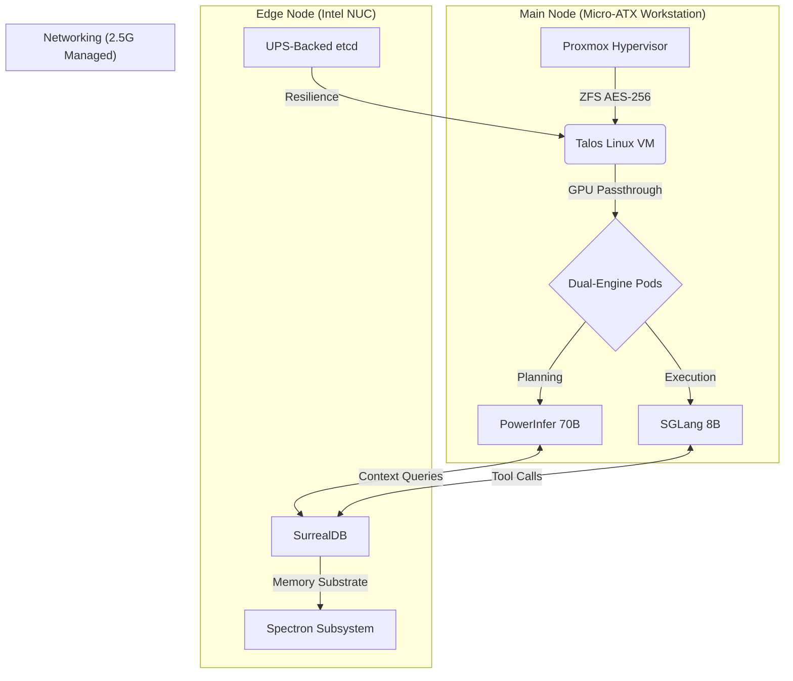

# **Project Janus: Synapse Edge**

**Autonomous AI Orchestration at the Edge.**

Welcome to the central documentation for Project Janus. This repository contains the complete blueprint for building a datacenter-grade AI cluster on consumer-grade hardware, specifically optimized for the Blackwell (RTX 50-series) architecture.

## **🌌 The Vision**

Project Janus was born from a single question: *Can a 400W consumer workstation rival a 10,000W rack server in autonomous reasoning capabilities?*

By applying **Constraint Engineering**, we bypass physical hardware limitations using:

* **NVFP4 Quantization:** Shrinking 70B models to fit into consumer VRAM.
* **Dual-Engine Slicing:** Separating "Deep Planning" from "Rapid Tool Execution."
* **Edge-Memory Offloading:** Moving state and long-term memory to a resilient NUC node.

## **🏗️ High-Level Cluster Architecture**

Below is the logical flow of the **Synapse Edge** stack, from hardware passthrough to autonomous agent execution.

## **🎯 Technical Pillars**

### **🚀 Dual-Engine Paradigm**

Simultaneous hosting of a 70B "Architect" model and an 8B "Worker" model on a single 16GB GPU. \[:octicons-arrow-right-24: View Inference Strategy\](05. Core AI Inference Deployment (The Dual-Engine).md)

### **🗄️ Bi-Temporal Memory**

An append-only ledger on SurrealDB that allows agents to remember not just *what* happened, but *when* it changed. \[:octicons-arrow-right-24: Explore Data Layer\](06. Data Layer & Memory Substrate.md)

### **🛡️ Crash-Safe Resilience**

A distributed "Safe-Stack" that protects long-term memory even if the main compute node suffers immediate power loss. \[:octicons-arrow-right-24: Setup Prep\](🛠️ Preparation\_ The *Safe-Stack* Configuration.md)

### **💤 Autonomous Dreaming**

An event-driven idle-loop that consolidates knowledge and optimizes agent source code while the cluster is unused. \[:octicons-arrow-right-24: See Idle Loops\](09. The Autonomous Dynamic *Idle-Loop* & \_Dreaming.md)

## **🚦 System Status Tracking**

This represents the current build-out state of the Synapse Edge cluster:

* \[x\] **Phase 1: Bare Metal** (Proxmox/ZFS/Thermal Tuning)
* \[x\] **Phase 2: Orchestration** (Talos/K3s/Nvidia-SMI)
* \[ \] **Phase 3: The Brain** (SurrealDB/PowerInfer/SGLang)
* \[ \] **Phase 4: Autonomy** (DSPy/AlphaEvolve/Janitor Daemon)

## **🗺️ Where to start?**

1. **Preparation**: Review the \[Safe-Stack Configuration\](🛠️ Preparation\_ The *Safe-Stack* Configuration.md) before building.
2. **Hardware**: Deep dive into the \[Architecture Overview\](00. Architecture Overview & Constraints Strategy.md).
3. **Security**: Understand the \[Multi-Tenant Privacy Tiers\](12. Multi-Tenant Profiles & Privacy Tiers.md).
