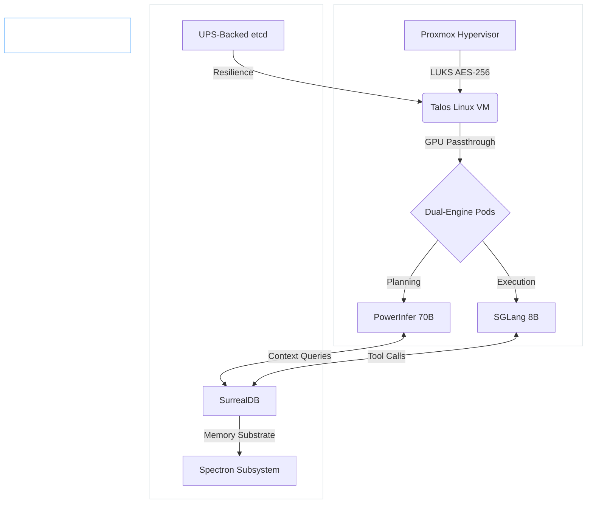

# Project Janus: Synapse Edge

**The Technical Specification for Autonomous AI Orchestration at the Edge.**

Welcome to the definitive engineering reference for **Project Janus**. This documentation suite details the architectural design, physical implementation, and operational protocols for deploying a datacenter-grade AI cluster on consumer-grade hardware, specifically optimized for the **NVIDIA Blackwell (SM120)** architecture.

---

## 🌌 The Vision: Constraint Engineering

Project Janus is an exercise in **Constraint Engineering**. It attempts to resolve the fundamental conflict between high-compute AI requirements and consumer-level power/thermal envelopes. By decoupling stateless inference from stateful memory and utilizing the native hardware-accelerated **NVFP4 (4-bit floating point)** math of the Blackwell architecture, we enable a 400W workstation to rival the autonomous reasoning capabilities of significantly larger systems.

---

## 🏗️ High-Level Cluster Architecture

The **Synapse Edge** stack operates across two physical nodes, bridged by a high-speed 2.5G managed backbone. This separation ensures that the "Brain" (SurrealDB Memory) remains resilient even if the "Body" (Tensor Worker) undergoes immediate power loss.

---

## 📚 Documentation Chapters

The documentation is organized as a sequential textbook. It is recommended to follow the phases in order to ensure hardware safety and software stability.

### Phase 1: Physical Foundations & Bare-Metal Hardening

* **[🛠️ Preparation: The Safe-Stack Configuration](<🛠️ Preparation_ The _Safe-Stack_ Configuration.md>):** Defining the "Nuke and Pave" philosophy and hardware baseline.
* **[01. Physical Assembly, BIOS & Bare-Metal Security](<01. Physical Assembly, BIOS & Bare-Metal Security.md>):** Thermal clearances, 14700K undervolting, and DMA protection.
* **[02. Debian Substrate, LUKS Encryption & Proxmox Sideloading](<02. Debian Substrate, LUKS Encryption & Proxmox Sideloading.md>):** Establishing the LUKS-native cryptographic boundary and hypervisor sideloading.
* **[03. Proxmox Kernel & Hypervisor Optimization](<03. Proxmox Kernel & Hypervisor Optimization.md>):** P-Core/E-Core pinning and ZFS ARC tuning.

### Phase 2: Orchestration & AI Inference

* **[04. Virtualization & Kubernetes (Talos + K3s)](<04. Virtualization & Kubernetes (Talos + K3s).md>):** Immutable OS deployment and GPU resource delegation.
* **[05. Core AI Inference Deployment (The Dual-Engine)](<05. Core AI Inference Deployment (The Dual-Engine).md>):** Scaling 70B models on 16GB VRAM via PowerInfer and SGLang.
* **[06. Data Layer & Memory Substrate](<06. Data Layer & Memory Substrate.md>):** SurrealDB GraphRAG and bitemporal state management.

### Phase 3: Networking & Security

* **[07. API Gateway, Orchestration & Network Firewall](<07. API Gateway, Orchestration & Network Firewall.md>):** LiteLLM, n8n workflows, and strict ingress/egress policies.
* **[12. Multi-Tenant Profiles & Privacy Tiers](<12. Multi-Tenant Profiles & Privacy Tiers.md>):** Epistemological isolation and PII masking.

### Phase 4: Autonomous Logic & Resilience

* **[08. Agent Workflows & UI Layer](<08. Agent Workflows & UI Layer.md>):** AnythingLLM integration and Agent Zero task delegation.
* **[09. The Autonomous Dynamic Idle-Loop & Dreaming](<09. The Autonomous Dynamic _Idle-Loop_ & _Dreaming.md>):** Knowledge consolidation and evolutionary coding.
* **[10. Observability, Telemetry & GitOps](<10. Observability, Telemetry & GitOps.md>):** Langfuse, Prometheus, and ArgoCD synchronization.
* **[11. Disaster Recovery & Automated Healing](<11. Disaster Recovery & Automated Healing.md>):** The Janitor Daemon and "Cold Start" recovery sequences.

---

## 🎯 Technical Pillars

!!! abstract "Autonomous Resilience"
    The cluster is designed to be **Self-Optimizing** and **Self-Healing**. By utilizing AlphaEvolve, the system refines its own source code during idle hours, while the distributed state management ensures zero data loss during power outages.

!!! success "Blackwell Ready"
    Optimized for **NVFP4 (4-bit floating point)** precision, effectively doubling the parameter capacity of the 16GB VRAM pool and allowing the execution of 70B parameter models at interactive speeds.
