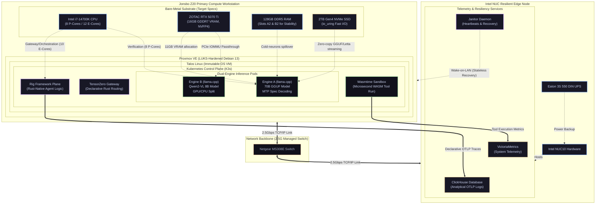

# Project Janus: Synapse Edge 2026

**The Definitive Engineering Specification for Autonomous AI Orchestration.**

Welcome to the definitive engineering reference for **Project Janus**. This documentation suite details the architectural design, physical implementation, and operational protocols for deploying a datacenter-grade AI cluster on consumer-grade hardware, specifically optimized for the **NVIDIA Blackwell (SM120)** architecture.

The 2026 "Synapse Edge" architecture represents a total departure from network-dependent, heavy-runtime frameworks. By utilizing a **Rust-native control plane**, **WASM-isolated tool execution**, and **Hardware-Accelerated NVFP4 math**, Janus achieves datacenter-grade reasoning within a 20-liter physical footprint.

---

## 🌌 The Vision: Constraint Engineering & Hardware-Aware Design

Project Janus is built upon the foundational philosophy of **Constraint Engineering**. We operate within the strict physical, electrical, and thermal limits of a single workstation housing an Intel i7-14700K processor and a single RTX 5070 Ti (16GB GDDR7 VRAM). In traditional deployments, scaling AI capabilities implies linear expansion of hardware budgets; in contrast, Janus resolves the compute and memory footprint challenges through extreme, hardware-aware virtualization and algorithmic co-design.

### The 2026 Strategic Pillars:

* **Compile-Time Safety & Low-Overhead Orchestration:** All agent logic is compiled natively in Rust using the **Rig Framework**. This replaces the massive memory overhead (typically 2GB+ per process) and unpredictable garbage collection latency of Python-based execution engines (such as CrewAI and Agent Zero) with a sub-millisecond, compile-time safe control plane that consumes less than 150MB of RAM.
* **Cognitive Memory Virtualization (Letta):** Instead of traversing network boundaries to external bitemporal databases, the agent's memory (partitioned virtually into Core, Recall, and Archival tiers) is managed directly within the LLM's active token-space. Under the hood, **Letta (MemGPT framework)** orchestrates the state machine, leveraging `io_uring` zero-copy stream operations in the guest OS kernel for sub-second, network-free cognitive state recall.
* **Blackwell Micro-Scaling Optimization:** By integrating hardware-native NVFP4 (4-bit floating point) math execution across llama.cpp, we double the functional parameter density of the RTX 5070 Ti's 16GB VRAM pool, enabling massive models to run locally at interactive speeds.
* **Mathematical WASM Sandboxing:** Ad-hoc, ephemeral agent tools execute in microsecond-latency **WebAssembly (WASM) runtimes** (powered by Wasmtime) embedded directly in the Rust control binary. This completely eliminates heavy, slow Docker containers, providing mathematically proven execution isolation and immediate, automatic host resource cleanup upon process termination.

---

## 🏗️ High-Level Cluster Topology

The **Synapse Edge** topology partitions operations across two physical nodes bridged by a symmetric, high-speed 2.5G managed network. This logical separation ensures that the stateful telemetry and backup systems remain fully resilient, allowing the high-compute primary workstation to run as a stateless compute cluster that can recover instantly from abrupt grid-power dropouts.

### 1. Primary Compute Workstation (Jonsbo Z20)
* **Engine A (Deep Reasoning):** Governed by **llama.cpp** running a 70B parameter GGUF model. Under-the-hood bandwidth limitations are bypassed using **Multi-Token Prediction (MTP) Speculative Decoding**. A lightweight 1.5B/3B draft model resides in VRAM to guess output tokens, while the physical P-Cores verify guesses against the larger 70B parameters paged across system DDR5.
* **Engine B (Reflex & Vision):** Governed by **llama.cpp** utilizing a GPU/CPU heterogeneous split. It hosts **Qwen2-VL** for real-time text-reflex and visual parsing, alongside high-density LoRA adapters swapped dynamically—all locked within a secure **4.5GB VRAM static fence**.
* **Orchestration:** Comprises the Rust-native **Rig** framework and **TensorZero** declarative gateway routing. All gateway, scheduling, and orchestrator tasks are pinned strictly to **10 Intel E-Cores** (leaving 2 Ghost Threads reserved exclusively for hypervisor LUKS decryption) to isolate inference math from application-level execution loops.

### 2. Edge-Tier Resiliency (Intel NUC)
* **Role:** Acts as the cluster’s offline logging center, cold telemetry repository, and remote recovery manager. It runs lightweight transaction logging inside **ClickHouse** and systems telemetry in **VictoriaMetrics**, isolated from the primary compute node's write overhead.
* **State and Recovery:** Powered by an **Eaton 3S 550 DIN UPS**. Following total power grid failures and subsequent restoration, the NUC automatically initializes, checks external network state, and delivers a hardware **Wake-on-LAN (WOL)** signal to trigger a cold boot on the compute workstation, which self-heals by pulling the latest declarations via GitOps (ArgoCD).

---

## 📂 Documentation Roadmap

The chapters are structured to form a comprehensive, textbook-style guide. It is recommended to proceed sequentially through the phases to ensure hardware safety, thermal stability, and exact cryptographic alignment.

### Phase 1: Physical & Substrate Foundations
* **[🛠️ Preparation: The Safe-Stack Configuration](./🛠️ Preparation The Safe-Stack Configuration.md):** Defining the bare-metal "Nuke and Pave" principles and the 2026 hardware constraints baseline.
* **[01. Physical Assembly & Bare-Metal Security](./01. Physical Assembly, BIOS & Bare-Metal Security.md):** Thermal limits, airflow paths, contact frame mounting, and i7-14700K undervolting protocols.
* **[02. Cryptographic Boundary & Proxmox Sideloading](./02. Debian Substrate, LUKS Encryption & Proxmox Sideloading.md):** LUKS-native block encryption, sideloading Proxmox VE onto Debian 13, and baseline hypervisor hardening.
* **[03. Hypervisor Optimization (Core Pinning)](./03. Proxmox Kernel & Hypervisor Optimization.md):** Configuring CPU topologies, pinning P/E cores, and tuning ZFS ARC thresholds to prevent VRAM memory conflicts.

### Phase 2: The Modern AI Stack
* **[04. Talos Linux & K3s Topology](./04. Virtualization & Kubernetes (Talos + K3s).md):** Immutable Talos OS installation, Talos networking, and declarative K3s Kubernetes resource distribution.
* **[05. Core AI Inference (The Dual-Engine)](./05. Core AI Inference Deployment (The Dual-Engine).md):** Fencing Engine A (llama.cpp) and Engine B (llama.cpp), configuring speculative execution, and managing mathematical precision.
* **[06. Data Layer & Letta Cognitive Memory](./06. Data Layer & Memory Substrate.md):** Setting up Letta (MemGPT) cognitive memory tiers in local token-space, streaming via `io_uring`, and repointing NUC cold backups.

### Phase 3: Orchestration & Autonomy
* **[07. TensorZero Gateway & Network DMZ](./07. API Gateway, Orchestration & Network Firewall.md):** Declarative gateway configuration via `tensorzero.yaml`, OTLP exporting, and firewalled local networking.
* **[08. Rig Framework & WASM Tool Sandboxing](./08. Agent Workflows & UI Layer.md):** Compiling Rust-native agents with Rig, embedding the Wasmtime interpreter, and securing microsecond-level tool execution.
* **[09. Autonomous Idle-Loops & GEPA Dreaming](./09. The Autonomous Dynamic _Idle-Loop_ & _Dreaming.md):** Designing offline consolidation routines, implementing Nous Hermes Native GEPA prompt evolution, and isolating prompt iterations from compiled systems code.

### Phase 4: Observability & Recovery
* **[10. OTLP Telemetry & GitOps (ArgoCD)](./10. Observability, Telemetry & GitOps.md):** Directing trace pipelines into ClickHouse, compiling VictoriaMetrics graphs, and synchronizing system state via declarative ArgoCD.
* **[11. Automated Healing & Disaster Recovery](./11. Disaster Recovery & Automated Healing.md):** Heartbeat tracking, Janitor Daemon configuration, cold-start power-recovery steps, and automatic backup restoration.
* **[12. Multi-Tenant Privacy Tiers](./12. Multi-Tenant Profiles & Privacy Tiers.md):** Segmenting operator environments, PII sanitization pipelines, and enforcing epistemological tier separation.

---

## 🎯 Technical Governance and Safety Thresholds

!!! success "Blackwell Ready (NVFP4 Optimization)"
    All active inference engines must target hardware-native **NVFP4 (4-bit floating point)** micro-scaling configurations. This is non-negotiable for preserving context capacity within the strict physical boundaries of the RTX 5070 Ti.

!!! info "Resilient Stateful Separation"
    The primary compute workstation must remain transactionally stateless during active hours. Active runtime micro-writes and log traces are strictly banned from local disks and streamed to the UPS-protected NUC. The primary NVMe hosts only the daily-compiled, read-heavy Letta Archival state, which is reconstructed asynchronously by the NUC in the event of a power failure.

!!! danger "No-Python Production Mandate"
    All production-tier agent logic, gateway routing, and sandbox scheduling must be compiled natively in Rust or executed within embedded WASM environments. Python dependencies (`pip`, `venv`, packages) are strictly prohibited from entering the runtime plane and are isolated entirely to offline Model Fine-Tuning and Quantization-Aware Training (QAT) pipelines.
