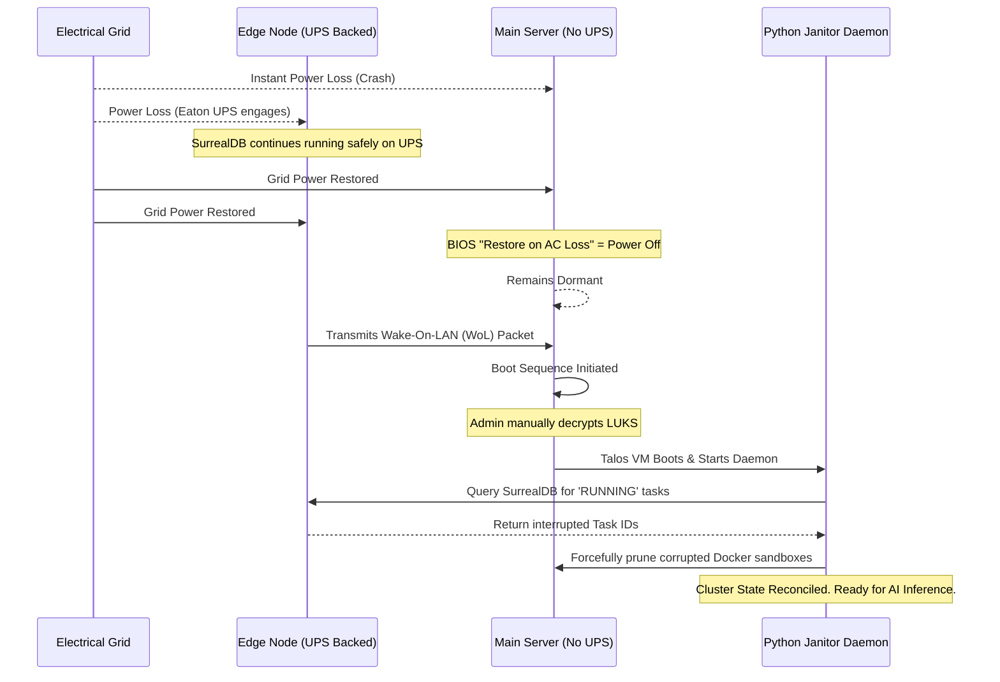

# Preparation: The "Safe-Stack" Configuration

The architecture relies on a specialized **"Hybrid-Resilience" Configuration**. While the primary high-performance compute node operates on a strict "Crash-Safe" philosophy—eschewing a costly high-wattage Uninterruptible Power Supply (UPS)—the critical Data Layer is physically isolated and fully protected. This methodology maximizes data consistency, prevents index corruption, and significantly extends the operational lifespan of the non-volatile memory express (NVMe) drives.

!!! abstract "Core Engineering Philosophy"
    Before provisioning the foundational operating system images, it is imperative to configure the low-level hardware parameters. The goal is to offload write-amplification from the SSDs to volatile RAM, secure off-site data, and implement deterministic boot sequencing following grid power failure.

---

## 1. The RAM Shock Absorber (SurrealDB on Edge-Tier)

The **Intel NUC10i5FNH** serves as the "Edge-Tier Brain" hosting the SurrealDB graph database. Because this node is continuously powered by an **Eaton 3S 550 DIN UPS**, we can fundamentally alter the standard database write-paranoia protocols.

Instead of writing every transaction synchronously to disk—which causes severe write amplification and premature SSD degradation—the ZFS filesystem is tuned to act as a massive write-cache. By modifying the ZFS dataset properties on the NUC to `sync=disabled` and extending the transaction group timeout (`zfs_txg_timeout=120`), SurrealDB executes thousands of micro-writes directly within the NUC's 16GB of DDR4 RAM.

Every 120 seconds, the ZFS daemon packages this state in memory and flushes it to the 250GB NVMe drive as a single, highly efficient contiguous block. This approach reduces SSD wear-and-tear by approximately 90%. Connectivity between the NUC and the main server is facilitated over a **NETGEAR MS308E Managed Switch**, ensuring that this isolated, high-speed database traffic does not contend with external routing.

---

## 2. Cryptographic Backup and Heartbeat

Because the primary Proxmox hypervisor is expected to lose power instantaneously during grid failure, an immutable backup strategy is the ultimate safety net.

Data redundancy is managed via a Restic cronjob executing on an incremental **three-hour interval**. To ensure strict data privacy when offloading to public cloud providers (e.g., Dropbox), the system employs Partially Homomorphic Encryption (PHE) or AES-256-GCM. All data is encrypted bare-metal on the server prior to network transmission.

!!! tip "Bandwidth Throttling"
    During the initial synchronization phase, the volume of data can severely saturate the local network. It is highly recommended to invoke Restic with the `--limit-upload` parameter to maintain Quality of Service (QoS) for concurrent operations.

---

## 3. The Cold-Start Initialization Sequence

When configuring the main compute server (Intel i7-14700K / RTX 5070 Ti), the initialization sequence must account for thermal constraints and power instability.

1. **BIOS Thermal Tuning:** To operate within the thermal dissipation envelope of the Jonsbo Z20 chassis, the CPU's PL1 and PL2 power limits must be strictly throttled to **180W** via the motherboard UEFI/BIOS.
2. **BIOS Power Policy:** The "Restore on AC/Power Loss" directive must be set to **Power Off**. If the grid power fluctuates, the main server must remain dormant. It only boots when the grid has stabilized and the UPS-backed NUC transmits a secure Wake-On-LAN (WoL) packet.
3. **LUKS Block Encryption:** The base installation utilizes a Debian 13 foundation with LUKS full-disk encryption, upon which Proxmox is sideloaded. This establishes a robust cryptographic boundary at the block level, ensuring that physical theft of the drives yields no readable data and requiring a manual unlock upon initialization.
4. **Hugepages Allocation:** To ensure zero memory fragmentation for the AI models, **56GB of Hugepages** must be pre-allocated. Crucially, this reservation is injected into the `talos-machineconfig.yaml` of the worker VM, *not* on the Proxmox host, to prevent hypervisor-level memory locking errors.

### 3.1 Automated Crash Recovery (Sequence Diagram)

The following sequence illustrates the automated recovery process following a sudden power failure on the main compute node.

---

## 4. Setup Roadmap

The deployment of the Safe-Stack configuration must be executed in a specific, serialized order to prevent configuration conflicts:

1. **Hardware Initialization:** Apply BIOS tuning (VT-d, IOMMU enablement, 180W Power Limits, and "Stay Off" rules).
2. **Base OS & Hypervisor Provisioning:** Install Debian 13 utilizing LUKS encrypted storage on the primary 2TB NVMe drive, followed by the manual sideloading of the Proxmox VE hypervisor packages.
3. **Resource Taming:** Limit the ZFS Adaptive Replacement Cache (ARC) to 8GB and disable the host swap partition to prevent unnecessary SSD wear.
4. **IOMMU Passthrough:** Isolate the RTX 5070 Ti from the host kernel and bind it to the VFIO driver, assigning it exclusively to the Talos Linux "Tensor Worker" VM.

!!! note "Manual Override and Airbag"
    Following any major configuration change or the ingestion of large datasets into the system, do not wait for the three-hour cron interval. Immediately execute a manual backup using the CLI to ensure the changes are immutably stored.
