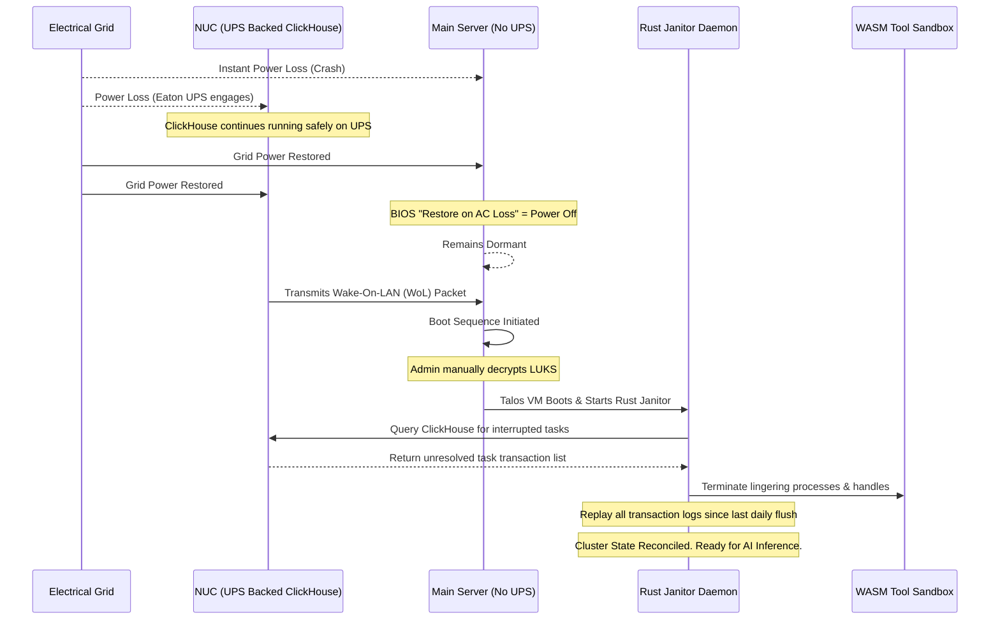

# Preparation: The "Safe-Stack" Configuration

The Janus architecture relies on a specialized **"Hybrid-Resilience" Configuration**. While the primary high-performance compute node operates on a strict "Crash-Safe" philosophy—eschewing a costly, high-wattage Uninterruptible Power Supply (UPS)—the critical Data and Telemetry Layer is physically isolated and fully protected. This methodology maximizes data consistency, prevents transaction ledger corruption, and significantly extends the operational lifespan of the non-volatile memory express (NVMe) drives.

!!! abstract "Core Engineering Philosophy"
    Before provisioning the foundational operating system images, it is imperative to configure the low-level hardware parameters. The goal is to offload write-amplification from the compute SSDs to local RAM, stream transaction logs asynchronously to the UPS-backed edge node, and implement deterministic boot sequencing following grid power failures.

---

## 1. The Telemetry and Resilience Substrate (Intel NUC Cold-Tier)

The Intel NUC10i5FNH serves as the "Edge-Tier Resiliency Node." In the 2026 architecture, the NUC is liberated from active, real-time database query operations. Instead, it hosts three strictly immutable services:

* **ClickHouse:** A column-oriented database housing the cluster's permanent cold-ledger and Letta memory logs.
* **VictoriaMetrics:** A highly compressed time-series database for node telemetry and thermal tracking.
* **MinIO:** A lightweight, S3-compatible object storage container utilized for backing up the Letta archival state and GitOps artifacts, while K3s state is natively backed up via the ClickHouse/PostgreSQL engine on the NUC to protect the declarative cluster state from main-node NVMe corruption.

Because this node is continuously powered by an **Eaton 3S 550 DIN UPS**, it is completely shielded from sudden grid-power dropouts:

*   **Asynchronous Logging Stream:** The compute workstation dispatches structured agent transaction traces and Letta memory logs asynchronously over the **NETGEAR MS308E 2.5G Managed Switch** to the ClickHouse database on the NUC. This protects the compute node's expensive FireCuda NVMe from the severe write-amplification caused by continuous agent logging.
*   **Contiguous Flushes:** ClickHouse caches incoming OTLP events in memory and writes them in highly contiguous, compressed blocks to the NUC SSD, reducing physical flash wear-and-tear by over 90% while guaranteeing transaction history durability.

---

## 2. Cryptographic Backup and Heartbeat

Because the primary Proxmox hypervisor is expected to lose power instantaneously during grid failure, an immutable backup strategy is the ultimate safety net.

Data redundancy for the massive Letta memory state is managed via an Event-Driven Restic Post-Hook. This backup triggers exactly once per day immediately following the ZFS flush during the nocturnal "Dreaming" phase, capturing the batched state before network transmission. To ensure strict data privacy when offloading to public cloud providers (e.g., Dropbox or S3), the system employs Partially Homomorphic Encryption (PHE) or AES-256-GCM. All Gitea prompts, Letta state snapshots, and ClickHouse archives are encrypted bare-metal on the server prior to network transmission.

!!! tip "Bandwidth Throttling"
    During the initial synchronization phase, the volume of data can severely saturate the local network. It is highly recommended to invoke Restic with the `--limit-upload` parameter to maintain Quality of Service (QoS) for concurrent operations.

---

## 3. The Cold-Start Initialization Sequence

When configuring the main compute server (Intel i7-14700K / RTX 5070 Ti), the initialization sequence must account for thermal constraints and power instability.

1.  **BIOS Thermal Tuning:** To operate within the thermal dissipation envelope of the Jonsbo Z20 chassis, the CPU's PL1 and PL2 power limits must be strictly throttled to **180W** via the motherboard UEFI/BIOS.
2.  **BIOS Power Policy:** The "Restore on AC/Power Loss" directive must be set to **Power Off**. If the grid power fluctuates, the main server must remain dormant. It only boots when the grid has stabilized and the UPS-backed NUC transmits a secure Wake-On-LAN (WoL) packet.
3.  **LUKS Block Encryption:** The base installation utilizes a Debian 13 foundation with LUKS full-disk encryption, upon which Proxmox is sideloaded. This establishes a robust cryptographic boundary at the block level, ensuring that physical theft of the drives yields no readable data and requiring a manual unlock upon initialization.
4.  **Hugepages Allocation:** To ensure zero memory fragmentation for the AI models, **84GB** of Hugepages must be pre-allocated at the host level. Crucially, to achieve true zero-fragmentation, this requires a Dual-Layer Allocation. The Proxmox host must lock **84GB** of physical RAM to back the VM via KVM passthrough, and the Talos guest OS must simultaneously inject `hugepagesz=1G hugepages=84` into its kernel command line within `talos-machineconfig.yaml` so the Kubernetes Kubelet can allocate them to the inference pods.

### 3.1 Automated Crash Recovery (Sequence Diagram)

The following sequence illustrates the automated recovery process following a sudden power failure on the main compute node:

---

## 4. Setup Roadmap

The deployment of the Safe-Stack configuration must be executed in a specific, serialized order to prevent configuration conflicts:

1.  **Hardware Initialization:** Apply BIOS tuning (VT-d, IOMMU enablement, 180W Power Limits, and "Stay Off" rules).
2.  **Base OS & Hypervisor Provisioning:** Install Debian 13 utilizing LUKS encrypted storage on the primary 2TB NVMe drive, followed by the manual sideloading of the Proxmox VE hypervisor packages.
3.  **Resource Taming:** Limit the ZFS Adaptive Replacement Cache (ARC) to 8GB and disable the host swap partition to prevent unnecessary SSD wear.
4.  **IOMMU Passthrough:** Isolate the RTX 5070 Ti from the host kernel and bind it to the VFIO driver, assigning it exclusively to the Talos Linux "Tensor Worker" VM.

!!! note "Manual Override and Airbag"
    Following any major configuration change or prompt update, immediately trigger the Restic backup hook or execute a manual backup using the CLI to ensure the changes are immutably stored in the cold telemetry tier.
